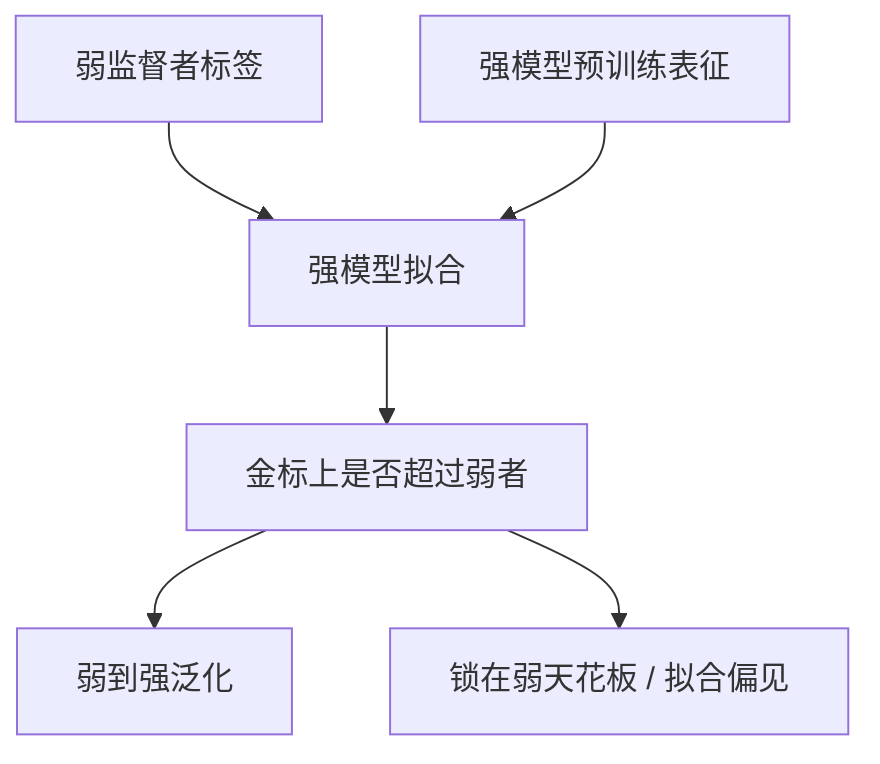

# 弱到强泛化

用弱模型的标签训练强模型，强模型有时能超过弱监督者——前提是弱标签仍与真值相关，而不是系统性地错。

<footer>—— Burns 等，Weak-to-Strong Generalization，OpenAI</footer>

[上一课](/llm/debate-oversight)希望弱裁判监督强辩手。更简单的设定是：弱监督者直接打标签，强学生做监督训练。缺口是：**学生会不会只模仿弱者的错误天花板？** Burns 等人用 GPT-4 当强、弱模型当监督者，在 NLP 与棋等任务上测量弱到强泛化。本课写这一现象与对齐含义，接到 [RLHF](/llm/rlhf-pipeline) 里「人已经比模型弱」的未来。

## 问题

经典监督假设标签接近金标。对齐的远期问题是：人类（弱）给超人类模型（强）反馈。实验室代理：弱 LLM 的预测当标签，强 LLM 做 SFT 或线性探针，看强模型在金标上能否超过弱模型准确率。若能，说明强模型的预训练表征里已有更好概念，弱标签只是噪声索引。若不能，对齐会锁死在弱者水平。

Burns 等发现部分任务有明显的弱到强差距被部分恢复，也发现简单的「强模型拟合弱错误」失败模式。这不是已经解决可扩展监督，而是一个可测量的中间现象。恢复幅度随任务变：常识分类更乐观，需要精确监督的安全轴更悲观——后者正是对齐真正在乎的。

### 与蒸馏相反

蒸馏用强教师标签训弱学生，天花板是教师。弱到强用弱教师训强学生，希望天花板是学生的预训练知识。方向相反，数据协议相似，解释完全不同。不要把 R1 蒸馏小模型叫做弱到强。

弱标签若有系统性偏见（总爱长、总拒答），强模型会把偏见学成原则，泛化的是偏见。相关噪声才可能被表征纠正。

## 方法

协议：弱模型在训练集上出软/硬标签 → 强模型拟合 → 在金标测试集上比较弱、强、以及强用金标训的上限。辅助：置信加权、表征探针、自洽。对齐迁移：人的比较当作弱标签，强策略做 [DPO](/llm/dpo) / PPO，金标是更贵的专家抽检或下游任务。

## 机制

一种解释：弱标签与真值在简单特征上相关，强模型还能用复杂特征去噪。辩论、过程监督试图提高「弱标签与真值的相关」，使泛化更容易。若弱者在关键安全轴上系统性错，去噪会朝错误方向。因此弱到强不能替代红队；它只说明能力轴上可能有恢复。

实验用的弱/强是同族不同规模，不是人类 vs 未来模型。外推要谨慎。

## 边界与工程取舍

有校验器则用校验器，不必弱标签。开放对齐才需要。下一课把弱到强、辩论、递归奖励模型收成可扩展监督纲领，并写它们共同的失败：监督信号被优化后失效。

弱标签的系统性偏见会被强模型学成原则。本课只保证：在弱–金标仍相关的任务上，表征有时能去噪。

## 小结

- 弱到强：用弱标签训强模型，看金标上能否超过弱者。
- 与蒸馏方向相反；R1 学生蒸馏不是本课。
- 系统性偏见会被放大；只有近似噪声才可能被表征纠正。
- 是可测量现象，不是已完成的对齐方案。
- 出处：Burns 等 Weak-to-Strong Generalization；对照 Irving 辩论、Christiano 偏好 RL。
