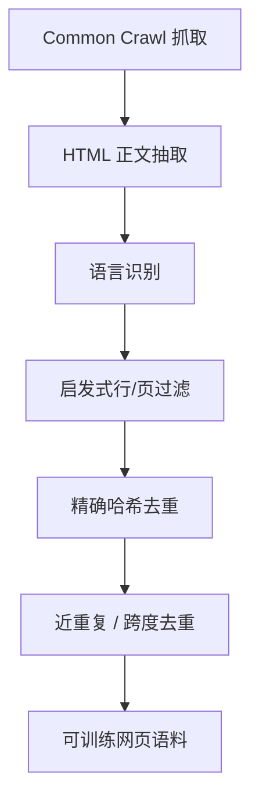

# 网页清洗与去重

从 Common Crawl 出发，用启发式规则丢掉不像自然语言的行与页，再对重复跨度去重，才能得到可训练的 C4。

<footer>—— Raffel et al., C4 / T5, JMLR 2020</footer>

预训练语料的第一桶金是网页。Common Crawl 量级巨大，却充满模板、导航、乱码、复制粘贴的新闻稿与机器生成的垃圾。直接拿来做语言建模，模型会把菜单、cookie 横幅和重复段落当成「语言」。清洗要回答的是：在不靠人工读网页的前提下，用哪些可规模化的规则，把原始抓取收成句子像人写的文本。去重是清洗的后半段：同一句话出现一万次，似然会被它绑架。Raffel 等人的 C4、后来 Penedo 等人的 RefinedWeb 与 FineWeb，以及 Gopher、Llama 的网页管线，走的是同一条路——启发式过滤加去重——只是规则集合与阈值在变。

## 问题

网页不是文档。一次抓取里，主文、侧栏、页脚、广告、代码片段和重复的法律声明叠在一起。HTML 去标签之后，仍可能留下「click here」成片出现、句子没有终结标点、词表被乱码污染。更麻烦的是重复：镜像站点、转载、CMS 模板会让同一段落在语料里占据不成比例的质量。Lee 等人后来证明，训练数据中的重复会抬高记忆、制造训练-评测泄漏，并让验证损失看起来过于乐观。

清洗面对的约束是召回与精度的权衡。规则太严，百科与论坛里的合法短句被杀光；规则太松，模型在低质量模板上浪费算力。C4 的策略是偏严的启发式：宁可变少，也不把明显非语言的行留下。后续 RefinedWeb、FineWeb 则表明，在同样抓取上，过滤与去重的质量可以比「堆更多原始 TB」更影响下游。

### 启发式能看见什么

典型规则只看局部统计：行是否以终结标点结束、页内字母数字比例、是否命中脏话表、是否含「lorem ipsum」一类占位符、句子长度是否极端。它们几乎不理解内容。优点是便宜、可复现、对多语言可用同一骨架（改词表与标点定义）。缺点是把诗歌、标题、代码注释、口语对话一并误杀，也放过语法通顺但信息空洞的生成文本。C4 要求很多行以句号等终结符结束，这对英语新闻友好，对标题党、列表、中文无空格文本不友好。把英语启发式原样搬到多语言抓取上，是配比失真的常见来源，而不是「质量」真的跨国界同构。

## 方法

管线通常按「抽取 → 语言识别 → 启发式质量 → 文档级去重 → 跨度级去重」排列。抽取把 HTML 变成纯文本，并尽量丢掉样板。语言识别决定这条文档进哪一个语言桶，也决定后续词表与标点规则。启发式质量用阈值砍页。去重分两层：精确哈希消灭字节级复制，MinHash 一类近似方法消灭改了几个词的近重复。Lee 等人同时做了精确子串与近重复，发现二者都会改变记忆与评测。

C4 的公开描述包括：丢弃没有终结标点的行、丢弃命中脏词的页、丢掉某些占位与政策页、对三句以上的重复跨度去重。Gopher 的 MassiveText 在网页之外还混入书籍、新闻、代码，并对网页做质量与重复控制。Llama 对 Common Crawl 用分类器打分（质量过滤篇再写），网页仍先走清洗。Penedo 等人的 RefinedWeb 强调：仅用精心过滤的网页，不必依赖书籍与对话的小众来源，也能训出强模型；FineWeb 把这一路线推到更细的抽取与过滤版本比较。

### 抽取比规则更先决定上限

同一条 URL，用不同正文抽取器会得到完全不同的字符。导航残留多，后续任何质量分类器都会被模板特征带跑。RefinedWeb 与 FineWeb 把抽取质量当成一等公民：先比较抽取器，再谈过滤。这纠正了一种常见错觉——以为去重和分类器能补救烂抽取。抽取错了，重复检测会把错误模板当成「高相似」，合法主文反而可能被连坐。

URL 级去重不能替代正文去重。同一篇文章换域名转载，URL 不同、正文几乎相同。只按 URL 或域名限流，会留下大量转载；只按域名黑名单，又会误伤综合站点里的好文章。正文指纹必须进管线。

## 机制

启发式过滤改变的是训练分布的支撑：某些字符串模式的概率被压到接近零。去重改变的是频率：支撑还在，但重复文档不再按出现次数加权。对交叉熵而言，前者少学垃圾模式，后者避免把梯度预算花在同一段落上。二者都会改变领域配比——例如新闻转载多，去重后新闻占比下降，论坛占比相对上升。清洗从来不是中性的预处理，它就是在选数据混合物。

Lee 等人指出，重复还会造成训练语料与下游评测集重叠，从而高估泛化。网页清洗若只做「看起来干净」，不做与评测集的重叠审计，报告的 benchmark 可能部分来自泄漏。工程上应把评测集 n-gram 或 MinHash 当成去重的另一侧，而不是训完再后悔。

### 文档边界与跨度边界

文档级去重一次丢掉整页；跨度级去重只剪重复段落，保留页内其余文字。C4 对三句重复跨度动手，是因为模板常以段落而不是整页复制。代价是实现更重：要在全局维护跨度指纹，误伤「引用同一句名言」的风险上升。阈值过低，语料被剪碎，文档级连贯监督变弱；阈值过高，转载新闻仍在。没有与规模无关的万能 $k$-gram 长度，只能按语言与抓取年代校准。

## 边界与工程取舍

清洗不能替代质量分类器，也不能替代领域配比。启发式对「像不像句子」敏感，对「有没有知识」不敏感。通顺的搜索引擎优化文、生成式垃圾、空洞的产品描述，常常能通过 C4 式规则。反之，高价值的表格、日志、代码块可能被当成非自然语言删掉——它们本该进代码桶而不是网页桶。

多语言与非拉丁文字需要单独的标点、脚本比例与语言识别阈值。把英语 C4 规则当成世界标准，会系统性地少收中文、日文与无空格文字。Gopher、Llama 的公开管线以英语为中心；Penedo 等人后续工作更明确地把「网页可以足够好」建立在英语高质量抽取上。迁移到其他语言时，应重做抽取与启发式，而不是只换语言识别标签。

「更多原始网页」和「更干净的网页」在算力固定时是竞争关系。Gopher 与 Llama 都选择少而干净的一边。RefinedWeb 进一步表明，过滤后的网页可以承担过去由书籍等精选源扮演的角色。这不是说书籍无用，而是说网页管线的上限被低估了。

清洗是可复现实验的一部分。规则、阈值、抽取器版本、去重粒度都应写入数据卡片。只报告「用了 Common Crawl」等于没报告：C4、RefinedWeb、FineWeb 与各实验室内部快照，是完全不同的训练集。

## 小结

- 网页预训练管线是抽取、语言识别、启发式过滤与去重的串联，不是把抓取解压后直接训练。
- C4 展示了一套可复现的偏严启发式；重复跨度去重是其中的关键步骤。
- 去重改变频率与评测泄漏，清洗改变支撑；二者都会间接改写领域配比。
- 抽取质量设定上限，分类器与 MinHash 不能挽回烂正文。
- RefinedWeb / FineWeb 表明，仔细过滤的网页本身可以成为主语料，而不必依赖小众精选源。
- 英语启发式不能原样用于多语言；标点与脚本假设会系统性偏置语种配比。
- 出处：Raffel et al.，T5 / C4，JMLR 2020；Lee et al.，*Deduplicating Training Data Makes Language Models Better*；Penedo et al.，RefinedWeb 与 FineWeb；对照 Gopher、Llama 的网页过滤实践。
