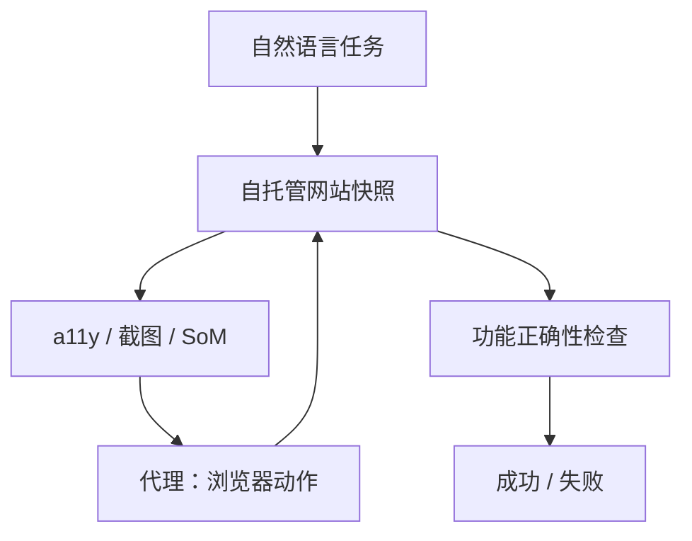

# WebArena / VisualWebArena

    
自托管的真实网站上测功能正确性：任务像人在网上办的事，成功看站点状态变没变，而不是动作序列像不像某条演示。

    <footer>—— Zhou et al., WebArena, ICLR 2024；Koh et al., VisualWebArena, ACL 2024</footer>

早期网页代理评测常在 MiniWoB 一类合成控件或不可复现的线上站点上进行：前者不像真实站，后者每次广告和登录墙都在变。Zhou、Xu、Zhu 等人的 **WebArena**（arXiv:2307.13854，ICLR 2024）搭了一套可复现的真实感环境：电商、论坛、协作开发、内容管理四个领域的完整站点，外加地图与文档等工具，并发布长程任务，用程序检查**功能正确性**。当时最好的 GPT-4 代理端到端成功率约 **14.41%**，人类约 **78.24%**。Koh 等人的 **VisualWebArena**（arXiv:2401.13649，ACL 2024）把任务改成必须看图才能做（比色、认物体、读海报），文本-only GPT-4 约 **7.25%**，GPT-4V 约 **15.05%**，人类约 **88.70%**。本篇写两套合同的差别。默认是自托管副本上的合法评测，不写对真实第三方站点的未授权自动化。

## 问题

若用真实互联网当环境，评测不可复现：商品下架、验证码、A/B 实验会把模型错误与世界变化混在一起。若用完全合成的玩具页，学到的选择器在 Magento、GitLab 上无效。WebArena 的问题是：如何在**功能完整、可重置、与真实开源站点同构**的网站上，测量自然语言网页代理。任务要长程、要跨页、有的还要对照站外手册，避免「只搜标题就能过」。

VisualWebArena 补的是另一缺口：很多真实网页任务的判别式信息在图里——哪件衣服是指定颜色、列表里哪张图符合描述——纯 a11y 树只有 alt 或没有。文本代理会瞎猜或依赖碰巧出现的文件名。需要在同一自托管哲学下，把观察改成真正的多模态，并保持功能正确性验收，而不是问「图里有一只猫吗」那种 VQA。

### 功能正确性，不是动作匹配

同一「给某用户发一条指定内容的帖子」可以有不同点击顺序。比对动作字符串会误杀合法路径，也会放过「点对了但没提交」的假成功。WebArena 在数据库、DOM 终态、URL 与可见文本上写检查器：该存在的记录在，不该改的没改。这与 SWE-bench 的 fail-to-pass 同属执行式评价，对象从测试套件换成网站状态。

WebArena 原文最佳 GPT-4 约 14.41%，人类 78.24%。VisualWebArena：文本 GPT-4 约 7.25%，加字幕约 12.75%，GPT-4V 约 15.05%，人类约 88.70%。后续 GPT-4o / 搜索增强会改写绝对数，引用必须钉论文表而不是排行榜截图。

## 方法

环境侧：把开源站点（购物、论坛、GitLab、CMS 等）连同数据快照自托管，外挂地图一类服务。代理观察通常是简化的无障碍树或网页文本，动作是点击、输入、导航等浏览器原语。任务模板实例化成几百到八百余条指令（原文强调多样长程、仿日常上网）。基线含直接提示与 [ReAct](/llm/react) 式推理-行动。停止条件是提交答案或用尽步数。评测器只看终态。

VisualWebArena 换到分类信息、购物、论坛等必须视觉接地的任务，观察含截图。强基线用 Set-of-Mark：在截图上标可点元素编号，让模型输出标号而不是原始坐标，降低接地难度。文本模型可加 BLIP-2 一类字幕当拐杖。验收仍是站点功能，不是图文匹配分数。这样，「会看图」和「会把看到的东西提交成正确数据库记录」被绑在同一条成功率里。

### 模板一致性暴露的是策略脆，不是偶发点错

WebArena 分析指出：同一模板下换实体，代理表现不稳定；不少可完成任务被模型误判为不可行。这说明失败不单是「某一个按钮没点到」，而是策略无法在站点结构上泛化。VisualWebArena 里，纯文本模型即使有树，也会在必须比色或认物体的题上塌方；加字幕有帮助，仍低于原生多模态。报分应带上站点子集（购物 / GitLab / 视觉分类信息），总分会掩盖「只会逛一个站」。

## 机制

WebArena 测的是：在部分可观察的文档对象上做长程决策，并用工具（站内搜索、地图、手册）补世界知识。没有执行反馈时，模型会在错误列表页上循环。ReAct 把思考写入上下文，有助于决定「该过滤还是该翻页」，但观察一长，早期约束丢失。VisualWebArena 额外测视觉接地：标号空间（SoM）把像素点击收成离散选择，降低坐标回归难度，却把「标号与控件对齐」交给渲染管线——标错就全错。

两套基准都不训练网站权重，默认是冻结骨干 + 提示 / 工具。因此脚手架（观察预处理、是否允许站点特定说明书、测试时搜索）会大幅改分。Koh 等人后续用测试时树搜索抬高 VisualWebArena / WebArena，那是推理期计算，不是环境变简单。引用 SOTA 必须把搜索预算写进去。

不要把线上任意网站的演示成功率写成 WebArena。合同是自托管副本 + 公开任务 + 功能检查器。对真实第三方站点做未授权批量操作不在本篇范围；研究代码默认打向本地镜像。

## 边界与工程取舍

### 自托管镜像不是开放互联网

WebArena 的站点再真实，也不是整个互联网：没有验证码战场、没有不断改版的闭源巨头首页。VisualWebArena 的视觉任务仍落在可控的三类站上。两者都偏英语界面。步数上限会切掉「人慢慢试」的路径，故人类基线也是在同一界面上测的，不是无限时间。污染：预训练是否见过 GitLab 文档会影响手册题，但执行检查仍要求当场改对状态。把线上任意域名的一次成功演示写成 WebArena 分数，等于换了环境还沿用旧名。

与 OSWorld：WebArena 家族锁在浏览器标签里；OSWorld 还要桌面应用与跨程序。与 SWE-bench：一个改网站数据，一个改仓库代码。产品若只刷 WebArena 就声称「通用计算机使用」，缺了像素桌面与仓库两维。评测工程上要冻结站点镜像版本，否则前端一次升级会让历史分数作废。

出处：Zhou, Xu, Zhu, Zhou, Lo, Sridhar, Cheng, Bisk, Fried, Alon, Neubig，*WebArena: A Realistic Web Environment for Building Autonomous Agents*，ICLR 2024，arXiv:2307.13854。Koh, Lo 等，*VisualWebArena: Evaluating Multimodal Agents on Realistic Visual Web Tasks*，ACL 2024，arXiv:2401.13649。

## 小结

- WebArena：自托管真实感网站 + 功能正确性，GPT-4 当时约 14.41% 对人类约 78%。
- VisualWebArena：必须看图的网页任务，GPT-4V 约 15% 对人类约 89%；纯文本显著更弱。
- 验收看站点状态，不比对动作字符串；SoM 是接地脚手架，不是新环境。
- 报分写子集、观察、是否测试时搜索；不要用开放互联网演示替代。
- 出处：Zhou et al. ICLR 2024；Koh et al. ACL 2024。
