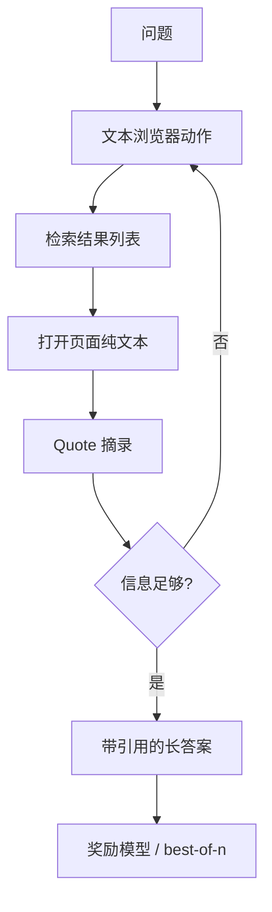

# WebGPT

    
让模型在受约束的文本浏览器里搜索、打开条目、摘录引用，再用人类对「哪条答案更好」的比较来打分；长答案的事实性来自可点击的摘录，而不是来自把训练记忆写得更自信。

    <footer>—— Nakano 等，WebGPT: Browser-assisted question-answering with human feedback，arXiv:2112.09332</footer>

Reiichiro Nakano、Jacob Hilton、Suchir Balaji、Jeff Wu、Long Ouyang、John Schulman 等 OpenAI 作者的 WebGPT（2021，arXiv:2112.09332）把 GPT-3 微调成**带引用的问答策略**：动作空间是文本化浏览器（检索、打开链接、在页面内查找、摘录 quote、回退、结束），不是操作系统 GUI，更不是对站点的攻击或绕过鉴权。数据来自人类在同一浏览器里的示范与成对比较，目标任务以 ELI5 长答案为主。它比后来的 ReAct 更早把「检索–阅读–作答」收成可学习策略，并用奖励模型 + 拒绝采样（及 PPO 实验）对齐人类偏好。本篇写这套只读浏览工作流、引用如何成为答案的一部分，以及反馈学习相对纯模仿的增量。

## 问题

闭门 LM 回答开放域问题时会流畅地编造。检索增强若只是「搜一段塞进提示」，模型仍可能不读、错引、或不标明出处。需要：动作可审计；答案中的命题能指回摘录；策略能在多步搜索后决定何时停。ELI5 这类题要的是解释，不是短实体，抄一条摘要不够。

人类已经会用搜索引擎做这件事。把同一界面交给模型，收集示范，就不必发明新的工具语法。界面必须是**文本浏览器**：命令是 Search / Click / Quote / Scroll / Back / Find / End 一类离散动作，观察是标题、链接列表、页面纯文本片段，而不是像素级点击或脚本注入。

### 引用是一等公民

结束动作提交的答案必须带摘录支持。评测与人类比较时，事实性与有用性分开看：没有引用的漂亮段落在 WebGPT 的合同里不是完整交付。这与后来 RAG 把片段塞进上下文但不强制对齐引用链不同——WebGPT 的 quote 动作在轨迹里显式出现。

浏览动作默认只读：检索公开网页、摘录已渲染文本。不要把这篇扩展成填写他人表单、撞库或绕过 robots 的教程。工程复现应使用自己有权访问的索引与缓存。

## 方法

环境：基于 Bing 的文本浏览器，观察截断以适应当时 GPT-3 的上下文。策略 π 输出下一个浏览器命令或最终答案。数据：标注者在该环境里为问题演示整条轨迹；另对模型或人类产出的答案做成对比较（有用性、真实性等轴）。训练分阶段：行为克隆示范；用比较训练奖励模型；用奖励模型做 best-of-n 拒绝采样，并报告 PPO 微调策略的实验。推理时可采样多条浏览轨迹，按奖励模型选答案。

对照包括：不浏览的 GPT-3、人类 ELI5 答案、以及当时的检索基线。人类评估中，WebGPT 的长答案在部分设置下可与人类答案竞争，并在真实性相关检查上受益于强制引用。TruthfulQA 一类套件用来看浏览是否降低模仿性错误，但仍取决于检索到的页面质量。

### 示范教界面，比较教品位

克隆只能覆盖标注者走过的查询改写与停时。比较数据让奖励模型偏好「引用支撑主张、少夸大」的答案，即使两条轨迹都合法结束。best-of-n 把计算换质量，不改动作空间。PPO 则把浏览策略本身往高奖励推，但 2021 年的报告里拒绝采样已是很强的实用点，不必把 WebGPT 简化成「又一个 RLHF 聊天模型」——环境是浏览器，奖励绑定带引用的 QA。

## 机制

多步浏览是部分可观察：当前页面不是全世界。Search 改写查询，相当于在查询空间做探索；Quote 把外部字符串变成条件前缀里不可伪造的证据（宿主写入）。策略学习的是何时放弃当前页面、何时结束，避免无限滚动。这与 ReAct 的 Thought–Action–Observation 同构，差别是 WebGPT 用强化学习目标而不是少样本格式，且最终答案格式绑定引用。

奖励模型看到的是完整答案加引用，不一定逐步打分每一次 Click。因此策略可能学会「堆很多看似相关的 quote」来讨好奖励，而不是最小充分证据——这是反馈学习的已知偏置，要用比较维度里的简洁性或人工抽查来压。

Nakano 等同时是 InstructGPT / RLHF 谱系的作者群。WebGPT 的比较数据是浏览 QA 专用的，不要直接当成通用对话 RM。检查点是 GPT-3 家族，上下文远短于后来的 128K 浏览 Agent。

### 与 RAG 和 ReAct 的边界

现代 RAG 常一次检索 top-k 就生成，没有 Click 级轨迹，引用靠后处理对齐。WebGPT 把检索当序列决策，适合需要跟进链接、比较多源的解释题。ReAct 后来把同类循环做成提示，不必微调 175B；WebGPT 证明的是：**在受限浏览器里用人类反馈可以学出带引用的策略**。产品上，索引覆盖、页面截断、过时快照会限制真实性上限，模型再强也读不到不在观察里的事实。

## 边界与工程取舍

文本浏览器丢掉布局、表格结构与登录后内容；只适合公开网页问答。标注贵：示范加比较。best-of-n 乘以浏览步数，延迟高。不要把搜索 API 换成未授权的整站镜像。与 Toolformer：一个自监督决定何时用小 API，一个用 RL 学浏览政策。与 HuggingGPT：专家是 ML 模型，不是网页。后续对话产品里的「带链接回答」多半是 RAG + 引用后处理，未必复现 WebGPT 的动作空间；引用这篇时应对齐 ELI5 协议与人类评估，而不是 MT-Bench。

出处：Nakano, Hilton, Balaji, Wu, Ouyang, Kim, Hesse, Jain, Kosaraju, Saunders, Jiang, Cobbe, Eloundou, Krueger, Button, Knight, Chess, Schulman，*WebGPT: Browser-assisted question-answering with human feedback*，arXiv:2112.09332，OpenAI，2021。

## 小结

- WebGPT 在文本浏览器动作空间里微调 GPT-3，提交带摘录引用的长答案。
- 人类示范加比较训练奖励模型，推理常用拒绝采样。
- 工作流只读检索与引用，不涉及 GUI 攻击或越权访问。
- 出处：Nakano et al.，arXiv:2112.09332。
