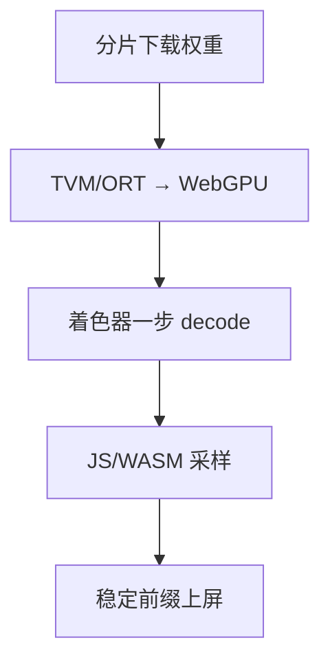

# WebGPU 推理

浏览器里的 GPU 没有 CUDA 运行时：计算着色器加上严格的内存配额，能跑的是量化后的小模型，不是把 vLLM 搬进标签页。

<footer>—— W3C WebGPU；浏览器 LLM 见 MLC WebLLM 与 transformers.js 一类 TVM / ONNX Runtime Web 路径</footer>

[上一课](/llm/mlx-apple)还有原生进程与统一内存。WebGPU 把计算放进沙箱：着色器、缓冲配额、无自定义特权内核。MLC 的 WebLLM 用 TVM 把模型编译到 WebGPU；transformers.js 常用 ONNX Runtime Web 或 WASM。本课写约束：权重要下载到浏览器、KV 占 JS/GPU 缓冲、decode 在带宽与启动开销双重劣势下跑。隐私（权重与数据不出页）是产品动机，不是性能动机。

## 问题

下载 4-bit 7B 仍是数 GB，首次 TTFT 含网络。配额与移动浏览器会直接拒绝。逐步：没有 [FlashAttention](/llm/flashattention) 那种 CUDA 核，注意力是着色器或退化实现，$n$ 稍长即炸。缺口是承认 Web 路径的模型级（1B–8B 量化、短上下文），以及预填充与 decode 的着色器启动开销。采样在 JS 或 WASM，词表扫描相对 GPU 着色器可能更刺眼——先修采样器内核的反面。

没有连续批：一页一个用户，$B=1$，工作点永远在带宽区。优化是量化、减层、短上下文，不是堆并发。

WebGPU 与 WebGL 不同。旧的 WebGL 路径不适合通用计算。检测能力失败时应回退 WASM CPU，并明确更慢。

## 方法

编译：TVM / ORT 把图降到 WGSL。分发：分片下载、缓存到 Origin Private File System。KV：固定最大 $n$ 预留，碎片回到 OpenVINO NPU 那类问题。流式：id 在 Worker 里 generate，主线程 detokenize，注意 UTF-8 稳定前缀。投机在浏览器上草稿也得是小模型或早退，下一课端侧投机再写；Web 上内存更紧。

## 机制

沙箱禁止持久内核与无限显存。每步着色器启动相对 CUDA Graph 更贵，小核更多伤。会计公式仍用，$B_{\mathrm{HBM}}$ 换成共享显存或系统内存。安全：模型文件来自源站，仍要完整性校验，避免恶意着色器或权重。这与 safetensors 的供应链同一类，只是运行在浏览器官辖。

## 边界与工程取舍

不要承诺「在标签页跑 70B」。不要在 iOS Safari 的不稳定 WebGPU 上无检测直跑。下一课：真正的手机 NPU 部署，权限与工具链又不同。

出处：W3C WebGPU；MLC WebLLM；ORT Web。不发明 arXiv。

## 小结

- WebGPU 推理是沙箱着色器 + 下载配额；$B=1$、短上下文、强量化。
- 无 CUDA FA；长 $n$ 先炸内存再谈算法。
- 首次延迟含下载；要用分片缓存。
- 采样与 detokenize 在 Worker；注意稳定前缀。
- 产品动机常是隐私与零安装，不是吞吐。
- 下一课：移动端 NPU。
- 出处：W3C WebGPU；MLC WebLLM。
