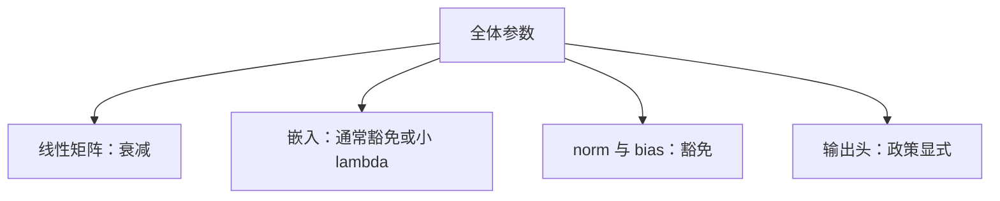

# 权重衰减的豁免：嵌入与 norm

解耦衰减对每个参数乘 $1-\eta\lambda$；把这一乘用在归一化增益和查找表上，等于按步数把尺度往 0 拉，而那两处的尺度本应被另外的课钉住。

<footer>—— Loshchilov & Hutter, ICLR 2019；预训练配方中的分组见 GPT-3 / Llama 一类报告</footer>

[上一课](/llm/lr-sensitivity-mup-practice)要求扫 $\eta$ 时声明 $\lambda$ 怎么走。缺口是：**哪些参数根本不该进衰减组**。AdamW 的 $W\leftarrow W-\eta\lambda W$ 对矩阵权有正则与尺度控制的双重作用；对 RMSNorm 的 $\gamma$、对嵌入行，同一乘会直接对抗 [激活漂移](/llm/activation-scale-drift) 与 [嵌入初始化](/llm/embedding-init-scale) 想保留的范数。主干 [AdamW](/llm/adamw) 已警告 bias / LN 豁免；本课写成稳定性条款，并处理嵌入该不该豁免的分歧。

## 问题

LN / RMSNorm 的 $\gamma$ 起步为 1，职责是通道尺度。每步乘 $1-\eta\lambda$，等于强制 $\gamma\to 0$。训练还能靠 CE 把 $\gamma$ 撑住，但衰减与损失在打架：LSE 课里写过，z-loss 要把 logits 往下拉，衰减要把 $\gamma$ 往下拉，嵌入豁免又让输入范数涨——三条力同时作用在尺度上，日志无法归因。偏置同理：衰减把 $b$ 往 0 拉，而 $b$ 常常在学频率先验。

嵌入更麻烦。Loshchilov 的图像实验倾向衰减权重、豁免 bias。语言模型的 $E$ 既是输入也常是（tied 时）输出。衰减嵌入：稀有行被反复乘小于 1 的因子、又很少被梯度更新，行范数趋向 0，变成死 token。不衰减：热门行范数可以涨，总线 RMS 涨。GPT-2 / GPT-3 / Llama 的具体分组不完全相同，本课不编造某一家的表，只要求**显式列出**四组：隐藏矩阵、嵌入、输出头、norm/bias。

「weight_decay=0.1」若应用在未分组的 `model.parameters()` 上，LN 和嵌入都在里面。这是实现默认，不是论文定理。读配置必须读 optimizer param groups。

## 方法

推荐起点（可被消融推翻）：

- **衰减：** 注意力与 FFN 的线性矩阵。
- **不衰减：** 所有 norm 的 $\gamma,\beta$、所有 bias。
- **嵌入：** 默认不衰减或使用更小的 $\lambda$；tied 时与输出头同一政策。
- **untied 输出头：** 可衰减，作为对抗 LSE 发散的一条力，但 α 与 $\lambda$ 不要同时从零加到头。

μP 下 $\lambda$ 是否随宽度变，跟主干 weight-decay-mup 课，不在这里另造一列。本课只决定**集合**，不决定 $\lambda(d)$。

验收：训练中途打印 $\|\gamma\|$、嵌入行范数的分位数。$\gamma$ 若系统性掉到 $\ll 1$，衰减组包进了 norm。嵌入行范数若双峰（热门极大、长尾近 0），考虑把嵌入拆出衰减或给长尾一个地板。

## 机制

解耦衰减与梯度无关，稀疏行也会被每步缩小。这和「权重衰减约等于先验」在稠密卷积上的故事不同：卷积核几乎每步都有梯度，衰减与更新平衡；嵌入长尾没有平衡项。norm 的 $\gamma$ 每步都有梯度，但目标尺度是 $O(1)$ 而不是 $O(0)$，衰减的不动点与职责冲突。

与 z-loss：两者都想压输出尺度。衰减 $W_{\mathrm{out}}$ 压的是权重范数，z-loss 压的是 LSE。只衰减、不 z-loss，LSE 仍可因 $h$ 的 $\gamma$ 变大而涨。只豁免、不 z-loss，尺度更容易飞。稳定性配方应写成三列：衰减集合、z-loss α、是否 cap，而不是一个「正则系数」。

## 边界

本课不讨论把衰减改成对激活的正则。也不把「嵌入不衰减」写成必然提高下游——它首先是避免死行与尺度打架。下一课开始把**多检查点**合成更稳的推理权重：EMA 与平均，不再改单步更新。

## 小结

- AdamW 的 $1-\eta\lambda$ 对 norm 增益是错误的尺度先验，对嵌入长尾会造成死行。
- 必须写清四组：矩阵、嵌入、输出头、norm/bias；禁止一个全局 $\lambda$。
- 衰减、z-loss、cap 是三条尺度力，要能单独开关。
- 验收看 $\|\gamma\|$ 与嵌入行范数分位数，不看「配置里写了 0.1」。
- 出处：Loshchilov & Hutter, ICLR 2019；GPT-3 / Llama 预训练中的参数分组实践。
