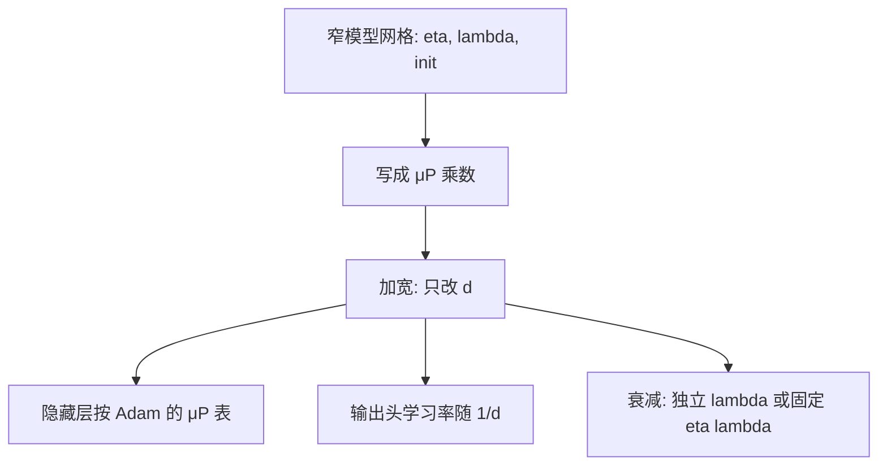

# 权重衰减与 μP

把衰减从自适应分母里拆出来，再按宽度给初始化与学习率定标，窄模型上调好的超参才有机会直接搬到宽模型。

<footer>—— Loshchilov &amp; Hutter，AdamW；Yang 等，Tensor Programs / μP</footer>

权重衰减控制参数范数，学习率控制一步走多远。Adam 若把 $\ell_2$ 正则写进损失，梯度会先被 $\sqrt{v}$ 除，有效衰减跟着二阶矩走，不再是你写下的 $\lambda$。AdamW 把衰减解耦成独立的一次乘：每次更新后 $W\leftarrow W-\eta\lambda W$（实现细节略有出入）。μP（Maximal Update Parameterization）要解决另一件事：宽度 $d$ 变大时，初始化方差、学习率、有时包括衰减，必须按层类型用确定的幂次重标，使「每层的特征更新」在无穷宽极限里仍是 $O(1)$，从而窄模型上扫到的超参可以零样本迁到宽模型。Yang 等人的 Tensor Programs 系列给出这套定标；本篇只谈它与衰减、AdamW 的交界，不展开无限宽图的全部引理。

## 问题

预训练配方里 $\lambda$ 常取 $0.1$ 或 $0.01$ 量级，看起来像一个无量纲小数。它其实有单位：在 AdamW 下，每步权重乘 $1-\eta\lambda$，衰减率是 $\eta\lambda$ 而不是 $\lambda$ 本身。改学习率日程、改峰值、改 token 数，而不改 $\lambda$，等于改了权重被拉向原点的速度。余弦末期 $\eta$ 变小，衰减也变弱；WSD 稳定段 $\eta$ 恒定，衰减率全程不变——同一 $\lambda$ 在两种日程下不是同一正则。

宽度带来第二重错位。隐藏层矩阵的梯度与初始化方差随 $d$ 变；若学习率不按 μP 重标，宽模型要么一步太大（特征更新爆炸），要么一步相对宽度太小（退回核体制，只学最后一层）。此时即使 $\lambda$ 数字不变，有效正则相对「这一层实际走了多远」已经变了。问题是：衰减应跟 $\eta$ 走，还是跟宽度走，还是跟二者的乘积走。

### 解耦权重衰减在改谁

Adam 的耦合 $\ell_2$ 把 $\lambda W$ 加进梯度，再除 $\sqrt{v}+\epsilon$。$v$ 大的坐标衰减变弱，$v$ 小的坐标衰减变强，正则被自适应项扭曲。AdamW 的解耦形式把参数更新写成

$$
W\leftarrow W-\eta\,\hat{m}/(\sqrt{\hat{v}}+\epsilon)-\eta\lambda W.
$$

第二项与 $v$ 无关，所有坐标按同一比例收缩（在这一 step 的 $\eta$ 下）。嵌入表是否衰减、偏置与 RMSNorm 的 $\gamma$ 是否衰减，是分组问题：常见做法是二维权重衰减、一维增益与偏置不衰减。这不是 μP 的要求，是经验分组；μP 会再问这些组的 $\eta$ 与 $\lambda$ 如何随 $d$ 变。

「权重衰减等于 $\ell_2$ 正则」只在 SGD、且学习率恒定时近似成立。AdamW 的解耦衰减是优化器里的额外收缩，和把 $\frac{\lambda}{2}\|W\|^2$ 写进损失再走 Adam 不是同一条离散轨迹。复现论文时要看代码进的是哪一条。

## 方法

μP 把参数分成几类，每类有自己的初始化方差乘数与学习率乘数（相对一个基准宽度 $d_0$）：

- **输入嵌入 / 输入投影**：初始化与学习率随宽度的规则与隐藏层不同，避免输入范数随 $d$ 涨。
- **隐藏层权重**（注意力投影、FFN）：SGD 下学习率常按 $1/d$ 缩放；Adam 下隐藏层学习率往往对宽度不敏感或按另一套表——**以 Tensor Programs 给出的 Adam 规则为准，不要用 SGD 的表去套 Adam**。
- **输出头**：学习率通常随 $1/d$ 变，使 logits 尺度不随宽度爆炸。

实现上，微软 mup 一类库用 `InfDim` 与乘数在模块上标注「哪一维是宽度」，优化器按组乘上对应因子。从窄模型把 $\eta$、$\lambda$、初始化一次扫好，加宽时只改 $d$，不改这些「μP 空间里的」超参。

衰减在 μP 里有两种常见挂法，公开讨论并不完全收敛，必须标成选择而不是定理：

1. **独立 $\lambda$**：配置里的 $\lambda$ 不随宽度改，也不随 $\eta$ 改。则有效收缩率 $\eta\lambda$ 随学习率定标一起变。
2. **固定收缩率**：保持 $\eta\lambda$ 不变，即 $\lambda\propto 1/\eta$。宽度或日程改 $\eta$ 时反推 $\lambda$。

哪一种能零样本转移，取决于你认为正则应当惩罚「参数范数」还是「每步相对步长的收缩」。Yang 等人的主文本更完整地处理初始化与学习率；衰减的宽度规则在后续实践与第三方复现里有分歧。迁模型时应对 $\lambda$ 做一次小网格，不要默认「μP 了就可以不扫衰减」。

### μP 要把哪些超参跟宽度绑在一起

必须跟宽度走的是：隐藏层与输入、输出的**初始化方差**，以及**各层类型的学习率乘数**。注意力的 $1/\sqrt{d_k}$ 已经是宽度相关的前向缩放，μP 还有一套对残差分支乘数的建议，避免宽度变大时残差盖过主干。不必跟宽度走的是：层数（那是深度，μP 不管深度推广）、词表大小、序列长度——它们各有自己的扩展律。把层数和宽度用同一套乘数去「μP」，是用错了定理的对象。

Adam 的 $\epsilon$、$\beta_2$ 有时也随宽度显出敏感。μP 原文不把它们当作一等公民；宽模型上 $\epsilon$ 相对 $v$ 的尺度会变，表现为某些层更新被 $\epsilon$ 主导。这是实践中的第三变量，应在迁宽度失败时检查，而不是一上来就改 $\lambda$。

## 机制

无穷宽极限里有两套体制。核体制下，隐藏层的预激活随训练几乎不动，学习发生在最后一层线性；特征学习体制下，隐藏表示随训练明显移动。μP 选择后者：通过把每层更新的幅度钉在对宽度不变的量级，让宽网络仍然在学特征。Adam 的坐标自适应改变了「幅度」的定义，因此 SGD 与 Adam 的缩放表不同。抄错表，宽模型会悄悄滑回核体制：训练损失仍在降（最后一层在学），但加宽带来的收益远小于预期。

衰减进入这个图像的方式是：它给每层一个指向原点的向量，幅度 $\eta\lambda\|W\|$。若 $W$ 的范数本身随宽度涨（初始化未按 μP），衰减项也涨，宽模型被额外拉回。若 $\eta$ 已按 μP 缩小而 $\lambda$ 不变，收缩率变弱，宽模型相当于更小的正则。两种偏差都会破坏「窄模型上的 $\lambda$ 最优仍最优」。这就是为什么衰减不能在 μP 叙述里缺席，即使它不是 Tensor Programs 最核心的那条引理。

μP 不是「把学习率除以宽度」的口诀。输入、隐藏、输出三组乘数不同；Adam 与 SGD 不同。口头简化抄到输出头上，logits 会随宽度消失或爆炸，表现为立刻 NaN 或永远学不动。

### 从窄模型迁到宽模型时衰减怎么走

操作建议：窄模型上用 AdamW，扫 $\eta$ 与 $\lambda$（以及是否对嵌入衰减）。记录的是 μP 乘数，不是绝对 $\eta$。加宽后，先按官方 Adam-μP 表改各层 $\eta$，**$\lambda$ 先保持独立不变跑一次**；若宽模型范数相对窄模型系统性偏大或偏小、下游与训练损失的关系走样，再试固定 $\eta\lambda$。不要同时改日程形状、数据配比和 $\lambda$，否则分不清是 μP 失败还是衰减失败。

Muon 等矩阵优化器与 μP 的合写目前没有像 Adam 那样的标准表。正交化已经改变了更新的谱范数，再按 Adam 的 μP 表去乘 $1/d$ 可能过小。这是未决问题：迁宽度时把 Muon 的 $\eta$ 与 $\lambda$ 当作需要重新网格的对象。

## 边界与工程取舍

μP 不管深度、不管序列长度、不管 MoE 专家数。深层的残差缩放（DeepNorm 一类）是另一套 $N$ 相关的常数；超长上下文改变的是注意力的噪声与激活内存。把 μP 当成「所有尺度的万能转移」，会在深度或数据轴上失望。

词嵌入是否纳入宽度维，实现必须一致。共享输入输出嵌入时，μP 对输入与输出的相反缩放会打架，需要特殊处理（只按其中一侧，或解绑）。这是落地时的已知坑，不是 μP 失效。

检查转移是否成功，不要只看最终损失。应看隐藏层激活的 RMS、注意力 logits 的幅度、输出 logits 的方差是否在宽度变化时保持同量级。这些统计比「loss 也在降」更能揭示是否仍在特征学习体制。

权重衰减也不能替代 dropout 或数据正则。它惩罚的是参数欧氏范数（解耦后是坐标收缩），对「用大权重记住某一批脏数据」有用，对注意力的尖锐模式、对 MoE 路由塌缩没有直接抓手。$\lambda$ 扫到最优之后还尖峰，应去看数据与梯度裁剪，而不是继续加大衰减。

## 小结

- AdamW 把权重衰减从自适应分母里拆出，有效收缩率是 $\eta\lambda$，会随学习率日程一起变。
- μP（Yang 等 Tensor Programs）按层类型重标初始化与学习率，使宽度变化时仍做特征学习，并支持超参零样本转移。
- 衰减随宽度如何走，实践中有「独立 $\lambda$」与「固定 $\eta\lambda$」两种挂法，应小网格验证，不宜当成已闭合的定理。
- Adam 与 SGD 的 μP 表不同；输入、隐藏、输出乘数不同。口头口诀不够。
- 深度、词表、序列、矩阵优化器，都不在标准 μP 表的担保范围内。
- 出处：Loshchilov & Hutter，AdamW；Yang 等 Tensor Programs 系列与 μP / 零样本超参转移；mup 等实现库中的层类型乘数。
