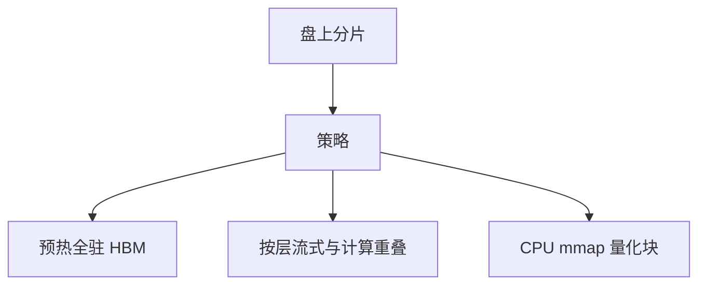

# 权重加载与流式

启动延迟是把百 GB 权重量进设备内存的时间；能 mmap 的量化块可以边用边页入，但 decode 热路径上的缺页会变成逐步抖动。

<footer>—— 对照 llama.cpp 对 GGUF 的 mmap，以及 Hugging Face 加速库按 device_map 分片加载；容器格式见下一课 safetensors</footer>

[上一课](/llm/embedding-serving)的模型往往小到一次加载可忽略。LLM 服务的冷启动、扩容、换 LoRA 基座，都是 *把权重从盘送到 HBM*。本课写加载策略：一次性拷贝、内存映射、分层流式、以及与量化的关系。[llama.cpp](/llm/llamacpp) 用 mmap 让操作系统页入 GGUF 块；GPU 服务通常要 cudaMemcpy 或 GDS。下一课专写 safetensors 为什么替代 pickle。本课不把格式当主角，当传输与驻留。

## 问题

$W_{\mathrm{bytes}}$ 在会计里是逐步要读的常数；启动时还要付一次把它放进设备的时间。70B 半精度约 140GB 量级，从网络盘加载可以分钟计，扩容 SLA 破掉。缺口是：驻留策略（全驻 HBM、CPU 卸载、分层流式）与 *缺页是否落在 decode 热路径*。mmap 在 CPU 推理上自然；GPU 上若内核假设指针常驻 HBM，缺页或不完整拷贝就是错误或巨大抖动。

流式加载：先把第 1 层送上 GPU 即可开始 prefill 的第一层，与后续层拷贝重叠。依赖是层序。TP 下每卡只加载分片，体积除以 TP，但要同步对齐。

量化后 $W$ 变小，加载与逐步带宽双赢。GPTQ 权重要么预量化在文件里直接加载，要么先加载 FP16 再量化——后者把启动峰值显存顶回 FP16，常 OOM。

## 方法

生产 GPU 服务：预热时完整加载，CUDA Graph / 核假设常驻。扩容用本地 SSD 缓存分片，避免每次从对象存储拉。CPU/GPU 混合：热层驻 GPU，冷层驻主机，decode 每步可能触发拷贝，TPOT 抖动——只适合内存不够的折中。llama.cpp 路径：mmap GGUF，decode 核直接读量化块，缺页由 OS 处理，适合单用户本地，不适合多租户 SLA。

与 LoRA：基座常驻，适配器热插拔加载体积小。多适配器不要每请求重载基座。

## 机制

加载带宽受盘、PCIe、PCIe 到 GPU 限制，往往低于 HBM。流式重叠把启动从「拷完再算」变成 max(拷, 前几层计算)，对长 prefill 有用。decode 开始后若仍在流后面的层，会与逐步抢 PCIe。应在 decode 前完成驻留，或明确接受抖动。

## 边界与工程取舍

不要在 GPU 热路径上对网络文件系统 mmap。不要边 decode 边从对象存储拉层。下一课：文件格式如何让加载既快又不执行任意代码。

出处：llama.cpp / GGUF 加载行为；Hugging Face `accelerate` device_map。不发明论文号。

## 小结

- 冷启动账单是 $W_{\mathrm{bytes}}$ 过盘与 PCIe；量化同时减启动与逐步 IO。
- GPU 服务应预热常驻；mmap 适合本地 CPU 路径。
- 按层流式可与 prefill 重叠，decode 前应结束。
- TP 加载分片；LoRA 不要重载基座。
- 预量化文件直接加载，避免 FP16 峰值。
- 下一课：safetensors 格式。
- 出处：llama.cpp；HF accelerate。
