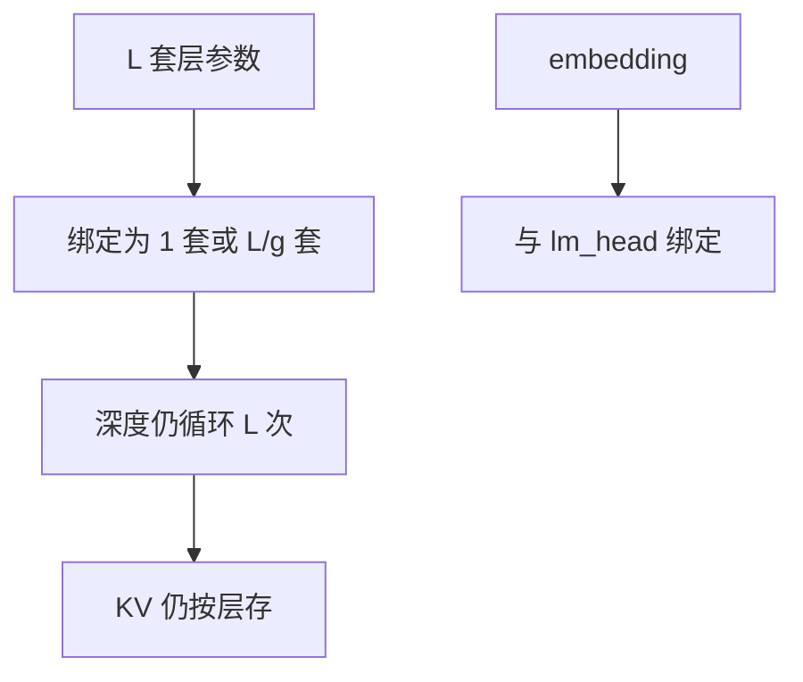

# 权重共享压缩

多层用同一套 FFN，或输入输出嵌入绑成一张表：参数按份数下降，深度变成反复应用，而不是反复存。

<footer>—— Lan et al., ALBERT, ICLR 2020；Dehghani et al., Universal Transformers, ICLR 2019；嵌入绑定见 Press & Wolf, 2017</footer>

[上一课](/llm/vocab-pruning) 减词表行数。本课行还在，**同一参数被多处引用**：层间共享、输入输出 tying。缺口是压缩课序的最后一刀——不剪、不量化、不分解，只让一份 $W$ 服务多次前向。后课 [困惑度评测的陷阱](/llm/perplexity-eval-pitfalls) 会拿 PPL 当压缩验收，本课先声明共享改了有效深度与词表几何，PPL 更不能当充分统计量。

## 问题

$L$ 层独立参数，容量随 $L$ 涨，显存也涨。ALBERT 跨层共享：所有层（或分组）用同一套注意力与 FFN，深度仍在，只是反复应用同一函数。Universal Transformers 把这写成显式循环。Press 与 Wolf、Inan 等人把输入嵌入与输出分类头绑成同一矩阵，立刻去掉一张 $|V|\times d$。问题是：共享之后，层间特化消失，表示必须靠反复迭代与位置信息区分深度；tying 则强迫隐空间与词空间同一套基。

这与 [LoRA](/llm/lora) 的多任务适配器相反：LoRA 是「一份 $W_0$，多份小增量」；跨层共享是「一份层参数，多次前向」。服务时 KV 仍按层缓存——共享不自动减 KV，只减权重加载。

把检查点里的层张量指针指到同一存储，是实现；训练时是否共享梯度，是算法。只在推理把层权重平均起来，没有 ALBERT 的训练动态，质量通常更差。

## 方法

训练期共享：层参数 ident 绑定，优化器只看到一份。可分组共享（每 $g$ 层一套）在容量与深度特化之间折中。嵌入 tying：$\mathrm{lm\_head}=E^\top$（或再加偏置），与词表裁剪兼容——先 tying 再裁行。事后共享：把已训的 $L$ 层平均或用 TIES 合并成一套再循环，属于模型合并向深度轴的迁移，需短愈合，不能当无损压缩。

验收：同等参数的独立层小模型 vs 共享大深度，比的是深度迭代是否换回容量。不要与「7B 共享成一份还叫 7B」混报有效参数。

## 机制

未共享时每层可学不同函数。共享后，一层网络被当成迭代算子 $x\leftarrow f(x)$，位置编码或层下标嵌入若还在，才能让第 $\ell$ 次应用与第 $\ell{+}1$ 次不同。没有层下标，纯共享接近循环，过深会振荡或饱和。tying 让「谁在词表里相近」与「谁在隐空间相近」锁死，对分类头校准有益，对需要把头空间扭开的任务有害。

压缩账：权重字节降，激活与 KV 不降。Decode 带宽墙若由权重主导，共享有收益；若由 KV 主导，收益接近零。这与 MoE「参数大、激活小」对偶：共享是「参数小、激活次数仍多」。

## 边界与工程取舍

不要把层共享写成免费的深度缩放。不要在已经高度特化的推理模型上突然绑层还不愈合。量化应对共享的那一份做一次 [GPTQ](/llm/gptq)，不要按层重复量化同一张量却用不同校准激活。压缩进阶到此结束：下一课起，数字怎么来本身会骗人。

## 小结

- 跨层共享减权重份数，不减 KV；深度变成迭代同一 $f$。
- 嵌入 tying 立刻去掉一张 $|V|\times d$，并锁词空间与隐空间。
- 事后平均层 ≠ ALBERT 式训练共享，需要愈合。
- 报有效参数，不要报「循环次数 × 单层」当独立容量。
- 出处：Lan et al., ALBERT；Dehghani et al., Universal Transformers；Press & Wolf, 2017。
