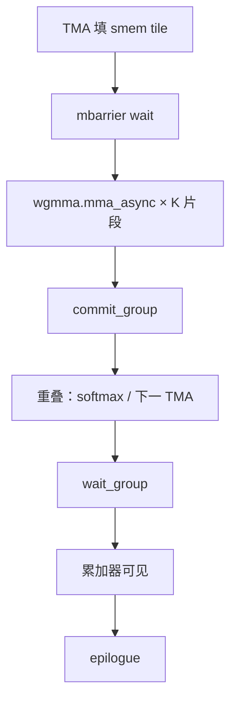

# WGMMA

    
Hopper 的矩阵乘加以 warpgroup 为发行单位：四个连续 warp、128 线程一起发一条异步 MMA，操作数可来自共享内存，完成与后续计算重叠。

    <footer>—— NVIDIA Hopper 架构白皮书与 PTX ISA 中的 `wgmma.mma_async`</footer>

Volta 以来，Tensor Core 的软件接口从 warp 级 WMMA、到 Ampere 的 `mma.sync`，每次都把一块固定形状的 $D=AB+C$ 绑在一个 warp 的寄存器上。Hopper 引入 warpgroup MMA（WGMMA）：以四个连续 warp 组成的 warpgroup 为原子，发出更大的异步 MMA，源操作数 $A$、$B$ 可以直接是共享内存中按约定 swizzle 排好的碎片，而不必先 `ldmatrix` 进全部寄存器。异步意味着 `wgmma.mma_async` 发行后，同一 warpgroup 可以去干 softmax 或其他算术，再用 `wgmma.commit_group` / `wgmma.wait_group` 等待累加器就绪。

本篇写指令合同、形状、异步分组，以及它和 `mma.sync` 的代际差。不编造未公开的发射宽度或每时钟 MMA 条数。产品峰值仍见 [代际对照](/llm/nvidia-gpu-gen) 与 [Tensor Core](/llm/tensor-core)。

## 问题

大 GEMM 要打满 Hopper 的第四代 Tensor Core，需要足够大的 tile 和足够深的重叠。若仍用 Ampere 风格：每个 warp 自己 `mma.sync`，操作数先从 smem 进寄存器，再与 [TMA](/llm/hopper-tma) 在 `__syncthreads` 后串行，则会出现两类浪费。一是 tile 偏小，阵列填不满；二是 MMA 同步等待把 TMA 能藏住的 HBM 延迟重新暴露出来。WGMMA 把「更大的原子」和「异步发行」绑在同一条指令族上，让集体主循环能按 warpgroup 而不是按单 warp 来切 [tiling](/llm/kernel-fusion-tiling)。

合同是硬的。线程必须属于对齐的 warpgroup；寄存器里的累加器碎片布局由指令形状规定；smem 中的 $A$、$B$ 必须是该指令认可的 swizzle 与对齐。布局差一点，PTX 汇编可能失败，或运行时读到错误碎片。问题不是「会不会用 Tensor Core」，而是「能不能合法发出 wgmma」。

### 异步分组在等什么

`mma.sync` 的语义是：指令退休时这次乘加对寄存器可见。`wgmma.mma_async` 把乘加送进 MMA 流水线，可见性延迟到 wait。软件可以把若干次 async 收成一个 group，一次 wait 等待 group 完成。这允许「连发沿 K 的若干 MMA，再一次性等」，与软件流水的 stage 不同：group 管的是 MMA 流水内部的完成，stage 管的是 smem 里哪一块数据合法。两者都要配对，只等一个会要么空转、要么读脏数据。

口语里的 wgmma 与 PTX 助记符 `wgmma.mma_async` 指同一族指令。文档里还有 `wgmma.fence`、`commit_group`、`wait_group` 等配套。只换 MMA 形状、不插入 fence/wait，属于未定义使用，不是「更快的 sync」。

## 方法

合法发射的最小单元是 128 个连续线程（4 个 warp）。CUTLASS sm90 集体把一个消费者角色做成一个或多个 warpgroup，每个 warpgroup 绑定一个 `TiledMma`。形状以 PTX 为准，常见的是 $M=64$ 为粒度，沿 $N$、$K$ 有多种组合，精度包括 TF32、BF16、FP16、FP8 等 Hopper 支持的 Tensor Core 类型。$A$ 可以来自寄存器或 smem，$B$ 通常来自 smem；具体哪一种组合可用，按指令变体查表，不要假设「都能 smem-to-register」。

与 TMA 的衔接：TMA 把下一 $K$ 块写入 smem 并 arrive mbarrier；warpgroup wait barrier 后对当前块连发 wgmma，commit 后不必立刻 wait，可以先发下一 round 或去做 epilogue 的一部分。注意力核把 wait 之后的空档拿去跑 softmax 特殊函数，这是 [FA3](/llm/flashattention-3) 利用率的来源之一，也是 [warp 特化](/llm/warp-specialization) 存在的理由。

### 精度、累加与 FP8

WGMMA 的累加器通常高于输入精度（例如 FP16 乘、FP32 累加），epilogue 再转换写回。FP8 变体要求缩放协议在核外交接或在 epilogue 里应用，指令本身不负责「自动对」Transformer Engine 的 amax。稀疏 2:4 若走对应 MMA 变体，权重必须满足模式；稠密权重发稀疏指令是错误，不是加速。不要把产品表上的稀疏 FP8 峰值写进稠密 WGMMA 核的验收标准。

寄存器预算是实践中的硬顶。Warpgroup 要同时活着：当前累加器、（可选）下一块 $A$ 的寄存器操作数、epilogue 向量。Tile 在 $N$ 上张得太大，寄存器溢出，占用率崩溃，wgmma 峰值反而不达。CUTLASS 的默认 `TiledMma` 已经在这一约束下选过；手写放大 $N$ 必须看编译器报告的寄存器数。

## 机制

WGMMA 快，是因为硬件按固定碎片做密集乘加，并且允许与拷贝、与同一 SM 上其他功能单元重叠。代价是灵活性：不规则稀疏、无法排成碎片的布局、小于一个 warpgroup 的工作，都发不出这条路径。Decode 时 $M$ 很小，即使发出 wgmma，阵列利用率仍低——这是指令峰值与工作形状不匹配，不是 WGMMA 「在 decode 上坏了」。此时更应关心 HBM 与 kernel 启动，见 [显存墙](/llm/decode-memory-wall)。

Warpgroup 内四个 warp 必须同步在同一条 MMA 控制流上。一个 warp 提前 wait、另一个还在发，属于非法使用。这与普通 SIMT 里「有的通道掩掉」不同：MMA 发行是 warpgroup 级动作，不能靠谓词让其中两个 warp 去干别的。要把 softmax 和 MMA 重叠，正确做法是**不同 warpgroup** 之间 ping-pong，或同一 warpgroup 在 wait 之前的空档做不依赖当前累加器的活，而不是拆开四个 warp。

Nsight Compute 上应看 Tensor Pipe 占用，而不是 SM 占用。SM 很忙可能只是在做特殊函数或在等 barrier。Tensor Pipe 接近 0 说明根本没有发出 MMA；中等占用加高等待，说明流水深度或 TMA 跟不上。

### 与 WMMA / mma.sync 的迁移

把 A100 核的 `mma.sync` 循环改名成 wgmma 会失败：寄存器碎片、smem swizzle、同步原语全变。迁移路径是换 CUTLASS sm90 集体，或按 PTX 重写消费者循环。Ada（sm89）有自己的 MMA 集合，也不等于 Hopper wgmma。编译架构必须是 `sm_90` / `sm_90a` 文档要求的那一档；用错 target，链接期或加载期才会暴露。

## 边界与工程取舍

不要在非 Hopper 的卡上假设有 wgmma。不要把 FA3 论文里的注意力调度写成「所有 GEMM 都必须 ping-pong softmax」——那是注意力 SFU 占比高时的特化。不要忽略 `fence` 与 wait 配对。数值验收应用已知矩阵对照 cuBLAS，半精度累加顺序不同会有尾差，应设相对容差，但数量级错误说明布局或 wait 错了。

Blackwell 及之后的 MMA 形状与内存操作数层次会再变；本篇合同停在 Hopper 白皮书与对应 PTX。跨代复用 CUTLASS atom 要按 sm 标签选，见 [CUTLASS 层次](/llm/cutlass)。

出处：Hopper 架构白皮书中的第四代 Tensor Core / warpgroup MMA；PTX ISA 的 `wgmma` 节；CUDA 编程指南的 Warp Matrix / MMA 演进。CUTLASS 3.x sm90 示例给出合法的寄存器与 smem 布局对照。

## 小结

- WGMMA 是 Hopper 上以 4-warp 为单元的异步矩阵乘加，操作数可直接来自约定布局的共享内存。
- 完成靠 commit/wait group，与 TMA 的 mbarrier 是不同的流水；两者都要配对。
- 形状、swizzle、warpgroup 对齐是硬合同，抄 Ampere `mma.sync` 循环不成立。
- 小 $M$ 的 decode 即使用上 wgmma 也打不满阵列；峰值表不能当 decode SLA。
- 与 softmax 重叠应在 warpgroup 之间或 wait 前的空档，不能拆开 warpgroup。
- 出处：Hopper 白皮书与 PTX `wgmma.mma_async` 文档。
