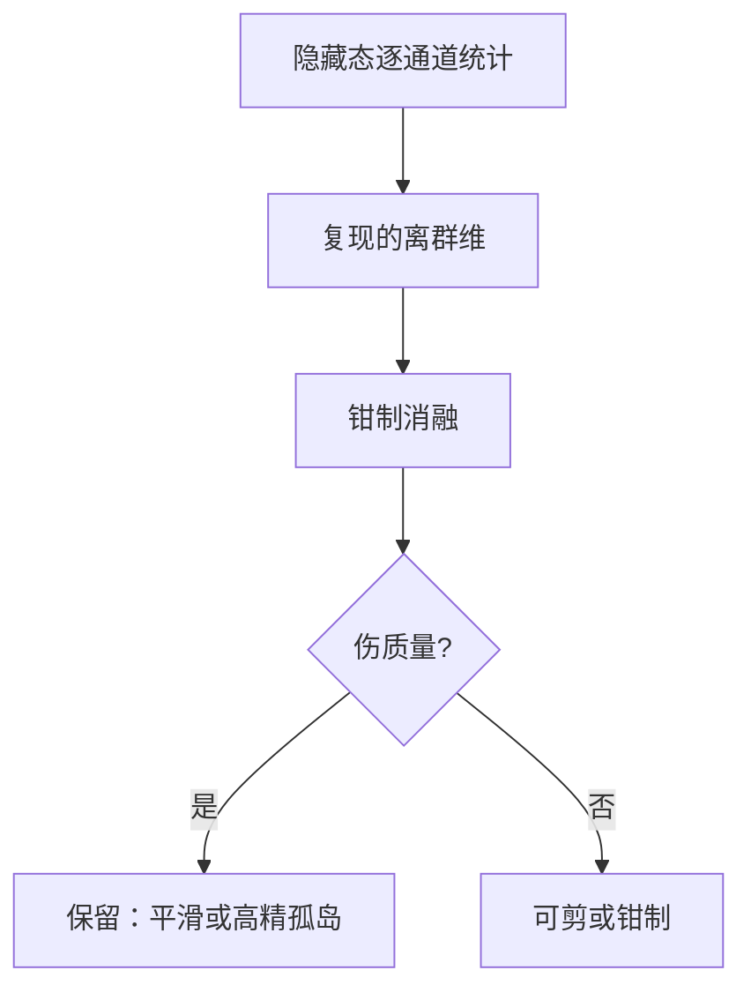

# 激活离群值为何出现

少数通道的激活幅度比其余大上两个数量级时，按张量统计的量化器会为这几根钉子付出全部的格子，其余通道挤在零附近。

<footer>—— 对照 SmoothQuant、LLM.int8() 对激活离群通道的观察；不是权重量化课的重复</footer>

[上一课](/llm/draft-as-compression) 把投机草稿写成对下一步分布的有损压缩。本课转到**同一张网内部**为何难压：激活（以及部分权重行）出现离群通道，使按张量或按 token 的均匀量化失效。结构剪枝课已经能删宽、删层；它们不解释「为什么 8bit 激活在某几维炸」。后课量化与剪枝的分工默认你会：离群是统计现象，有结构来源，不是随机坏点。

## 问题

LLM 的 FFN 与注意力输出里，常有极少数 hidden 维在很多 token 上同时取极大值。LLM.int8() 把它们当「新兴维度」单独留精度；SmoothQuant 把量化难度从激活挪到权重。现象先于方法：若激活近似高斯，INT8 格子够用；若第 $99.9$ 百分位是均值的 $50$ 倍，格子全被这根钉占用，其余维量化成零，质量崩在看似「只有 0.1% 异常」上。

缺口是 **为什么训练会长出钉子**，而不是又一篇 INT8 配方。来源候选包括：RMSNorm / LayerNorm 的尺度、残差累积、词嵌入与 lm_head 的未归一化方向、RoPE 与长上下文、以及 MoE 共享通路上每个 token 都打到的通道。搞清来源，才能决定是平滑、旋转、剪掉该通道，还是承认它在承载功能不能动。

### 离群不是噪声，常常是功能

若某通道在「句首 / 标点 / 特殊 token」上系统激活，它可能在当位置或分隔符探测器。剪掉或钳制会伤格式。若只在某几层、某几个专家上出现，可能是路由或残差的尺度事故，钳制更安全。诊断要看 **哪些 token、哪些层、是否跨数据域稳定**，不能只看一张激活直方图。权重离群与激活离群相关但不等同。某权重行很大，会把对应激活推大；激活离群也可以来自输入方向碰巧对准一个并不算大的权重。SmoothQuant 的迁移假设「迁移后权重仍可量化」；若权重已经处于离群，迁移只是把钉子换边。

## 方法

### 测量、阈值与钳制消融

测量：对校准集记录每层每通道的 $\max |h|$、RMS、以及跨 token 的出现频率。离群通道定义为相对中位 RMS 超过阈值（如 $10\times$）且在高比例 token 上复现。再做消融：将该通道在前向钳制到中位，看 CE 与下游。CE 几乎不变则更像尺度冗余；显著变差则像功能维。

与归一化：Pre-LN 残差流的尺度由各子层输出累加。若某子层不遵守「输出 $O(1)$」，钉子会沿深度放大。μP 与残差缩放课管训练期；已经训完的模型，钉子是既成事实。QAT 可以从小重建尺度，但贵。推理期平滑（逐通道缩放 $h\leftarrow h/\sigma,\ W\leftarrow W\sigma$）不改变数学函数（在无限精度下），只改变哪一侧更好量化。

## 机制

一个有用的图像：残差流里少数方向承担「通配符计数器」或「注意力汇」——很多 query 都要读的全局位。训练没有稀疏惩罚时，把这种全局位塞进单通道比散到多通道更省参数，优化器会找到这个解。于是离群是 **压缩功能到低维** 的副作用，与模型「太大」无关，小模型也会有，只是大模型上更刺眼因为你开始量化。

长上下文与 RoPE：某些通道可能编码幅度极大的相位，外推失败时激活爆炸，离群变成长度相关。这与短校准集上看到的钉子集合不同。校准必须覆盖目标长度，否则 SmoothQuant 的 $\sigma$ 估错，线上长请求才炸。

MoE [共享专家](/llm/moe-shared-routed-size) 的离群会被每个 token 打到，量化误差变成全局的；路由专家的离群只打中被选 token，误差呈稀疏。共享通路更应保留精度或做逐通道平滑。配比 $\rho$ 大，问题更像稠密模型。

### 与 LayerDrop、剪枝的交叉

若离群集中在即将被[层剪](/llm/layer-prune)删掉的块里，先剪层再量化，钉子可能消失。若钉子在底层嵌入几何，剪中间层无济于事。顺序应是：测钉子位置 → 再决定剪深度还是平滑激活。随机先量化再抱怨 INT8 不行，是把诊断顺序走反。

## 边界与工程取舍

钳制训练（activation clipping）可减少钉子，但改变函数，需要续训。只在推理钳制而不续训，等于给网络加了一个校准集上拟合的非线性，域外 token 会把别的通道顶成新钉子。旋转 / 正交变换（如某些量化前处理把离群打散到多维）对「少数通道极大」有效，对「所有通道都有中等厚尾」无效。先看谱再选工具。

不要把视觉 token、音频码的动态范围和文本隐藏态混成一张表。多模态早融合里视觉前缀的离群统计可以完全不同，共用一组 SmoothQuant 系数会牺牲其中一模态。分模态、分层校准。

本课不给出「离群的第一条数学定理」。经验机制足够指导压缩顺序：测量、消融、再平滑或剪。把钉子神秘化成模型觉醒，对工程无帮助。

## 小结

- 激活离群是少数高频、高幅度通道，破坏按张量量化的格子分配。
- 先测 token / 层 / 域上的复现，再消融判断功能维还是尺度事故。
- 来源常与残差尺度、全局位压缩、长上下文、共享专家有关。
- 平滑迁移钉子到权重侧；功能维应留精度而不是剪掉。
- 校准覆盖目标长度与模态；顺序是诊断再压缩。
- 出处：LLM.int8()、SmoothQuant 等对离群通道的实证；结合残差与 MoE 配比。
