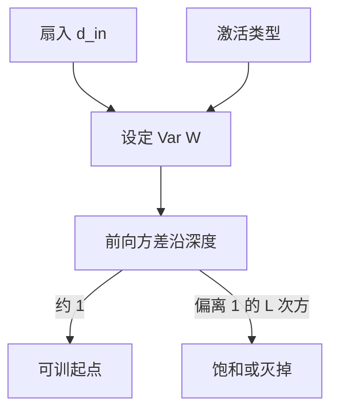

# 初始化为何需要

随机权重的尺度决定前向方差沿深度是爆还是灭；初始化不是「随便给个数」，而是把每层增益放在 $1$ 附近。

<footer>—— 据 Glorot &amp; Bengio, Understanding the Difficulty of Training Deep Feedforward Neural Networks, AISTATS 2010；He et al., Delving Deep into Rectifiers, ICCV 2015 整理</footer>

[激活：ReLU 与饱和](/llm/activation-relu-saturation)选定了 $\sigma$。本课不重画分段线性。缺口是：$W$ 若按过大的方差抽取，前向 $\|h\|$ 爆炸、激活饱和；过小则信号灭掉、反向一并消失。优化课的 $\eta$ 管一步有多长，不管第一步站在哪。方法是按扇入 / 扇出设 $\mathrm{Var}(W_{ij})$，使每层输出坐标的方差大致保持。残差与 LayerNorm 会放宽这条，但不会让「全零或过大」变得合法。

## 问题

全零初始化使对称的神经元收到同一梯度，永远无法分化——对称性打破必须靠随机。但随机的尺度是自由量。考虑一层 $y=Wx$，$x$ 各维独立、方差 $v$，则 $\mathrm{Var}(y_i)\approx d_{\mathrm{in}}\,\mathrm{Var}(W_{ij})\,v$。要 $\mathrm{Var}(y)\approx\mathrm{Var}(x)$，需 $\mathrm{Var}(W_{ij})\approx 1/d_{\mathrm{in}}$。ReLU 丢掉约一半能量，He 初始化改成 $2/d_{\mathrm{in}}$。缺口不是再选一种 $\sigma$，而是承认深度把每层方差误差同样做成指数，与梯度连乘是同一类 $\rho^L$。

「从预训练加载」也是初始化：后层看见的尺度已经被前层与归一化钉死。从零训练时没有这份礼物。本课针对从零开始的前馈栈。

### 初始化不是把权重归一化成单位范数这么一次

把每行除以范数，只能管住起始瞬间的 $\|W\|_2$，训练几步后尺度由更新决定。初始化理论管的是**起点与早期**的信号传播，不是全程约束。全程约束是权重衰减、LayerNorm、残差。把初始化理解成「替代归一化层」，后课会显得重复。相反：初始化错了，归一化也救不了已经饱和或已经 NaN 的第一步。

偏置通常初值为 $0$。输出层有时按类先验设 $b$，使初始 softmax 接近数据频率，减少早期交叉熵的无谓大梯度。那是细节；本课的主杠杆仍是 $W$ 的方差。

## 方法

Glorot（Xavier）：均匀或高斯，方差 $2/(d_{\mathrm{in}}+d_{\mathrm{out}})$，兼顾正向扇入与反向扇出。He：ReLU 用 $2/d_{\mathrm{in}}$。实现上 `kaiming_uniform_` 一类按层类型与 $\sigma$ 查表。嵌入表常用更小的标准差，避免初始查找向量过大。所有方案都假定坐标近似独立、激活近似按期望工作；深度极大或高度相关时只是粗路标。

## 机制

初始化把每层的典型增益放到 $1$ 附近，使 $\rho^L$ 在早期不立刻崩。它不保证训练过程中增益一直为 $1$：那要靠残差的恒等支路、靠归一化把激活重新拉回。但若起点已经饱和，梯度从第一步起就是 $0$，自适应优化器也无计可施。因此「先能把损失算出来且梯度非零」，是初始化的验收标准，比「符合某篇论文的精确系数」更优先。

与 $\eta$ 的耦合：初始梯度范数随 $W$ 的尺度变。同一 $\eta$，He 与过大方差的高斯不可互换。改初始化之后要重扫 $\eta$，不要只改其中一项就比较曲线。

## 边界

本课不推导均值场的完整递归，不写正交初始化的全部定理。下一课[参数量：深度与宽度](/llm/params-depth-width)假定网络已经能训起来，问容量花在加层还是加宽。后课默认：从零训练的线性层按激活选择扇入缩放；禁止全零权重。

## 小结

- 随机初始化为了破对称；尺度为了让每层方差沿深度既不爆也不灭。
- Glorot / He 把 $\mathrm{Var}(W)$ 设成 $1/d_{\mathrm{in}}$ 量级，ReLU 再乘 $2$。
- 初始化管起点，不替代全程的归一化与残差。
- 改初始化要连学习率一起看。
- 出处：Glorot &amp; Bengio, AISTATS 2010；He et al., ICCV 2015。
