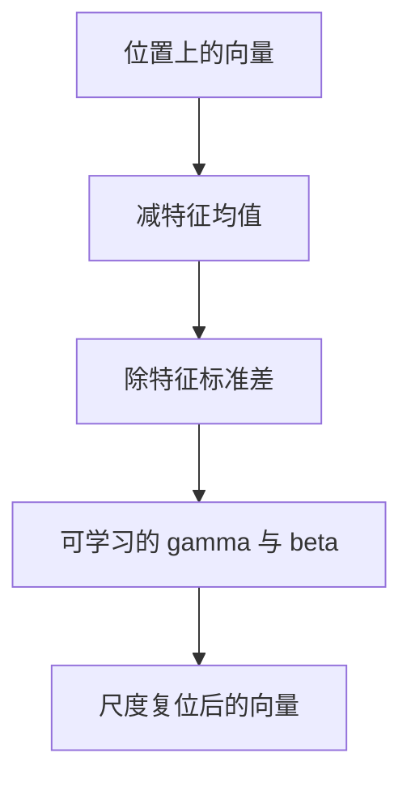

# LayerNorm 的动机

残差保证有路可走，不保证路上的向量尺度稳定；按特征维减均值除标准差，把每个位置重新放到可比的量级。

<footer>—— 据 Ba, Kiros &amp; Hinton, Layer Normalization, 2016 整理</footer>

[残差的动机](/llm/why-residual)给出 $h+f(h)$。本课不重画旁路。缺口是：沿深度把许多 $f$ 加回去，$h$ 的均值与范数会漂移；点积打分、激活的工作区都对尺度敏感。批归一化按批统计，对变长序列、对小 $B$ 不稳定。方法是 LayerNorm：在每个位置的特征维上独立地标准化。本课只讲动机与接口，不把 RMSNorm、Pre-LN / Post-LN 的全部变体写完。

## 问题

残差把增量加回 $h$。若 $f$ 的输出均值为正或范数大于 $1$，深度个加法之后 $\|h\|$ 可以单调涨。softmax 与点积会饱和，学习率失去意义。初始化只能管起点。缺口是一个在每层（或每块）可重复的复位：不依赖批里其他样本，不依赖序列里其他位置，只看当前向量的 $d$ 个坐标。

BatchNorm 用批内同一通道的统计量。语言模型的 $B$ 可以很小，长度不同，填充位置会污染均值；推理时还要维护滑动平均。LayerNorm 的统计量来自单一样本的特征维，训练与推理一致。这是序列模型更常用它的原因，不是因为它「总是比 BatchNorm 准」。

### LayerNorm 不是「把向量变成单位长度」这么一次

减均值再除标准差之后，结果仍可再乘可学习的 $\gamma$、加 $\beta$。模型可以恢复尺度与偏移；归一化强迫的是**内部**先居中、先单位方差，再允许仿射。只除 $\ell_2$ 范数（不做减均值）是另一算子，后课 RMSNorm 走那条，本课不提前替换。也不要把 LayerNorm 当成损失上的约束：它是前向里的一层，有自己的反向。

对 $x\in\mathbb{R}^d$，$\mu=\frac{1}{d}\sum_i x_i$，$\sigma^2=\frac{1}{d}\sum_i(x_i-\mu)^2$，$\hat x_i=\gamma_i\frac{x_i-\mu}{\sqrt{\sigma^2+\varepsilon}}+\beta_i$。$\varepsilon$ 防止除零。$\gamma,\beta$ 与 $d$ 同形，按位置广播。

## 方法

输入形状 $(B,n,d)$，LN 在最后一维上算 $\mu,\sigma$，输出同形。放在残差块里有两种常见秩序：先 LN 再 $f$ 再相加（Pre-LN），或先 $f$ 再相加再 LN（Post-LN）。Pre-LN 让 $f$ 吃到尺度稳定的输入，深层往往更好训；Post-LN 让块输出被重新标准化。本课不裁定唯一正确；后课读结构图时要看 LN 画在加号前还是后。

## 机制

LN 把「绝对尺度」从残差流里拿走，留给 $\gamma$ 去学相对尺度。点积的输入不再随深度漂到几十，softmax 更不容易无故饱和。它也引入新的依赖：每个坐标的输出依赖该位置上所有坐标的统计量，反向会有对应的耦合。这通常可接受。LN 不能替代残差：没有加法旁路时，深层增益连乘仍在；LN 管的是每一步的工作点，不管路径拓扑。

$\varepsilon$ 过小，某位置特征几乎常数时除零风险上升；过大则标准化变弱。这是数值地板，不是新的归纳偏置。LN 对每个位置独立，因此不能在位置之间传递「这一批有多亮」——那是 BatchNorm 的能力，也是它在小 $B$ 上不稳的原因。序列模型用 LN，是在放弃跨样本统计，换取长度与批大小无关。

与权重衰减的互动：$\gamma,\beta$ 是否衰减会影响尺度自由度。常见做法是不衰减 LN 的仿射参数，与偏置类似。

## 边界

本课不写 RMSNorm 的公式对照，不讨论跨设备的统计同步。下一课[Dropout 直觉](/llm/dropout-intuition)是正则，不是归一化。后课默认：序列模型的块内用 LayerNorm 复位特征尺度；残差相加与 LN 的顺序要在结构里写明。

## 小结

- 残差加法会累积尺度；LN 在每个位置的特征维上减均值除标准差。
- 统计量不依赖批，适合变长序列与小 $B$。
- $\gamma,\beta$ 允许恢复仿射；LN 不是死钉单位范数。
- Pre-LN / Post-LN 改变 $f$ 看见的尺度，需在图上标明。
- 出处：Ba, Kiros &amp; Hinton, 2016。
