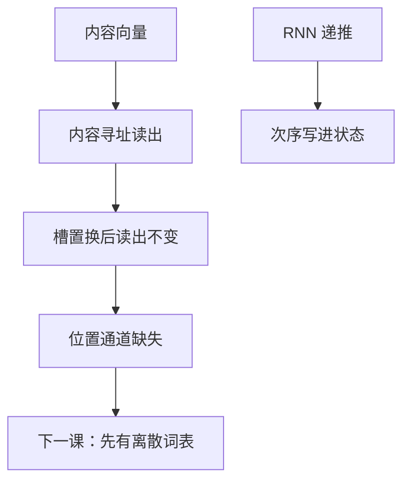

# 位置还没进模型

内容寻址按槽里的向量来读，不按槽的排列次序来读；把序列打乱，只要内容不变，加权和可以不变。

<footer>—— 据 Vaswani et al., Attention Is All You Need, NeurIPS 2017 整理</footer>

[从加性注意力到点积](/llm/additive-to-dot-product)把匹配收成内积。本课不写 $\sqrt{d}$。缺口是：纯内容读取对记忆槽的**排列**不敏感。RNN 用时间导线把次序写进状态；一旦读取变成对集合做加权和，「谁在谁前」必须另有通道。本课是深度学习基础的最后一课：把「位置还没进模型」收成明确缺口，交给主干第一课[离散符号与词表](/llm/token-as-discrete-unit)。不在这里讲正弦位置编码，不重写 BPE，不讲完 SDPA。

## 问题

注意力读出 $c=\sum_j\alpha_j v_j$，$\alpha=\mathrm{softmax}(s(q,k_{\cdot}))$。若对槽做置换 $\pi$，同时把 $k,v$ 按 $\pi$ 重排，分数跟着走，$\alpha$ 重排，$c$ 不变。对无序集合这是优点；对语言是缺陷：「狗咬人」与「人咬狗」可以只有次序不同。RNN 编码器的 $h_j$ 因递推而含有「到过 $j$」的痕迹，因而**间接**携带位置。一旦后课用自注意力替换递推，这条间接通道消失，置换不变性变成硬问题。

缺口因此不是词表有多大，而是：符号序列的对象还缺「第几位」。内容向量只回答是什么，不回答在哪。本课停在这一判断。注入位置的方法——可学习表、正弦、旋转——属于主干位置课序，这里不展开公式，以免基础课吞掉后面的课。

### 位置不是子词切分

切分改变粒度与长度，不给片段编号赋予几何。BPE 合并表也不编码「第 $i$ 个 token」。把「还没有位置」理解成「还没有词表」，会在下一课重复讲离散符号。下一课要钉的是有限 $V$ 与 id；位置是 id 序列之上的第二件事。本课明确交给词表课的，是「现在我们有向量、有注意力接口、仍缺离散符号协议与位置协议」之中的前半——后半由位置课序接着。不要在本课写 byte-pair 算法。

RNN 不是置换不变的：倒序输入会得到不同的最终状态。这就是它「免费」携带位置的方式，也是并行化的障碍。注意力并行换来的，正是必须显式补上的位置。

## 方法

盘点基础课已经交给主干的对象：张量形状、线性层、对数空间的下一词损失、反向与残差、查找表、门控递推、内容寻址与点积匹配。尚未交给的：token 如何从文本切出、$V$ 如何封闭、位置如何进入 $q,k$ 或残差流。本课只把最后一项标成「缺」。阅读约定：后课若用自注意力，必须假设位置已经或将要被注入；若仍用 RNN，位置可以暂时靠递推。

## 机制

置换不变来自求和与按内容的权重，与加性还是点积无关。任何只依赖 $\{k_j,v_j\}$ 集合的读取都一样。要打破不变性，必须让 $s(q,k_j)$ 或 $v_j$ 依赖 $j$ 本身：绝对下标、相对距离、或递归状态。RNN 选了第三条。Transformer 主干将选前两条之一。本课不替主干做选择，只禁止假设「有了点积就有了语序」。

相对距离若只在打分里出现（「键在查询左侧多少步」），仍是位置通道，只是不把绝对下标写进向量。本课连这种形式也不展开，以免变成位置课序的缩写。需要记住的只有：没有其中任何一条，模型看见的是词袋式的槽集合。

与下一课的衔接：没有离散词表，位置下标没有对象——「第 $i$ 个」必须先有第 $i$ 个符号。所以主干从符号与 $V$ 起笔，而不是从位置编码起笔。本课把顺序说死：先有可编号的原子，再谈原子站在哪。

## 边界

本课不推导 RoPE，不写正弦公式，不重写 BPE / UNK / 词表大小。下一课[离散符号与词表](/llm/token-as-discrete-unit)是「表示与 Transformer 块」的第一课，默认读者已读完深度学习基础。后课默认：纯注意力读取不含语序；语序要么来自递推，要么来自显式位置通道。五栏之内，这里不进入限价簿、不进入光刻、不把权重量化写成「量化」。

## 小结

- 内容寻址对槽的排列不变；语言需要次序。
- RNN 把次序写进状态；替换成注意力后必须另开位置通道。
- 位置不是分词算法；切分不提供下标几何。
- 下一课先建立有限离散词表，位置在更后面的课序注入。
- 出处：Vaswani et al., NeurIPS 2017（对位置编码必要性的论述）；本课不展开其公式。
