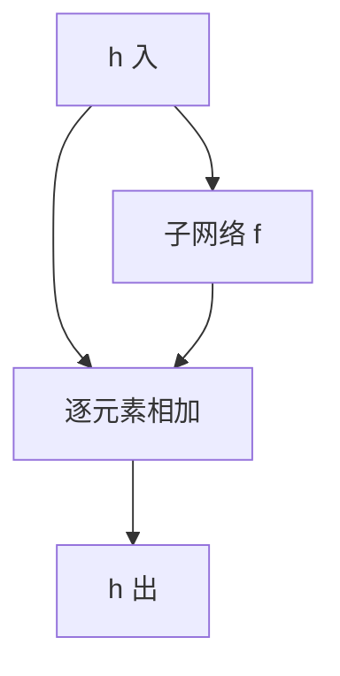

# 残差的动机

若恒等已经够用，让层去拟合增量比强迫它拟合整份映射更容易；旁路把反向增益钉在 $1$ 附近。

<footer>—— 据 He et al., Deep Residual Learning for Image Recognition, CVPR 2016 整理</footer>

[参数量：深度与宽度](/llm/params-depth-width)指出：普通栈加层会让**训练**误差变差，那不是过拟合。本课不重记账。缺口是：如何让深度增加时，至少存在一条增益为 $1$ 的路径，使优化可以选择「这一层什么都不做」。方法是残差：$h_{\mathrm{out}}=h_{\mathrm{in}}+f(h_{\mathrm{in}})$，其中 $f$ 是带非线性的子网络。LayerNorm 是下一课；本课只钉住加法旁路。

## 问题

退化现象：更深的普通 MLP 或卷积栈，连训练集都拟合得更差。若只是容量不足，更深应至少不更差——可以把后加的层学成恒等。普通层学恒等并不容易：$W=I$、$\sigma$ 还在、初始化离 $I$ 很远，反向路径仍是 $\rho^L$。缺口不是再加宽，而是改参数化：把目标从「学 $H(x)$」改成「学 $H(x)-x$」，恒等对应 $f=0$，而 $f=0$ 与「小权重」一致，靠近初始化。

残差不消除过拟合，也不自动给出注意力。它只保证：前向可以走 $x$ 本身，反向可以把上游梯度原样加到 $x$ 上（加法结点的分流）。$f$ 支路上的增益仍可消失，但不再是唯一路径。

### 残差不是「把两层输出拼在一起」

拼接改变形状，通道数增加，不是恒等旁路。逐元素相加要求 $f(x)$ 与 $x$ 同形；若宽度变化，要用投影把 $x$ 映到同一维再加，投影本身又可以是带或不带非线性的线性层。把残差画成 concat，后课的 $d_{\mathrm{model}}$ 残差流会对不上。也不要把残差理解成集成多个模型：共享的是同一条流上的增量，不是平均几个独立网络。

反向：$\partial L/\partial x=\partial L/\partial h+\partial L/\partial f\cdot\partial f/\partial x$。第一项是恒等。即使 $f$ 的 Jacobian 很小，第一项仍在。这就是对消失的结构解，与裁剪不同。

## 方法

块：$h\leftarrow h+f(h)$，$f$ 通常是两层仿射夹一个激活（预归一化变体把 Norm 放在 $f$ 前，下一课）。形状 $(B,n,d)$ 在块的两端不变，这就是「残差流」。深度变成块的个数；每块可以选择贡献接近 $0$ 的 $f$。初始化 $f$ 的最后一层接近 $0$，能让起点更接近恒等，是常见技巧，不是定义的一部分。宽度中途改变时，旁路要先投影再加，投影本身应尽量接近恒等。

## 机制

优化看到的损失对 $h_{\mathrm{in}}$ 的梯度始终含一项「跳过 $f$」。浅层因此能收到顶层信号，即使中间 $f$ 饱和。前向上，若 $f$ 初期很小，表示不会每层翻倍，缓解爆炸。He 等人的实验是：普通栈在某深度之后训练误差升高，残差栈可以继续降。这验证的是可训练性，不是「残差一定泛化更好」——泛化仍看验证集。

$f$ 内部仍可以消失：若 $f$ 极深且无自己的旁路，增量支路学不动，块退化成近似恒等，深度的表达力用不上。因此残差块里的 $f$ 通常很浅（两层卷积或两层仿射），深度靠堆块而不是靠加厚单个 $f$。这与「更深总更好」并不矛盾，只是深度必须长在带旁路的骨架上。

残差与宽度的配合：流的宽度 $d$ 必须稳定，才能一路加下去。MLP 里 $f$ 可以内部加宽到 $d_{\mathrm{ff}}$ 再投回 $d$。预算仍按上一课来记，只是现在加层不再默认导致退化。

## 边界

本课不写 LayerNorm 公式，不写 Transformer 块的完整顺序。下一课[LayerNorm 的动机](/llm/why-layernorm)管的是流上的尺度，不是旁路本身。后课默认：深层前馈用残差块，$h$ 的形状在块间保持；说到「退化」，指无旁路的训练误差升高。密集连接或公路网络是旁路的变体，本课不并列展开。

## 小结

- 普通深栈出现训练误差升高，因为层很难学恒等，$\rho^L$ 仍在。
- 残差改学增量，$f=0$ 即恒等；反向含一条增益为 $1$ 的路。
- 相加不是拼接；形状必须对齐。
- 残差解决可训练性，不自动解决过拟合。
- $f$ 宜浅、深度靠堆块，避免增量支路自己消失。
- 出处：He et al., CVPR 2016。
