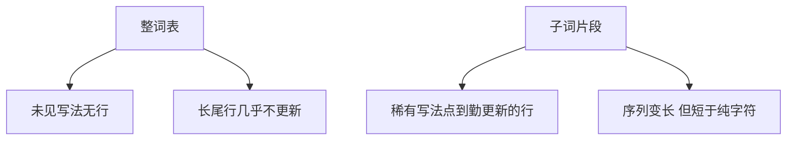

# 子词的动机

整词词表把未见过的写法当成全新符号，梯度到不了那一行；切成可组合的短片段，让稀有写法去点那些更新更勤的行。

<footer>—— 据 Sennrich, Haddow &amp; Birch, Neural Machine Translation of Rare Words with Subword Units, ACL 2016 整理</footer>

[负采样](/llm/negative-sampling)让大词表上的训练算得动。本课不重写 $k$ 个负例。缺口是：即使算得动，**整词** $V$ 仍有两处硬伤——未登录词没有行，稀有词形的行几乎不更新。方法是改粒度：把词切成子词，使新写法由旧片段拼出。本课只讲动机；BPE 的合并算法、词表大小与 UNK 协议，是主干课[离散符号与词表](/llm/token-as-discrete-unit)之后的事，这里不重写。

## 问题

skip-gram 给每个词型一行。语料里出现一次的姓名、拼写变体、形态变化，各自占一行，梯度只来自那一次窗口。未见过的词在推理时没有行——one-hot 与查找表都无法索引。放大 $|V|$ 只是把更长的尾巴收进来，永远有更长的尾巴，内存按 $|V|d$ 涨。缺口不是再换 NEG 的 $k$，而是让不同词型**共享**片段对应的向量，使「第一次见到的复合写法」仍能查到若干已训练的行。

形态丰富的语言、代码标识符、数字，最能暴露整词假设的失败：人能从词缀与词根读出结构，整词表把结构当成新原子。子词把这条结构暴露给查找表，而不需要句法树。

### 子词不是字符级模型的同义词

每个字符一行也能覆盖未登录写法，但序列变长数倍，窗口与后来的 RNN 都更难捕获词级共现。子词介于词与字符之间：常见词往往整块保留，罕见词才被拆开。这是数据驱动的折中，不是「越短越好」。把动机理解成「全部切成字节」，后课词表压缩与长度预算会对不上。本课也不把某一套合并规则写成唯一实现。

共享片段意味着同一行会被许多词型点到，更新更勤——与嵌入查找课「长尾行学不透、短符号行更新勤」是同一现象的预告。本课只给动机，不定义 gather。

## 方法

选定一个有限的片段词表 $V_{\mathrm{sub}}$，切分函数把字符串映到 $V_{\mathrm{sub}}$ 上的序列。训练与推理用同一套切分，保证往返协议稍后可以讨论。模型看见的是片段 id 序列，不再看见「词」这一层（除非切分碰巧把整词留下）。分布假设改在片段上：共现窗口可以跨过原来的词边界。这会把词内结构与词间句法混在同一窗口里，是代价，也是覆盖未登录的来源。

## 机制

覆盖来自组合：新词若由旧片段拼成，嵌入几何至少有各片段的向量可加或可拼接（如何聚合成词向量是后话；序列模型干脆不再聚合，直接把片段当时间步）。统计来自共享：高频词缀的行被反复更新，低频词干也能搭车。失败模式：切得过碎，窗口装不下原来的句法邻域；切得过粗，未登录仍大量出现。动机课只要求承认这条权衡存在。

同一字符串的切分必须在训练与推理上一致，否则查找表的行对不上，往返也无法定义。这是协议，不是模型容量。词表 $|V_{\mathrm{sub}}|$ 越大，整词越容易被留下，未登录越少，但嵌入表内存按行数涨，且长尾行又回来。动机是把「无限词型」换成「有限片段上的序列」，具体数字交给主干词表课。

数字与代码往往被拆成字符或字节级片段，这是整词假设在开放词类上的必然，不是分词 bug。人名与 URL 同理：第一次出现也必须能切出已有行，否则又回到 UNK 一条向量扛所有未知。

## 边界

本课不写出 BPE 的 pair 统计与合并表，不讨论 byte fallback。下一课[嵌入作为查找](/llm/embed-as-lookup-motive)假定已经有有限 id，把表示收成 gather。主干的词表课会从离散符号重新起笔；本课只在深度学习基础里留下「为何不要死守整词」这一缺口。后课默认：开放词汇需要子词粒度；具体算法不在本课。字符 CNN 或混合切分是其它组合方式，同样服务于覆盖，不在此并列。

## 小结

- 整词表无法索引未登录写法，长尾行学不透。
- 子词让稀有写法复用频繁更新的片段行，序列长度介于词与字符之间。
- 动机是覆盖与共享，不是某一种合并算法。
- BPE 与 UNK 协议交给主干词表课，本课不重写。
- 训练与推理必须共用同一套切分，否则行对不上。
- 出处：Sennrich, Haddow &amp; Birch, ACL 2016。
