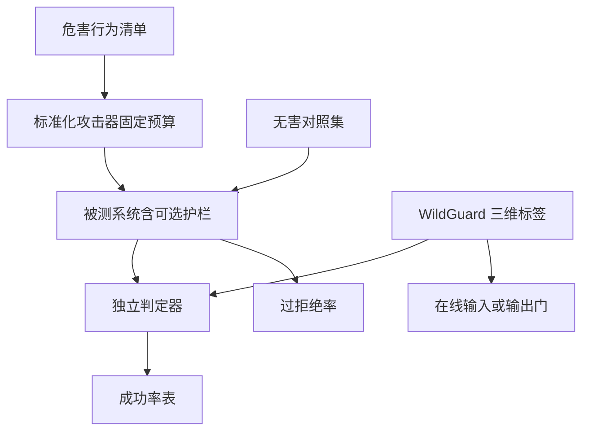

# WildGuard / HarmBench

没有共享的危害分类与标准化攻击预算，每篇论文的「越狱成功率」都不可比；护栏模型则需要同时标清提示有害、回答有害、以及助手是否在拒绝。

<footer>—— Mazeika et al., HarmBench；Han et al., WildGuard</footer>

安全论文很容易自说自话：各自的提示集、各自的「成功」定义、各自的攻击步数。HarmBench 把自动化红队收成一套固定的危害行为、标准化的攻击器与判定器，使防御可以在同一张表上比。WildGuard 则针对「开源护栏数据又窄、标签又混」：它要一个分类器同时回答三件不同的事——用户提示是否有害、模型回答是否有害、模型是否在拒绝——以免评测把拒答、配合、过拒绝搅在一个准确率里。本篇写这两套工具在评测栈里的位置与如何误用；不收录基准里的具体危害行为描述，不复述攻击器内部的可执行配方。

## 问题

防御声称「GCG 成功率从 A 降到 B」，若 A 的后缀长度、步数、目标开场、判定方式与 B 不同，数字无意义。人工红队不可复现、覆盖随写手变化。需要：一份行为清单（要测哪些不允许的帮助）、一组公开实现的攻击器（在固定预算下跑）、一个判定模型或规则（输出是否构成该行为）。HarmBench 的问题设定就是把这三项钉死，让「鲁棒性」成为可重复的实验，而不是演示。

护栏模型的问题不同。训练数据若只标「整段对话坏不坏」，模型分不清：该拦用户、该拦助手、还是助手已经在拒仍被当成有害。评测过拒绝时，又需要知道「无害请求被拒」与「有害请求被拒」的差别。WildGuard 把标签拆成三维，使同一条样本能监督三种头，也使评测能报三个 F1，而不是一个含糊的 safety accuracy。

### 判定器与被测模型必须隔离

用被测模型自己判断「我有没有配合」，会系统性低估越狱：它刚被诱导配合，再问它是否有害，答案不可信。HarmBench 强调独立判定。WildGuard 可作为这种判定器或护栏本身，但若它与被测模型同族、同数据，转移风险要另报。原则是：生成、攻击、判定三者尽量异构。

基准会过时。新的越狱族（长上下文、多模态、工具调用）若未进当前版本的攻击器列表，表上的「已防御」只对表内威胁成立。写论文应声明版本与覆盖缺口。

## 方法

HarmBench 侧：选定标准行为集，对每个行为跑若干标准化攻击（含优化类与模板类，具体名单以原文为准），在固定查询次数或优化步数下取成功与否，由判定器打分。防御方法作为被测系统的一部分接入：可以是生成模型本身的对齐、可以是[Llama Guard](/llm/llama-guard) 式过滤器、可以是[Circuit Breaker](/llm/circuit-breaker)。报告应给全表，而不是只给自己最强的那一列。WildGuard 侧：用多样的真实与合成对话训练三路分类，推理时对提示、回答、拒答标记分别输出。它既可当在线护栏，也可当离线评测的标注器。

二者常一起用：HarmBench 出攻击与行为定义，WildGuard 或 HarmBench 自带判定器打标签，Llama Guard、[宪法分类器](/llm/constitutional-classifiers) 当防御层。比较防御时，攻击器与判定器保持不变，只换防御层——这是唯一公平的消融。

### 三维标签如何避免评测塌缩

提示有害而回答拒绝：防御成功，不是「有害对话」。提示有害而回答配合：攻击成功。提示无害而回答拒绝：过拒绝。提示无害而回答有害：模型主动泄漏或幻觉，不是越狱诱导。把这四格压成一个准确率，会让「全拒」系统看起来完美。WildGuard 的拆分迫使报告四格。HarmBench 的行为是「是否完成了不允许的帮助」，主要填「有害提示下是否配合」这一格；过拒绝要另接无害集。完整评测栈两套都要。

## 机制

HarmBench 的机制是实验设计：把攻击看成对系统的预言机查询，预算是超参，成功率是预算下的期望。它不声称穷尽一切威胁，它声称**在声明的威胁模型内可比**。标准化攻击器里包含梯度优化类（与 [GCG](/llm/gcg-suffix) 同族）时，白盒假设必须写进表头；只暴露采样的系统应走黑盒攻击列，不要用白盒数字自我表扬。

WildGuard 的机制是多任务监督。拒答检测特别关键：许多生成模型的拒答是软的（警告后仍给步骤），关键词「我不能」会假阳性。把「是否拒绝」交给专门头，可用语义而不是套话。训练数据覆盖野生越狱与良性安全讨论，是为了降低对实验室提示的过拟合。即便如此，它仍是分类器，对[多模态](/llm/multimodal-jailbreak) 与超长 [many-shot](/llm/many-shot-jailbreak) 的覆盖取决于数据是否包含这些通道。

用 WildGuard 训练另一个 WildGuard，或用同一判定器既选超参又报最终数字，会泄漏。应冻结判定器版本，另留盲测行为子集。

### 误用方式

只报平均成功率、不报按行为类别的分桶，会掩盖「某一类完全没防住」。只跑最弱的攻击器、关掉优化类，会高估防御。用基准提示去微调被测模型再在同一提示上测，是训练/测试污染。把 WildGuard 当唯一在线门、却不测它自己的对抗鲁棒性，只是把攻击面从生成模型挪到分类器。正确做法是：基准用于比较，红队用于发现基准外的通道，分类器自己也要进 HarmBench 的过滤器评测列。

## 边界与工程取舍

HarmBench 默认文本、单轮或短多轮，对工具调用、检索增强、语音、图像要另接扩展；扩展后攻击预算与判定器都要重校准。WildGuard 的语言与文化覆盖随训练数据偏斜，跨语种不可直接抄英文 F1。两者都是英文文献里的公开工具，中文产品应建设自己的行为清单与判定器，可以借用协议，不应借用未审查的提示原文当生产过滤器。

判定器也会过拒绝安全研究与新闻。政策上要把「允许讨论」写进判定说明，并在无害集里放足量边界样本。数字上，防御论文应同时报 HarmBench 攻击成功率与 WildGuard/人工抽检的过拒绝；缺一列则不可采信。本篇不转载基准中的行为条目与攻击器超参默认值，以免变成配方；实现以官方仓库与论文附录为准，并在隔离环境运行。

「我们在 HarmBench 上 SOTA」只说明在该版本、该攻击列、该判定器上更好。换判定阈值，排行就会动。发表时应固定种子、版本哈希与阈值。

## 小结

- HarmBench 提供可比的行为集、攻击预算与判定协议；WildGuard 提供提示/回答/拒答三维分类。
- 评测要把攻击成功与过拒绝拆开，避免全拒虚高。
- 生成、攻击、判定宜异构；判定器版本冻结，防止泄漏。
- 标准化攻击不能覆盖多模态与超长上下文，缺口要显式声明。
- 护栏自身必须作为被测系统进入同一协议，而不是假定分类器不可攻击。
- 中文与工具场景应扩展清单，而不是直接抄英文提示。
- 出处：Mazeika et al., *HarmBench*；Han et al., *WildGuard: A Safety Moderation Dataset and LLM Classifier*。
