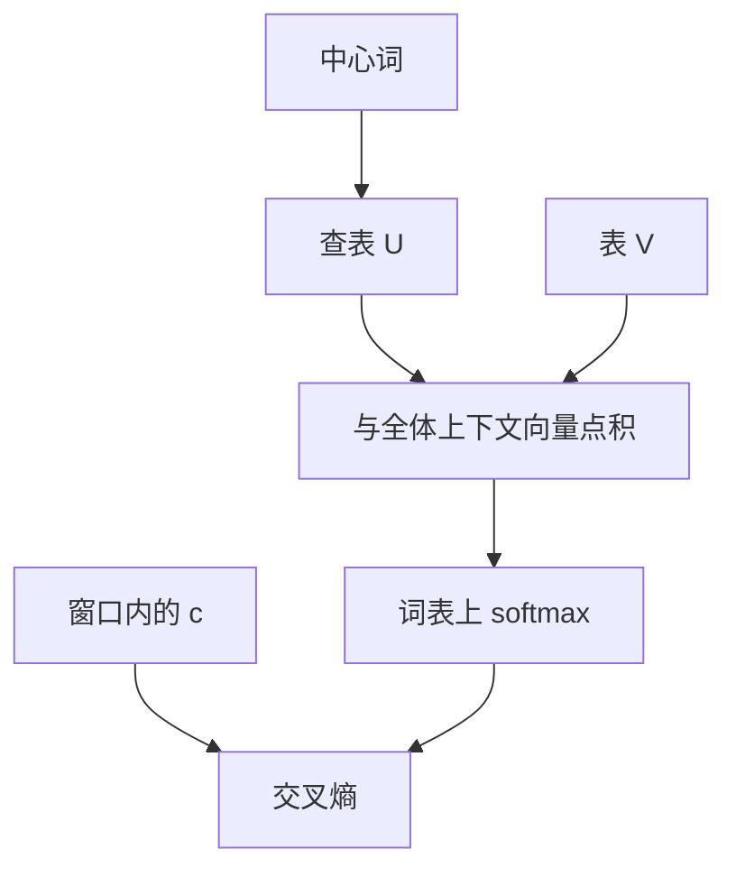

# Word2Vec skip-gram

固定中心词，去预测窗口里每一个上下文词；两张查找表把分布假设收成可反向的分类目标。

<footer>—— 据 Mikolov et al., Efficient Estimation of Word Representations in Vector Space, 2013；Mikolov et al., Distributed Representations of Words and Phrases, NeurIPS 2013 整理</footer>

[词向量与分布假设](/llm/distributional-hypothesis)给出「邻域 $\Rightarrow$ 靠近」。本课不重写 Firth。缺口是：把邻域写成显式的预测问题，使交叉熵能训练向量。skip-gram 选中心词 $w$，对窗口内每个上下文 $c$ 最大化 $P(c\mid w)$。CBOW 方向相反，本课不并行展开。负采样是下一课，因为整表 softmax 的 $|V|$ 还太大。

## 问题

分布假设没有指定似然。共现矩阵加 SVD 能给出向量，但接不进上一单元的小批量 SGD，也难与非线性层共用。缺口是一个神经网络式目标：输入是一个词的向量，输出是词表上的分布，标签是窗口里的词。这样，[下一词分类](/llm/clm-as-next-token)的代数可以直接用，只是条件从「左侧整句」收成「中心词」，上下文从「未来一个符号」换成「窗口内各个符号」。

skip-gram 把每个 $(w,c)$ 对当成独立分类。窗口大小 $k$ 是超参：$k$ 大则主题相近也算正例，$k$ 小则更句法。本课不调 $k$，只承认目标随窗口定义而变。位置在窗口内通常不加权或仅按距离降权；真正的位置编码还不存在——那是本课程最后一课的缺口。

### skip-gram 不是语言模型

语言模型要 $P(t_i\mid t_{\lt i})$，必须读有序前缀。skip-gram 丢掉次序，只保留「是否同窗」。它学到的是词型的静态向量，不是上下文相关的 token 表示。用 skip-gram 向量初始化嵌入表可以，把它当成已经解决语言建模，后课 RNN 与注意力会没有事做。本课的输出是 $|V|$ 行向量，一行一词型。

实现上有两张表：中心词 $U\in\mathbb{R}^{|V|\times d}$，上下文 $V\in\mathbb{R}^{|V|\times d}$。打分 $u_w^\top v_c$。训练结束后常只用 $U$，或用 $U+V$。两张表是为了让同一词在作中心与作上下文时角色分开。

## 方法

对语料位置 $t$，中心 $w=t_t$，上下文 $c\in\{t_{t-k},\ldots,t_{t+k}\}\setminus\{w\}$。logits 为与所有词型的点积 $U_w V^\top\in\mathbb{R}^{|V|}$，再稳定 softmax，损失是 $-\log p[c]$。每个窗口对多个 $c$ 求和。这正是全词表交叉熵，计算量每步 $O(|V|d)$，大词表上不可接受——下一课改目标。本课先把「正确的、但太贵的」似然写清，避免负采样看起来像凭空而来的技巧。

## 机制

梯度把 $u_w$ 拉向 $v_c$，并把 $u_w$ 从其他 $v_{c'}$ 推开（按 $p_{c'}$ 加权）。高频词作为 $c$ 时贡献大，这与分布假设一致：常见邻域主导几何。低频词更新稀，向量靠近初始化。子词课将用更短单位来分享这些更新。点积打分沿用[范数、余弦与投影](/llm/norm-cosine-projection)：未归一的内积含长度，高频词向量往往更长。

因为丢掉词序，skip-gram 不能区分「狗咬人」与「人咬狗」的角色，只能说这些词型曾共现。要顺序与长程，必须把条件改回序列模型。本课停在词型几何。

## 边界

本课不引入负采样、层次 softmax 的细节。下一课[负采样](/llm/negative-sampling)把 $|V|$ 项归一化换成几个二分类。后课默认：说到 Word2Vec，默认 skip-gram 的「中心预测窗口」；它不是自回归语言模型。

## 小结

- skip-gram 用中心词向量预测窗口内上下文，目标是词表上的 softmax 交叉熵。
- 两张表 $U,V$ 分开中心与上下文角色。
- 每步 $O(|V|d)$，大词表上需要下一课的近似。
- 学到的是静态词型向量，不含词序。
- 出处：Mikolov et al., 2013；NeurIPS 2013。
