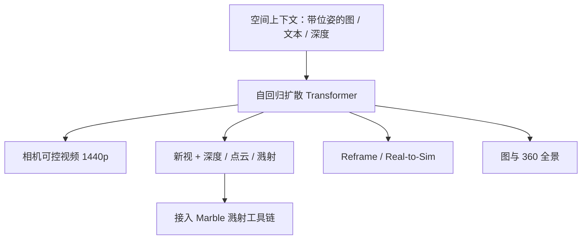

# World Labs Atlas Omni 世界模型

文本、图像、视频与三维进同一共享空间上下文；模型按自回归扩散写出下一元素，并在三维上与已见内容一致、对未见部分展开想象。

<footer>—— World Labs Team，Atlas: A World Model for Spatial Intelligence，2026-09-01</footer>

2026 年 9 月 1 日，World Labs 发布 Atlas：从零预训练的 **omni** 世界模型，原生操作文本、图像、视频与三维。架构名称是 multimodal autoregressive diffusion transformer——多模态自回归扩散 Transformer。所有输入合进共享**空间上下文**，每张图钉在显式相机位姿上。任务表跨四类：相机可控生成（最多约 1 分钟、1440p）、稀疏到多视的空间重建（可出点云与三维高斯溅射）、时空仿真（视频 reframing 与 Real-to-Sim）、以及并非主业的文生图 / 360° 全景。Atlas 进入精选合作方早鸟，并被写成将驱动未来版本的 [Marble](/llm/worldlabs-marble)。ARDT、空间上下文、整流流、相机、写出链已有叶子；本篇写博客总图、任务如何共用一条序列、以及公司自评基准该怎么读。

## 问题

视频模型把相机写成「缓缓左移」，三维重建是另一族专家网络，机器人仿真又是第三套。空间智能若成立，生成、重建、仿真应共享同一份对三维的理解，而不是在接口上对齐误差。LLM 的上下文是时间上的 token 串；世界模型的上下文必须是**钉在位姿上的观测**。否则两张无关参考图无法被放进同一房间的两端，再让模型想象中间的走廊。

标准架构不够用：纯 LLM 没有连续像素；纯视频扩散一次出整段、中途不能插入新的带位姿参考；纯重建网络不会「从一张图想象后院」。需要一种序列，元素可以是文本、图、位姿、深度，下一个元素可以是其中任何一种，且连续场用去噪而不是词表 softmax。

### Omni 不是「四个专家加胶水」

博客把 Atlas 定义为单一权重、从零预训练、随算力扩展。多模态：当前公开类型为文本、图像、相机位姿、三维深度，视频是带位姿的图像序列。自回归：每个输出条件于序列中更早的部分，任务只是输入–输出排列不同。扩散：整流流逐步去噪，步数换质量。Transformer：吃矩阵乘与 KV cache。四项合在一起才叫 ARDT，细节见 [ARDT](/llm/atlas-ardt) 与 [整流流](/llm/atlas-rectified-flow)。

早鸟没有公开权重、定价、延迟或合作方名单。公司表上的相机跟随人类偏好与稀疏重建 AbsRel，都是自家评测协议。独立复现前，应把数字当「发布方主张」而不是第三方榜。

## 方法

与 LLM 类似，先把输入编进上下文再生成；差别是每张图（及深度图）落在三维位置上，形成 [空间上下文](/llm/atlas-spatial-context)。管理这份上下文就是创意控制：把两张无关参考图放到空间两端，模型生成平滑过渡；把一条手绘相机轨迹当 [原生相机](/llm/atlas-native-camera)，而不是写进提示词。相机可控生成从一张到六张参考图出发，博客展示手绘路径与最多约一分钟 1440p。

重建吃可变数量的输入视。少图时想象补洞；多图时想象比例下降，「少至两三张」被写成已能忠实重建，也能吃上百张。同一组输入可渲许多条轨迹，场景保持一致。显式三维：深度与 RGB 联合生成，反投影融合成点云，再升为与 Marble 相同的溅射表示，见 [写出链](/llm/atlas-3d-writeout)。视频路径逐帧估深度再融合；单图路径联合生成新视与几何。

时空仿真把空间与时间合起来：少至三路普通手机即可做子弹时间式 [reframing](/llm/atlas-video-reframe)；机器人侧从少量实拍重建空间，再沿机体相机生成 RGB 与深度，并变化物体、光照、背景以扩 Real-to-Sim 数据。图像生成与 360° 被写成附带能力：能跟复杂提示、能画字、多样式，但主叙事仍是世界建模。

### 相机跟随与稀疏重建两张表

基准两块。相机跟随：单图加一到三段电影机位（pan / truck / crane 等），Atlas 走原生相机，对照视频模型走文本描述机位，第三方人类选谁更跟得上；公司表显示相对 MiniMax H3、Gemini Omni Flash、FLUX 3、Seedance 2.5 等 Atlas 得票更高，轨迹越复杂优势越大。稀疏重建：给定图与位姿，预测每像素三维点，在 DTU / ETH3D / KITTI / NRGBD / 7-Scenes / Tanks and Temples / ScanNet 等上复现开源专家，公司表称平均 AbsRel 低于所列基线。

相机对照实验承认：更好的提示工程或把轨迹画进条件图，可能抬高部分视频模型的跟随。评测用文本是因为那是常见接口。读表时要把「原生相机 vs 文本相机」写成不对称条件，而不是纯模型容量差。

## 机制

空间上下文把「条件于哪些观测」从注意力下标变成几何邻接：同一位置的新视应看附近已见表面，而不是序列里碰巧相邻的 token。自回归让任务模板可变——先参考图后轨迹后视频，或先多视后点图——不必为每个产品功能训一个专家。扩散负责连续高维；元素级自回归负责「下一个是图还是深度」。缩放叙事：开发中由小到大加算力，每一档解锁新能力，博客预期趋势继续。这是主张，不是公开的缩放定律图。

想象与忠实是同一模型的两个工作点。输入视越少，世界先验占比越高：单张地面照片的航拍里，花园可能对、房子可能是编的；补上第二、第三张，编造区域缩小。这对机器人是双刃剑：Sim 数据的多样性来自想象，度量真值不来自想象。溅射让写出的几何可在设备端渲染，并与 Marble 工具链对齐；点云仍是检查几何的中间物。

### 生成、重建、仿真共用权重的代价

共用意味着没有「关闭想象」的开关：多图只能压低、不能消灭编造。动态物体在逐帧深度融合里会拉出鬼影，静态假设见视频专文。KV cache 与扩散蒸馏在博客里作为可借鉴的 LLM / 视频系统技术出现，未给 Atlas 的实现参数。服务形态（是否分拆 prefill、是否缓存空间上下文）未披露。

重建表是逐像素点图误差，不是网格 IoU，也不是溅射新视 LPIPS。KITTI 等驾驶集上的误差量级与室内 DTU 不同，平均一行会掩盖场景类型。引用「超过最强开源重建模型」必须带数据集名。

## 边界与工程取舍

截至 2026 年 9 月，Atlas 不是可下载权重。原生网格、UV、碰撞体不是这条写出链已确认的终点。深度是否度量、相机模型细节、潜空间大小均未给模型卡。公司基准无第三方复核；机位文本对照不对称。早鸟合作方的工作负载可能与宣传片分布不同。

Marble 的 Chisel / Composer / 双网格是产品层能力，不要写成 Atlas 当天已提供的 API。图像生成不是主业，勿用文生图榜代替世界模型评估。许可与安全策略未在博客展开。评测自制协议应同时看：新相机几何误差、未见区域是否被标成想象、时间维上动态物体是否鬼影。

## 小结

- Atlas 是 2026-09-01 发布的 omni 世界模型：从零预训练的多模态自回归扩散 Transformer，输入钉在空间上下文里。
- 任务覆盖相机可控视频、稀疏重建与显式三维写出、视频 reframing 与 Real-to-Sim；将驱动未来 Marble。
- 叶子专文写 ARDT、相机、写出等技术点；本篇管总图与基准读法。
- 出处：World Labs Team，*Atlas: A World Model for Spatial Intelligence*，https://www.worldlabs.ai/blog/atlas 。
