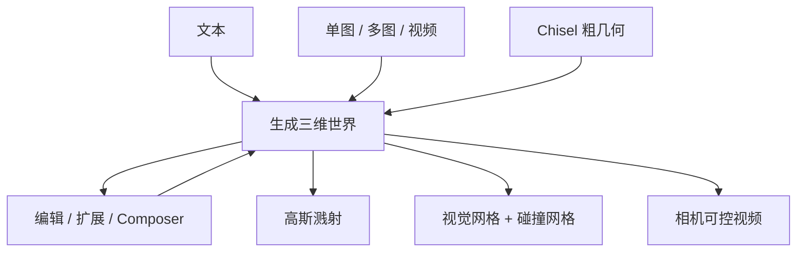

# World Labs Marble 世界模型

世界模型应能从任何已有信号升起完整三维，并在新信息到来时迭代更新；Marble 把生成、编辑、扩展与导出收成一条可带走的世界。

<footer>—— World Labs，Marble: A Multimodal World Model，2025-11-12</footer>

World Labs 在 2025 年 11 月 12 日把 Marble 从内测推到公开：一个生成式多模态世界模型，输入可以是文本、单图、多图、视频或粗糙三维布局，输出是可漫游的三维世界，再导出为高斯溅射、三角网格或视频。空间智能的叙事是：模型要重建、生成、仿真三维世界，并让人与智能体进去交互。Marble 是这条路上的产品步，不是一篇可复现的 arXiv。溅射保真、双网格、Chisel、Composer、Spark、视频增强已有叶子；本篇写博客里的**总图**：多模态如何进世界、编辑与扩世界如何迭代、导出合同如何分层，并与后来的 [Atlas](/llm/worldlabs-atlas) 分工，不把 Atlas 的自回归扩散倒填进 2025 年 11 月的 Marble。

## 问题

文生视频把世界锁在一段像素时间线里：换相机等于再抽一次奖。传统三维资产管线能进引擎，却要建模师。需要一种世界：生成结果是**持久的三维对象**，而不是服务端一次会话。用户手里的信号从来不成套——有时只有一句提示，有时有几张参考图，有时有一段手机视频，有时已经有白盒布局。世界模型必须把「现有信号」升起为同一类三维，并允许看完之后再改，而不是推倒重来。

第二个问题是下游异构。浏览要外观，游戏与机器人要碰撞，视效要相机可控的视频。一种表示很难同时最优。Marble 的回答是同一世界、多份导出，而不是一个万能文件。

### 从提示到世界不是单次采样

文本或单图最省事，也最不控：未指定的背面、邻室、材质全靠模型补。多图把不同方向的参考钉进同一空间，缝由模型填。视频与实拍多图把真实场所的元素抬进来，仍允许想象未见部分。Chisel 用盒子、平面或导入资产定**结构**，文本定**风格**，把「做成什么形状」和「做成什么样子」解开。没有这种分层，改风格会连带挪墙。

2026 年 1 月的 World API 把「提交生成请求、异步取回可漫游世界」写成开发者接口，输入含文本、单图、多图、360° 全景与视频。那是 Marble 能力的 API 化，不是第二套世界模型。引用产品能力时以博客与平台文档为准，不要编造公开的网络结构图。

## 方法

公开能力可以看成一条环：生成 → 预览 → 编辑 / 扩展 / 拼接 → 再生成 → 导出。生成端把任意模态升成三维。编辑端允许小而局部（去掉物体、修一块表面）或很重（换物体、换风格、重组大块结构）；局部性落在空间区域上，而不是词掩码，细节见 [世界编辑](/llm/marble-world-edit)。扩展让用户圈一块区域，模型在该处长出更多可行走内容，也可把糊掉的远角洗清楚。Composer 把多个世界按用户指定的相对位姿拼成更大地图，见 [扩展与拼接](/llm/marble-expand-compose)。Chisel 是实验性三维雕刻模式，见 [Chisel](/llm/marble-chisel)。

### 导出分三层：溅射、网格、视频

导出分三层。高斯溅射是外观保真最高的表示，浏览器里用开源 Spark（THREE.js）画，见 [溅射](/llm/marble-gaussian-splats) 与 Kerbl 等 2023 年论文。网格分碰撞网格（低保真、给物理）与高品质视觉网格（尽量追溅射观感），见双网格专文。视频带像素级相机控制；增强视频可加细节、去伪影、加烟火流水等动态，同时尽量钉住已生成的三维结构，见 [视频增强](/llm/marble-video-enhance)。

Marble Labs 是案例与教程中心，覆盖游戏、视效、设计、机器人仿真等，不是模型卡。NVIDIA Isaac Sim 一类工作流典型是：PLY 溅射做外观、GLB 碰撞做物理，再经 NuRec 一类工具进 USD——那是集成，不是 Marble 内部实现。

溅射没有干净碰撞体；只导出 PLY 进物理引擎会穿模。只导出碰撞网格去做演示片，观感会掉到「能走不能看」。正确的产品合同是两份文件对齐同一坐标系，外观通道与实体通道不要抢同一份原语。

## 机制

多模态升起的机制是条件：每一种输入都约束世界的某一截面，未见截面由模型的世界先验填。单图约束可见表面；多图约束多个可见表面并要求其间连续；视频提供时间上的多视，但动态物体会把静态世界假设撕开。粗几何约束度量布局，文本约束外观分布。编辑把旧世界当条件、把指令当差分，再采样一个与旧世界大部分对齐的新世界——所以「小改」仍是一次生成，不是在高斯上刷顶点。

持久三维相对视频的差，是新相机不再经过生成器：溅射或网格可以在设备端转。这要求生成时多视一致，否则导出后侧视穿帮。扩展与 Composer 把尺度问题从「一次生成无限大」改成「用户控制的拼图」：配额上先碰到点数墙或接缝重影，而不是先碰到理想中的无限世界。

### 与 Atlas 的产品分界

Atlas（2026-09-01）是从零预训练的 omni 基座，原生吃文本、图像、视频、三维，并被写成将驱动未来版本的 Marble。Marble 博客发布时，用户面对的是生成–编辑–导出产品；Atlas 博客面对的是相机可控视频、稀疏重建、Real-to-Sim。不要把 1440p 一分钟视频写进 2025 年 11 月的 Marble 能力表。反过来，Chisel / Composer / 双网格导出是 Marble 产品叙事，Atlas 公开材料确认的显式三维写出是深度、点云与溅射。

博客几乎所有展示视频都声称由 Marble 世界直接渲出。那说明产品把「世界 → 相机轨迹 → 视频」当成一等路径，不说明存在可下载的权重或可复现的扩散配置。评测应对用户新相机与提示符合度，而不是只看宣传片。

## 边界与工程取舍

Marble 是闭源服务。生成世界不是激光扫描：遮挡面与画外结构是想象，尺度、材质、可仿真接触都要另做对齐。扩展会在接缝处留下密度不匹配；Composer 重叠不删会先爆点数。风格改写可能改变未指定区域。网格从溅射抽出，薄结构与半透明会丢。增强视频引入的运动（烟、火、水）不一定有对应的三维动力学。

许可、配额、点数上限以平台当时条款为准。机器人仿真要把碰撞网格做成简化凸包或网格碰撞，而不是假设视觉网格可直接当刚体。公开材料没有给出网络深度、损失或训练数据表；复现实验应把 Marble 当黑盒生成器，用多视一致性与导出可用性评，而不是猜它是哪篇 NeRF 论文的微调。

## 小结

- Marble 是 World Labs 2025 年 11 月公开的生成式世界产品：多模态输入，可编辑、可扩展、可拼接，导出溅射 / 网格 / 视频。
- 结构与风格可在 Chisel 里解开；外观保真走高斯溅射，实体走碰撞网格。
- 叶子专文写各技术点；本篇管产品总图，并与 Atlas omni 基座分界。
- 出处：World Labs，*Marble: A Multimodal World Model*，https://www.worldlabs.ai/blog/marble-world-model 。对照 World API 博客与 Kerbl 等 3DGS。
