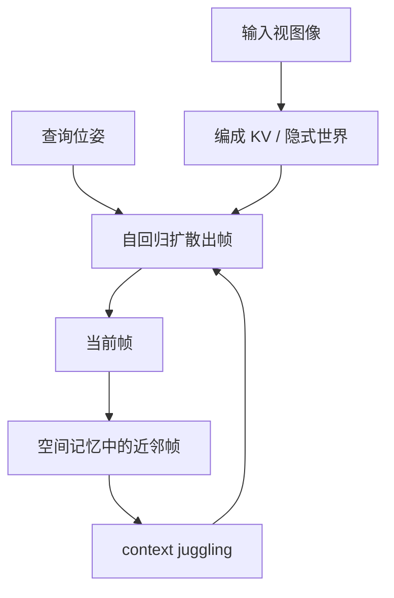

# RTFM：探索时实时出帧而非导出场景

不必先把世界写成网格或高斯再光栅化；把当前视图像查询，让网络在交互帧率下直接画出下一帧，世界以带位姿的帧为记忆。

<footer>—— 归纳自 World Labs, RTFM: A Real-Time Frame Model</footer>

Marble 路线把生成结果落成可导出的三维资产，再用 [Spark](/llm/marble-spark) 在浏览器里画。RTFM（Real-Time Frame Model）走另一条：不先导出完整 mesh 或 splat 场景，用户在探索时由模型按当前位姿实时出帧。World Labs 把它写成研究预览：单卡 H100 上交互帧率，世界在转身离开后仍应可回去。这与 [持久三维世界 vs 边走边生成帧](/llm/persistent-3d-vs-streaming-frames) 是同一分叉的生成侧实现。本篇讲任务与系统选择；形变等失败模式见 [实时世界模型的形变与不一致性](/llm/rtfm-morphing)。

## 问题

若把现代视频架构直接当成交互世界，算力会先爆。官方估算：交互 4K、60 fps 意味着每秒超过 $10^5$ 量级 token；若再让注意力窗口覆盖一小时探索，上下文可到 $10^8$ token。这在今天的集群上既不经济，也无法塞进一张推理卡。传统图形学的回答是：先有显式三维（三角网、3DGS），再光栅——探索成本与场景复杂度相关，与「生成过多少帧」无关。生成式世界若坚持显式资产，就必须走 Marble 的导出；若坚持从视频数据端到端学习反射、高光、阴影，显式资产又成了手写归纳偏置，不易随数据规模变好。

RTFM 要同时满足三件事：今天就能在单 H100 上交互；架构仍能随数据与算力放大；探索多久都不该把走过的地方忘掉。这迫使它把「渲染」定义成神经网络的前向，而不是导出后再画。

### 出帧与导出是两种持久性

导出场景的持久性在资产文件里：高斯或网格在磁盘上，关掉浏览器再打开还在。实时出帧的持久性必须在模型状态里：KV、检索到的旧帧、或某种外部记忆。没有显式几何时，「还在」的含义变成：再查询靠近旧位姿的相机，能否得到与当时相容的像素。这比文件持久更弱，也更便宜——不必为尚未走到的角落实例化上千万 splat。

RTFM 可以与 Marble 串联：用 Marble 从单图生成世界，再让 RTFM 当学习到的渲染器去画反射与高光。此时 Marble 仍可能持有 splat，但 RTFM 自己并不依赖把这些 splat 读进着色器。两条表示可以并存，不要写成 RTFM 替换了 3DGS。

## 方法

RTFM 吃一张或多张场景的二维图，直接生成新视点的二维图，中间不构建显式三维。实现上是自回归扩散 Transformer：在帧序列上训练，条件于已有帧预测下一帧。输入帧被编成网络激活（KV cache），生成时用注意力读这份隐式世界。反射、光泽、阴影、镜头光晕等，靠在大规模视频里看见过，而不是写 BRDF。

位姿是一等条件。每一帧带三维位置与朝向；生成新帧时用待生成帧的位姿去查询模型。世界记忆因此是「带位姿的帧」，不是无序的视频 clip。这给出弱先验——世界是三维欧氏空间——但不强迫预测物体表面的三维坐标。当输入视很多，任务更像新视合成（插值）；视很少，则必须外推、想象未见区域。重建与生成被同一网络按条件松紧切换。

### Context juggling

朴素自回归会把所有历史帧留在上下文里，每多走一步，下一帧更贵，记忆被算力上限截断。RTFM 按空间取近邻帧组成当前上下文，官方称为 context juggling：在不同区域生成时用不同的条件帧。于是大世界的持久不必对「曾经见过的每一帧」做全注意力，只要在查询位姿附近找回相关帧。这是用空间索引换序列长度，和语言模型的无限上下文不是同一算法，但动机同构：不要让历史线性堆死解码。

「单 H100 交互」是系统设计目标，不是一条与分辨率、视场、步数无关的定理。扩散步数、是否蒸馏、输出分辨率都会改帧率。博客没有给出可引用的 fps 表；不要编造。

### 与 Marble 导出路径的分工

Marble 把世界写成可下载的 splat 或网格，探索成本在光栅；RTFM 把世界写成可查询的帧模型，探索成本在网络前向。前者适合要进引擎、要碰撞、要分享文件的工作流；后者适合要立刻走进、且显式资产还来不及或不必实例化的预览。官方可以把二者串起来：Marble 出世界，RTFM 当学习到的渲染器补反射。不要把「实时出帧」理解成已经淘汰了 Kerbl 的 3DGS——没有资产时物理与导出都会缺一块。

出帧路线的记忆在 KV 与检索集里，进程一杀就没有文件可备份。若用户需要可版本管理的世界，仍应导出 splat。RTFM 的 persistence 是交互过程中的空间记忆，不是 git 里的资产。

## 机制

把世界模型当成学习到的渲染器，等于把图形学里手写的可见性、材质、光照，全部折进权重。可微的只有「给定条件帧与位姿，像素应如何」。位姿条件让同一套权重能被问「从这边看是什么」，否则网络只是视频续写，相机一自由就与训练时的剪辑统计打架。自回归提供时间上的因果接口：已经生成的帧成为后续条件，探索过程本身在写记忆。扩散则负责高维连续像素；帧不是离散词表上的 token，不能只用交叉熵。

与 Kerbl 3DGS 对照：3DGS 把世界写成可排序的高斯，浏览器里用 [Spark](/llm/marble-spark) 画，探索不调用生成网络。RTFM 把世界写在激活里，每帧都要跑网络，换来的是数据驱动的外观，以及不必为整个场景分配 splat 显存。二者都不是「更正确的世界」，而是持久性放在文件还是放在推理状态。

## 边界与工程取舍

没有显式几何，物理、碰撞、机器人仿真不能直接读表面。需要资产时仍应走 Marble 导出。实时出帧的失败模式是形变与多视不一致：记忆检索漏了、位姿量化粗了、或外推过远，像素会在本该刚体的地方流动。官方强调 persistence，并不等于几何定理；评测应看「走远再回来」而不是只看单段漂亮运镜。

架构细节（层数、潜空间、是否整流流）在 RTFM 博客里没有写成可核对的配置。Atlas 后来把自回归扩散 Transformer 说得更完整，并明确整流流与潜扩散；不要把 Atlas 的模块表倒填进 RTFM，也不要给 RTFM 造一份 arXiv。出处就是 World Labs, *RTFM: A Real-Time Frame Model*（2025 博客）。Ho 的 DDPM 与后续视频扩散提供「帧是连续数据、用去噪生成」的背景，不是 RTFM 的论文声明。

## 小结

- RTFM = Real-Time Frame Model：探索时按位姿实时生成二维帧，不先导出完整 mesh/splat 再光栅。
- 它是自回归扩散 Transformer，用 KV 中的帧当作学习到的渲染器，从视频数据里学反射等高阶效果。
- 每帧带三维位姿；context juggling 按空间取近邻帧，使持久不必让上下文随探索线性膨胀。
- 视多偏重建、视少偏生成，同一网络按条件松紧切换。
- 单 H100 交互是系统目标；分辨率与采样步未公开成表，勿编造。
- 对照 Kerbl 3DGS：资产持久 vs 推理期出帧。形变与不一致性是这条路线的代价，见下一篇。
- 出处：World Labs RTFM 博客，无 World Labs arXiv 号可填。
