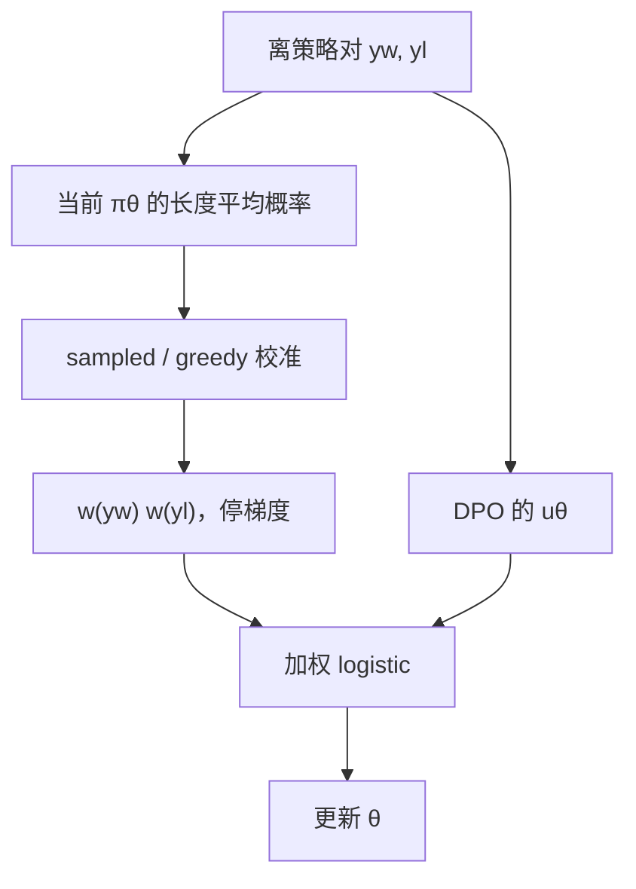

# WPO

    
离策略成对数据不必扔掉，也不必再采一轮：按当前策略下的长度平均概率给对加权，优化在分布上就会更像在策略上学习。

    <footer>—— Zhou 等，WPO: Enhancing RLHF with Weighted Preference Optimization，EMNLP 2024</footer>

离线偏好优化便宜：UltraFeedback 一类数据从别的模型生成、由裁判或人类标好，拿来直接跑 [DPO](/llm/dpo)。问题是采集策略与正在训练的 $\pi_\theta$ 不是同一个分布。对当前策略几乎不可能说出的 $(y_w,y_l)$，logistic 梯度仍按 $1$ 的权重推，模型把力气花在学不会、也不该学的区域。在线方法每步从 $\pi_\theta$ 采样再标注，分布对了，生成与标注成本高。Zhou 等人提出 Weighted Preference Optimization（WPO）：设想把旧数据集看成一台只能给「已经出现过的对」打标签的函数，若用当前策略重采并对能打上的对做 DPO，出现频率正比于 $\pi_\theta(y_w)\pi_\theta(y_l)$。不必真的重采，把这条频率写成样本权重即可。权重对反向传播停止，不改变 DPO 的 logit 定义。

## 问题

在策略 RL 里，轨迹来自正在优化的策略，重要性权重接近 1。离策略偏好学习把别人的 $y$ 当成自己的动作，却常常不做任何重加权。距离当前 $\pi_\theta$ 很远的对有两种坏处：对数概率饱和、梯度噪声大；以及标签来自另一种风格，最优方向与当前模型能走的方向不一致。经验上离策略 DPO 弱于在策略迭代 DPO，很大一块是这个缝。

真做在策略要：对每个 $x$ 采一对 $y$，用奖励模型或人类打标签，再过滤打不了的对。标签函数若只记得原数据集里出现过的字符串，绝大多数新样本会被拒绝，接受率低得无法训练。WPO 的观察是：在「无限次从当前策略采样、只保留原数据能标注的对」这一思想实验里，有效样本的分布已经被 $\pi_\theta$ 重加权。因此可以用原数据加权重去模拟，而不是真的拒绝采样。

### 远样本不是「更难的正例」

有人把低概率的 $y_w$ 当成应该大力学习的高质量示范。那是 SFT 的逻辑：示范来自人，概率低说明模型还不会。偏好对里的 $y_w$ 往往来自更强或不同的模型，当前 $\pi_\theta$ 说不出并不等于「说出来就更好」；梯度会把质量推到参考也没有的模式上，表现为过拒、乱码或长度崩。WPO 明确把当前策略下的高概率对当成更像在策略的信号，低概率对降权，而不是当黄金示范。

权重停梯度。若 $w=\pi_\theta(y)$ 对 $\theta$ 可微，模型可以靠把权重本身改掉来降损失，而不是改偏好方向。实现上必须 `detach`。这与 [KTO](/llm/kto) 的 $z_0$ 停梯度是同一类纪律。

## 方法

在普通 DPO 似然上乘两侧权重：

$$
\mathcal{L}_{\mathrm{WPO}}=-\mathbb{E}_{(x,y_w,y_l)\sim\mathcal{D}}\bigl[w(x,y_w)\,w(x,y_l)\,\log\sigma(u_\theta)\bigr],
$$

其中 $u_\theta$ 是标准的 $\beta$ 倍对数比差，$w$ 不反传。序列概率连乘会下溢且方差极大，改用长度平均：

$$
w(x,y)=\exp\Bigl(\frac1{|y|}\sum_{t}\log\pi_\theta(y_t\mid x,y_{\lt t})\Bigr).
$$

这仍有输入偏置：有的提示上模型天生更自信，在策略样本的 $w$ 也不均匀，违背「在策略样本应等权」的思想实验。作者提出两种校准，默认用 sampled alignment：用温度 1 随机采样一个 token 的期望概率 $\sum_v\pi_\theta(v\mid s_t)^2$ 去除每个位置的 $\pi_\theta(y_t\mid s_t)$，再长度平均取指数。贪婪校准则除该步最大 token 概率。校准后，来自当前策略的样本权重更集中，来自其它模型的样本仍然偏低。

WPO 可接到其它成对损失上，不只 DPO；论文在指令跟随基准上报告相对 DPO 的提升。离策略 UltraFeedback 设定下，AlpacaEval 2 长度控制胜率相对 DPO 最多高出约 5.6 个百分点。混合设定（离策略对再补当前策略生成的对）上，基于 Llama-3-8B-Instruct 或 Gemma-2-9B-it 的数字以论文表格为准；作者强调混合优于纯离策略或纯在策略。消融表明：给不喜欢侧加权比给喜欢侧更关键——当前策略仍会说的坏回答，才是最该压的。

### 思想实验与实现之间的缝

无限重采只保留「标签函数认识的对」，等价于对原数据按 $\pi_\theta(y_w)\pi_\theta(y_l)$ 加权。标签函数认识的是字符串匹配意义下的旧回答，不是语义等价。当前策略生成的同义改写会被思想实验拒绝，加权实现却根本看不到它们。因此 WPO 模拟的是「在旧回答集合上的在策略再加权」，不是完整的在策略 RL。混合设定把当前策略的新回答补进数据集，才真正扩大支持集。只有权重、没有新样本，分布缺口只能缩小到旧支持集与 $\pi_\theta$ 的交集。

## 机制

### 为什么不喜欢侧的权重更重要

DPO 梯度同时推高 $y_w$、压低 $y_l$。$y_w$ 若离策略很远，提高它的似然像在做困难 SFT，容易伤流畅。$y_l$ 若就在当前策略的高概率区，那是模型现在就会说的坏话，压下去立刻改变生成。加权后，留在高权区的 $y_l$ 正是这类近策略负例；远策略的夸张坏样本被降权，避免把梯度浪费在已经不可能采样的字符串上。论文把这一点写成经验发现，不是定理：换任务后是否仍然「负例更关键」，要用验证集再确认。

sampled alignment 除的是 $\sum_v\pi^2$，即温度 1 采样的期望 token 概率。它把「模型在该前缀上有多尖」削掉，使不同提示的在策略样本可比。贪婪校准则相对 argmax。作者报告 sampled 更好，因为训练解码并不是贪婪。权重与 [SimPO](/llm/simpo) 的平均对数概率长得像，角色不同：SimPO 用平均对数概率当奖励本身；WPO 只用它当样本权重，奖励仍是 DPO 的参考对数比。

不要把 WPO 的 $w$ 和重要性采样权重 $\pi_\theta/\pi_{\mathrm{data}}$ 当成同一个量。后者是纠正采样分布的无偏权重，往往还要截断；前者来自「标签函数可标注」的思想实验，两侧相乘，并且做了长度平均与校准。抄 IS 公式会得到另一套算法。

### 混合设定为什么往往最好

纯离策略：支持集固定，加权只重新分配注意力。纯在策略：支持集新，但早期策略弱，采到的对信息量低，标注还要在线 RM。混合把旧数据里仍然近策略的对留下来（省标注），再注入当前策略的新对（补支持集）。这与迭代 DPO、在线 RL 的精神一致，只是 WPO 让旧数据在每一轮仍然按最新 $\pi_\theta$ 重新加权，而不是训练一开始算死权重。

## 边界与工程取舍

WPO 几乎不增加前向：权重用的对数概率 DPO 本来就要算。额外的是校准项里对 $\sum_v\pi^2$ 或 $\max\pi$ 的归约，词表大时要在同一张 softmax 上取。权重分布若极端，有效 batch 会塌成少数高权对，需监控权重的分位数，必要时做截断或温度。标签错误的近策略对会被加重，噪声比均匀 DPO 更危险。

它不创造新回答，不能替代拒绝采样或自我对弈去探索。参考模型、$\beta$、成对数据需求与 DPO 相同。作者释放的代码基于 alignment-handbook 与 SimPO 仓库；复现时应核对是论文里的 v1 加权还是后续对平局、长度的数据筛选，两者不是同一张表。

长度平均概率对 tokenizer 敏感，与 SimPO 相同。训练与算权重必须用同一套分词。不要用字符数当 $|y|$。

### 何时不必上 WPO

数据本来就是当前策略采样再标注的，权重接近均匀，WPO 退化成 DPO。已经在做完整在线 PPO / [GRPO](/llm/grpo)，分布缺口不是主问题。没有参考模型、要无参考损失时，应先选定 ORPO / SimPO，再决定是否给它们加同类权重——论文说可以接，但主实验仍在 DPO 家族上。

## 小结

- WPO 用当前策略下的长度平均概率给离策略偏好对加权，模拟「重采且只保留能标注的对」，不必真的在线生成。
- 权重停梯度；默认 sampled alignment，用来消掉不同提示上的自信度偏置。
- 损失主体仍是 DPO 一类 logistic；加权改的是样本测度，不是隐含奖励定义。
- 不喜欢侧近策略时加权更关键；混合新旧数据通常优于纯离策略。
- 有效 batch 可能被高权样本主导，须监控权重分布。
- 它不能扩大回答支持集，探索仍要靠新采样。
- 出处：Zhou, Agrawal, Zhang, Indurthi, Zhao, Song, Xu, Zhu，*WPO: Enhancing RLHF with Weighted Preference Optimization*，EMNLP 2024，arXiv:2406.11827。
