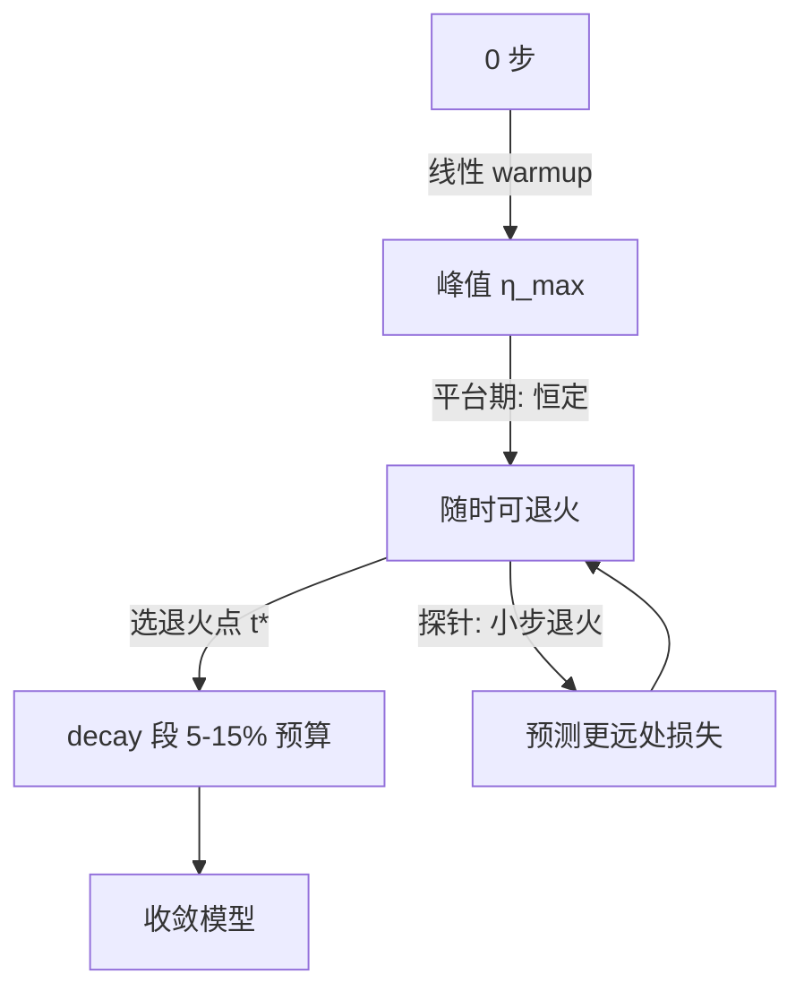
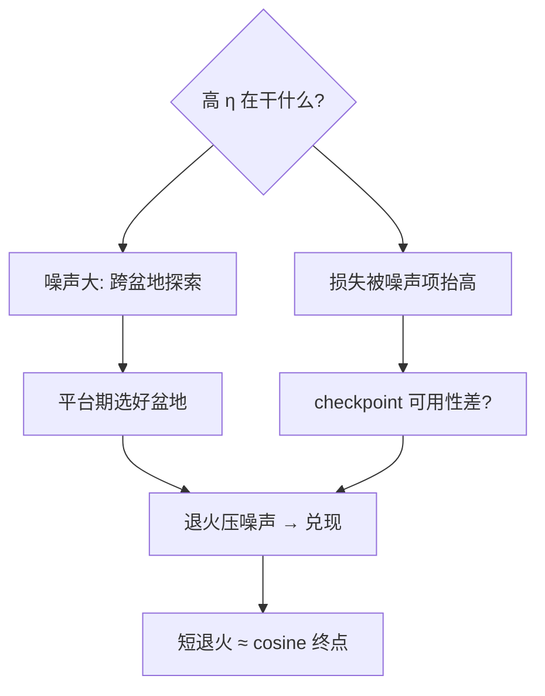

# wsd-schedule

学习率先爬坡、再恒走、末段骤降——WSD 把退火从尾声提前成一段独立跑道，训中评估从此有了意义。

<footer>—— 据 MiniCPM（Hu et al. 2024）与 DeepSeek-V2 训练报告；Zhou et al.「Defining Dead Zones」分析</footer>

[学习率调度](/llm/lr-schedule)把学习率从峰值平滑拖到零，训到一半时模型还悬在半空——中途 checkpoint 既不能部署也难评估。缺口是 **WSD（Warmup–Stable–Decay）**：峰值平台期保住「随时可收工」的可用状态，末段短促退火兑换损失骤降。本课只讲调度形状的选择，不进优化器动力学。

## 问题

预算上限定了，但「训到哪一步算够」事先不知道——cosine 需要提前定总步数 $T$，$T$ 估错则整条曲线作废。团队的现实需求：训中每 1000 步都要有「能拿去评测的模型」。缺口：一种让 checkpoint 永远处于「再训一小段就能退火到可用」状态的调度。

术语翻译：WSD = Warmup-Stable-Decay，三段式调度——warmup 数千步升至峰值 $\eta_{max}$，平台期恒定，末段退火到 0 或 $\eta_{max}$ 的 10%；「10% 退火长度」是经验起点。

数字实例：10T token 预算。warmup 2k 步；平台期到 9T token；最后 1T（10%）线性/二次衰减到峰值 10%。平台期内每个 checkpoint 都可在 1T token 内退火——相当于「随时打包」的存款，cosine 只有终点一次。

## 方法

三段配置：warmup 用线性升到 $\eta_{max}$；平台期学习率恒定——这是与 cosine 的本质差异；decay 段选形状（线性、指数、或按 MiniCPM 的「折扣到 10%」）。退火长度经验区间 5–15% 总预算，越短越省但要冒不收敛的险。平台期的副产品：**多次退火探针**——同一平台分别退火可画出「缩放曲线」，MiniCPM 用它从 9B 预测 100B 的损失，替代赌一次总预算。

直觉类比：cosine 是「航班准点起飞准点降落」，起飞前必须定好目的地；WSD 是「巡航飞机」——在巡航高度随便飞，想下就找个机场（退火点）降落，还能先低空盘旋看看（探针退火）再决定飞多远。

## 机制

为什么平台期 + 短退火 ≈ cosine 全程？SGD 噪声视角：损失由「期望项 + 梯度噪声方差项」组成，学习率大时噪声项主导、模型在盆地间游走；末段衰减把噪声项压掉，模型落进当前盆地底部。两种调度对「最终损失」的贡献几乎全在 decay 段，平台期只是把「落底位置」的空间探明——于是平台期 checkpoint 的损失高（带噪声）但**参数已在好盆地附近**，短退火即可兑现。这也解释了为何 10% 退火够用：盆地择优（探索）在平台期完成，收敛（兑现）只需短程。

常见误区：把平台期学习率调低——平台的意义是保持探索，降 η 等于提前退火、失去「随时收工」；另一误区是退火段中间取 checkpoint 当成品——退火中段的模型往往比平台期更差（噪声没压完、探索已停），要么用完要么别用。

## 边界

WSD 的代价：同等预算下平台期损失高于 cosine 中段（噪声税），只在「要训中 checkpoint」或「预算未定」时值回票价。多周期退火（连续 WSD，如 MiniCPM 的多阶段）可复用平台，但每次退火后重升学习率会有损失反弹，反弹幅度随阶段递减。与 [Schedule-Free 优化](/llm/schedule-free-optimizer)的接续：后者把「平台 + 退火」内化进优化器迭代点与评估点的分离，连退火决策都省了——但机制理解仍从 WSD 起步。与 AdamW 的配合：$\eta_{max}$ 按 μP 迁移，平台期与退火段不共用同一套 warmup 判断。

直觉类比：平台期像「把所有抽屉都拉开翻一遍」，退火像「选定抽屉后把手收干净」；cosine 则是从头到尾边翻边收——结果差不多，但 WSD 让你在翻完之前随时可以停下来说「就用这个抽屉」。

## 小结

- WSD 三段：升、恒、骤降；平台保探索与随时可用，退火兑现损失。
- 退火长度 5–15%，探针退火可预测缩放曲线。
- 本质是 SGD 噪声项的延迟压除——与 cosine 的差距集中在平台期损失。
- 出处：MiniCPM (Hu et al. 2024)；DeepSeek-V2 报告；Zhou et al.「Defining Dead Zones」2024。
