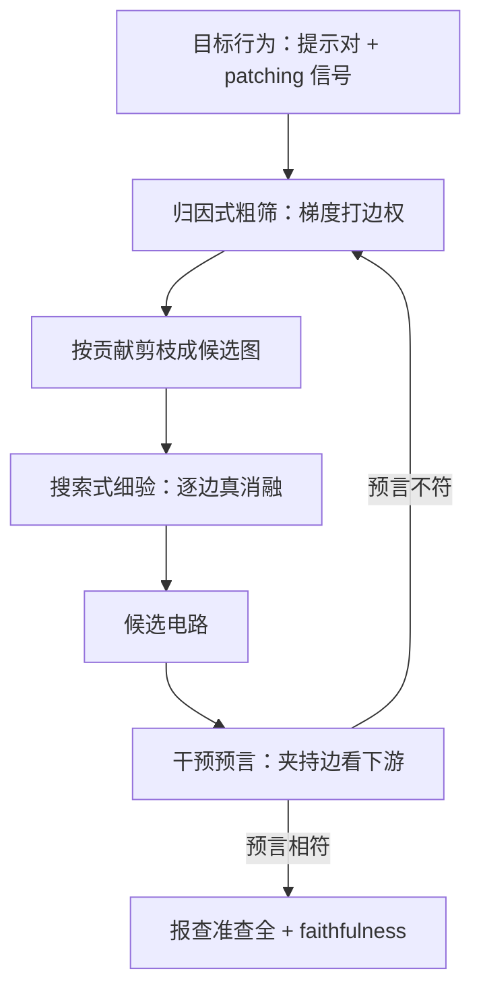

# 电路分析的自动化

手工电路证明了模型里存在算法，也证明了人读不过来；自动化的任务不是替人下结论，是把候选假设的吞吐提上去。

<footer>—— 据 Elhage et al., 2021 与 Conmy et al., 2023 的电路口径整理</footer>

[上一课](/llm/xai-feature-validation)把单条特征钉到「可用」：释义、激活预测、带对照的干预。但行为由特征的**通路**产生，不是由单点产生；手工电路分析在 GPT-2 的 IOI 任务上证明了可行性，也证明了不可扩展——一人月读一条电路。[Circuit Tracing 课](/llm/circuit-tracing)讲过替换模型流水线的全景；本课把「自动化」本身当主题：边怎么打分、图怎么搜、自动化到什么程度、以及用什么验收自动化。

## 问题

电路是一个带权有向图：节点是位点上的组件或特征，边是激活间的线性效应。给定提示与目标行为，要输出一张候选图，且图上每条边原则上都能被干预检验。手工流程——读权重、挑头、[path patching](/llm/activation-patching) 逐边验证——每步都靠人。自动化要回答三件事：边的分从哪来（消融效应还是梯度近似）；图从哪来（全图搜出来还是归因排出来）；以及自动化自己怎么验收。

失败模式也是三种：归因近似在非线性强处失真，边权与真实介导不符；搜索空间组合爆炸，预算烧完图还没成型；图是相关结构，直接当因果讲——这正是上一课「相关簇」问题在通路层面的重演。

## 方法

两条路线，实用中接成管线。

**归因式打分。** 用梯度或局部线性近似一次给所有候选边打分：把边效应近似成上游激活、梯度与权重的乘积，按贡献排序剪枝。替换模型上的 [attribution graphs](/llm/attribution-graphs) 把这套做成了流水线：稀疏特征当节点，线性化让贡献可加，一次反传覆盖全网。优点是吞吐，缺点是精度随非线性衰减。

**搜索式发现。** ACDC（Conmy et al., 2023）从稠密图出发，逐条边做消融检验：删掉后行为差不变则删边，直到剩下的图仍复现行为。优点是每条边都被真消融过，缺点是组合爆炸——搜索空间必须先被压小。

压小靠字典：**特征级电路**（Marks et al., 2024）把节点从神经元换成上一课验证过的 [SAE](/llm/sae-sparse-autoencoder) 特征，节点数降几个量级，归因粗筛加搜索细验才付得起。验收自动化本身有现成办法：在已知电路（IOI 一类）上对照真值算查准查全，再报 faithfulness——剪过的图仍复现行为——与 completeness——补边后不再冒出隐藏通路。

## 机制

两条路线的分野来自一个事实：归因是**线性化**。替换模型在当前激活附近近似分段线性，一阶贡献才可加；非线性越强、跨层越远，边权失真越大，且在重复消融下不稳定。搜索式对失真免疫——它只信真消融——但复杂度逼它依赖稀疏性先验。所以实用管线是「归因粗筛定搜索范围，消融细验定最终边」，两步都不能省。

误差节点在这里第二次入账（第一次在训练监控）：归因与搜索都只在字典节点上走，字典没覆盖的计算全部漏进误差项。一张没有误差占比的电路图等于隐去了模型的未知部分——报告里误差占比高的图，结论要按比例打折。

性价比的量级感：归因式一次反传播给全部边打分，搜索式一条边要做一轮消融前向。没有粗筛直接全图 ACDC，边数过万时预算按月烧；粗筛把候选边砍掉两三个量级后，细验才从研究变成日常工序。

## 边界

图是**提示局部**的：换提示、换上下文长度，图就换；跨提示合并成「一条通用电路」是解释者的假设，不是方法的产出。自动化输出的是候选机制，验证责任仍在人——假设–干预闭环（[电路追踪课](/llm/circuit-tracing)的口径）不能外包给打分器。特征级电路继承字典的绑定：换宽度、换 checkpoint，图作废重画。最后，图的语义命名——哪条路径「是」抑制、哪条「是」推理步骤——仍由人给出，自动化加速的是假设吞吐，不是结论。

## 小结

- 两条路线：归因式一次打分全线、搜索式逐边真消融；实用管线是粗筛加细验。
- 特征级电路把节点换成验证过的 SAE 特征，把搜索空间压小几个量级。
- 验收自动化用已知电路的查准查全，加上 faithfulness 与 completeness 双指标。
- 误差占比必须随图报告；图是提示局部、候选机制，结论由人担责。
- 出处：Elhage et al., *A Mathematical Framework for Transformer Circuits*, 2021；Conmy et al., 2023（ACDC）；Marks et al., 2024（Sparse Feature Circuits）。
