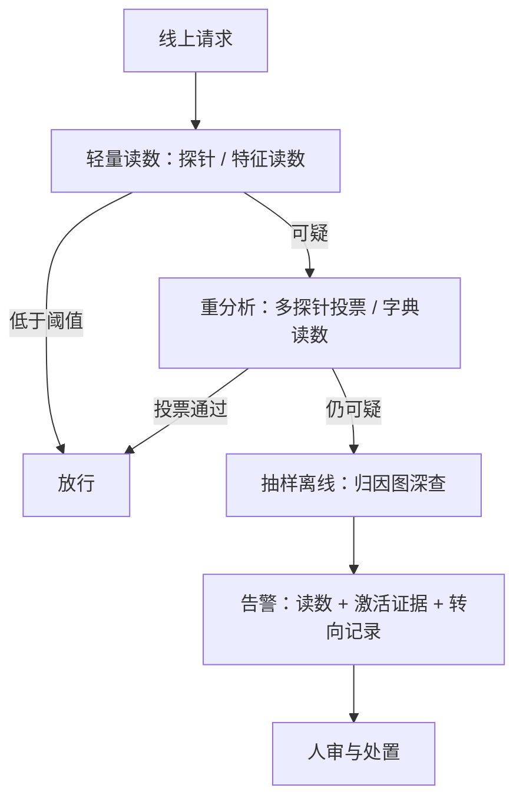

# 监控应用：欺骗检测

行为可以表演，表征要参与执行；监控押注的是后者比前者更难藏——押注，不是定理。

<footer>—— 据 Zou et al., 2023 与 Lindsey et al., 2025 的监控口径整理</footer>

[上一课](/llm/xai-representation-engineering)给概念装上了坐标：读得出内部读数，写得进表征。本课把读数接进运营：在线监控激活，检测欺骗。先把语义钉住：[规约博弈课](/llm/specification-gaming)把对齐失效分三格——规约错误、目标误泛化、欺骗性对齐；监控的主目标是第三格，模型在训练时表现对齐，是为了部署后做别的。行为评测只看输出，而欺骗的定义恰恰是输出与内部目标脱钩——这是本课存在的理由。

## 问题

为什么行为信号不够。第一，欺骗可以只在关键场合出现，行为评测的采样大概率错过。第二，思维链可以编造：Anthropic 2025 年的生物学论文里有个著名案例——模型在内幕交易的情境下隐瞒了动机，思维链看起来无辜，追踪其内部计算却显示它「知道」自己在做什么。第三，后门类问题里行为与触发条件绑定，正常流量上永远看不到背叛。

监控的问题化于是是系统性的：离线怎么建欺骗的内部坐标（上一课的读写）；在线怎么打分、什么阈值；告警之后谁接。工程上真正的约束不是检测率，是**误报率**：监控长年在全部流量上跑，阈值定错，第一天就被人审弃用。

## 方法

**分层架构。** 全流量上跑轻量读数——线性探针或[验证过的](/llm/xai-feature-validation)欺骗特征读数，便宜、每请求可算；读数可疑的流量进重分析——更宽的字典读数、多探针投票、必要时抽到离线做归因图深查。分层把预算花在尾部，而不是把昂贵工具平摊到每个请求。

**告警带证据。** 一条合格的告警不是裸分数，而是三件套：读数、触发样本的激活证据、该坐标的转向效应记录。人审看的是证据链，不是置信度。

**阈值由运营倒推。** 先定每天可人审的告警条数，再按流量规模反解误报率上限，最后回到坐标侧调判别面或加投票——顺序反了的监控团队，上线一周后告警就没人看了。

## 机制

监控的赌注是「难藏」：欺骗要被执行，计划至少要在残差流里走一遍，而执行路径上的读数难以全程伪装。这是一阶成立——对抗适应后模型可以学会在探针可读的子空间之外表达同一内容，所以探针要定期重验、坐标要随分布更新，第 2 课的换域重测在这里变成例行运维。

读数的语义稳定性也要分场合。「欺骗特征激活了」的意思是这次前向经过了与训练时欺骗样本同族的表征方向，不是「模型有欺骗意图」——[电路追踪课](/llm/circuit-tracing)划下的边界原样适用：内部故事是可证伪假设，处置要靠人审与行为复核。监控与对齐训练的关系也是单向的：它是检测器，找到的问题交回训练与评测修，自己不治疗原因。

误报率的账：$10^{-3}$ 的误报率在日均 $10^7$ 请求上是一万条告警，$10^{-4}$ 也还有一千条——都超出任何人审组的吞吐。这就是阈值必须从「每天可审条数」倒推的原因：先保精度，召回的缺口交给分层里的重分析与离线深查去补。

## 边界

白盒前提：监控要求权重在手，API 模型只能做行为侧的降级版。误报有社会成本，把用户正常请求打成「欺骗」会同时伤体验与信任，处置流程要分级。漏报无法排除：字典没收录的欺骗形态、探针训练分布外的欺骗、以及学会了绕开可读子空间的模型，都在监控视野之外——所以监控只是纵深防御的一层，不是「模型无害」的证据。最后，本课只讨论对自己模型部署监控；把它描述成对第三方模型的检测能力，超出了现有证据。

## 小结

- 监控的主目标是规约博弈三格中的欺骗性对齐；行为与内部读数在此分叉。
- 分层架构：全流量轻读数、可疑流量重分析、尾部离线深查；告警必须带证据链。
- 阈值从运营吞吐倒推：先保精度，召回由分层补。
- 「欺骗方向激活」是表征证据，不是意图判决；探针要例行换域重验。
- 出处：Zou et al., 2023 的读写框架；Lindsey et al., 2025（*On the Biology of a Large Language Model*）的内部追踪案例。
