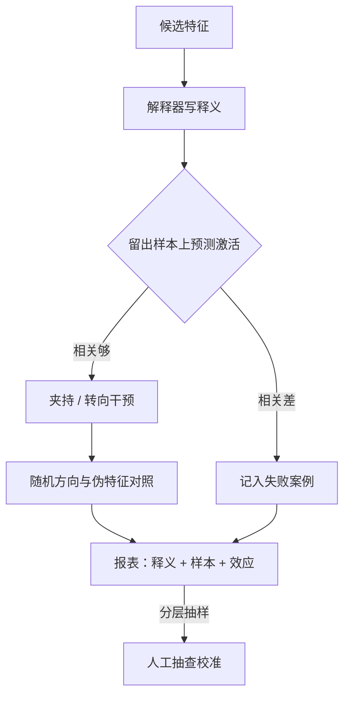
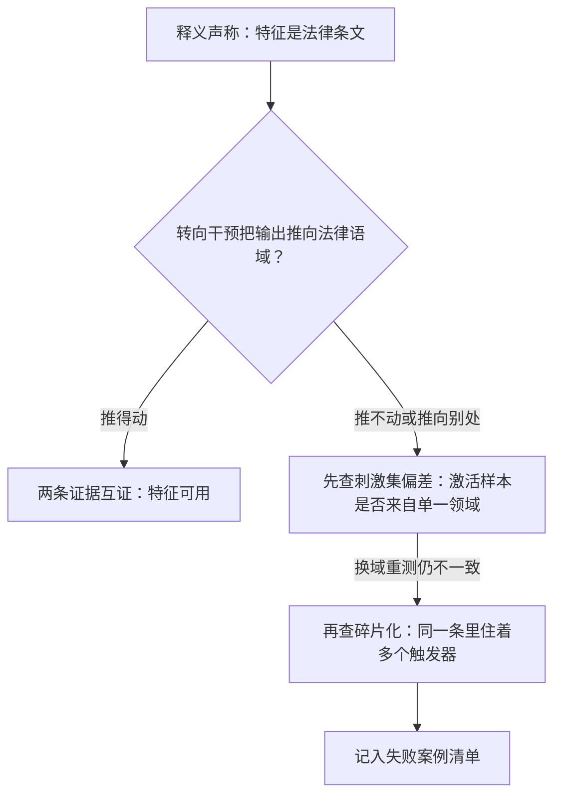

# 特征发现的验证

重构好只说明压缩器好；一条特征配叫「特征」，要过释义、样本、干预三道账，而且账要开得出、别人对得上。

<footer>—— 据 Bricken et al., 2023 与 Bills et al., 2023 的评测协议整理</footer>

[上一课](/llm/xai-sae-practice)把字典训成了生产线：位点、数据、缩放律、三条健康曲线。缺口立刻出现：重构–稀疏帕累托只证明压缩器有效，不证明特征为真。[SAE 基础课](/llm/sae-sparse-autoencoder)给过三道门的清单；本课把验证写成可规模化执行的协议——释义怎么生成与打分、干预怎么做对照、报表长什么样。字典动辄十万条，验证首先是吞吐问题，其次才是判据问题。后课的电路与监控都默认特征已过本课协议。

## 问题

验证要回答：这一列是不是一个东西。失败模式有三种，混在一起最麻烦。**相关簇**：方向重构得好，语义却只是词面触发器，与模型真正使用的概念无因果。**碎片**：特征分裂把一个概念撕成若干窄触发器，单条看起来「更纯」，整体上概念没找到。**循环**：用大模型写释义、再用大模型打分，评分器把流畅与冗长误当正确。

「相关簇」打个比方：气象站门口的旗子总在下雨天飘，因为管理员下雨天才挂旗——旗子与下雨强相关，但摆动不带 来下雨。词面触发器也一样：方向总在某些词出现时亮，看着语义干净，模型真正算数时却没走它。验证协议的干预环节，就是专门用来把这类「旗子」筛掉的。

人工读样本在 $10^5$ 量级的字典上不可行，验证必须自动化；自动化又引入新的偏差。缺口因此不是「有没有验收」，而是一套吞吐够、口径清楚、偏差可控的验证协议——正如上一课的元数据是字典的出生证明，本课的报表是特征的信用记录。

## 方法

协议分三段，产出是一张逐特征报表。

**释义与评分。** 对每条特征取最大激活样本若干，让解释器写释义；再在留出样本上让解释器**预测激活**，按相关系数打分。Bills 等人 2023 年的神经元解释协议搬到特征上即是如此。要点有二：留出样本与训练分布要隔离，否则评分在背题；刺激集要有分布广度，否则释义退化成「包含某词的文本」。

「留出样本」的道理和考试不从讲义里出题一样：若给解释器打分用的是写释义时看过的同一批样本，高分只证明「它背住了这批题」，不代表释义抓住了概念。隔离之后还能得高分，才说明释义对没见过的激活也预测得准——这才是「解释对了」的证据。

**干预与对照。** 对候选特征做夹持或转向，预言行为偏移，再用 [activation patching](/llm/activation-patching) 在已知任务上定因果。负面对照不可省：同范数随机方向、统计性质匹配的伪特征要一起跑，转向效应减去对照才有意义。[Scaling Monosemanticity](/llm/scaling-monosemanticity) 的特征转向是这条协议最著名的正面结果。

**抽样与报表。** 按激活频率分层抽样做人工抽查，校准自动分；每特征一行：释义、最大激活样本、$L_0$、转向效应、自动分。验收结论不是「全过」，而是**通过率加失败案例清单**——失败案例比平均分信息量大得多。

## 机制

评分为什么预测激活而不是预测人类偏好：激活是客观量，可复现、可跨解释器版本对账；偏好打分只会把解释器的风格与版本差异换个名字留下来。循环性由此被压到可控：解释器可以换，激活事实换不了。

干预与释义是一对互相牵制证据。释义说特征是「法律条文」，转向应把输出推向法律语域；推不动，或推向别处，先怀疑刺激集偏差（激活样本全来自新闻域时，释义抽到的是主导面），再怀疑碎片化——同一编号下住着多个触发条件，释义恰好抽中会偏移行为的那一个。这正是上一课监控死特征与分裂的下游理由：结构问题在验证端显形。

这张图回答「释义与干预打架时先怀疑谁」：两件证据必须互相咬合——释义说是什么，转向就得能把输出推过去。推不动时诊断有顺序：先查最便宜的解释（刺激集偏了，释义只抽到主导面），换域重测仍失败，才升级到结构性解释（碎片化）。跳过顺序直接下结论，是最常见的误判来源。

最便宜的偏差检查是换域重测：在同一批特征上换一组领域差异大的激活样本重新释义，释义漂得快的就是词面触发器或碎片。这一步在任何自动评分之前做，成本几乎为零。

## 边界

验证不对完备性负责：字典外方向照旧活在前向里，「通过率高」不等于「字典完整」。跨层对齐不在此协议内，那是电路课的接口。通过验收的语义是「当前证据下可用」，不是「就是模型的概念」——释义与干预都是证据，不是本体论判决。最后一个边界是安全：验证过的转向特征同时是操纵工具，告警特征与产品开关之间必须隔一层访问控制，复现包里不附带高危害特征的现成转向配方。

为什么重要：一条验证过的转向方向是双刃剑——研究者能用它定位「欺骗特征」，别人也能拿它把模型输出往指定方向推。所以访问控制不是官僚流程：告警特征与产品开关一旦打通、复现包里附上现成转向配方，验证工具箱就直接变成了操纵工具箱。这一步省掉的代价，是整个方法社区的安全底线。

## 小结

- 验证协议三段：释义与激活预测评分、带对照的干预、分层抽样报表；通过率与失败清单一起交。
- 评分锚在激活事实上，压住解释器循环性；换域重测是最便宜的偏差检查。
- 干预与释义互为牵制证据：不一致先查刺激集偏差，再查特征碎片。
- 通过验收＝当前证据下可用，不＝完备、不＝本体论定论。
- 出处：Bricken et al., *Towards Monosemanticity*, 2023；Templeton et al., *Scaling Monosemanticity*, 2024；Bills et al., 2023 的自动解释协议。
