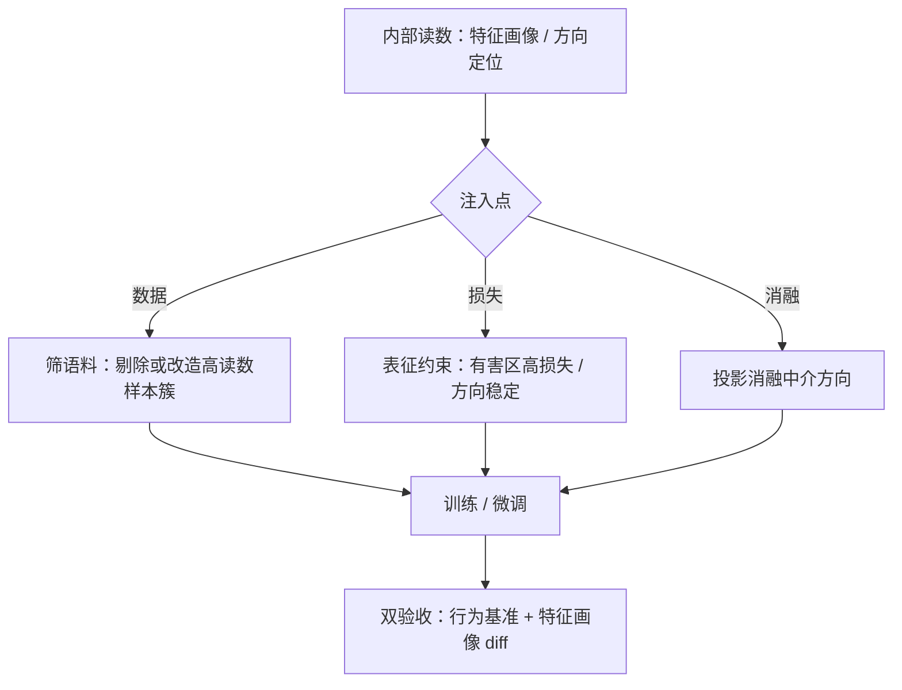

# 可解释性引导的训练

监控是读，训练是写；解释性从诊断室走进训练房，才算真正参与塑造模型，而不只是给模型拍片子。

<footer>—— 据 Zou et al., 2023 的 rerouting 思路与 Arditi et al., 2024 的方向中介结果整理</footer>

[上一课](/llm/xai-deception-monitoring)把内部读数接进监控：问题被检测出来，交回去修。本课往前一步：把内部读数直接写进训练目标，让解释性从诊断变成塑形工具。常规对齐改的是输出分布，中间表征可以原封不动地保持「随时能续写」的能力——[规约博弈](/llm/specification-gaming)的缝隙因此在表征里留门。本课写读数回写训练的三条注入点：数据、损失、消融，以及每条的验收。

## 问题

表征级训练的问题化有三问。把哪些内部量写进目标：特征读数、方向坐标还是区域约束；写进去会不会伤能力：残差流是共享总线，对有害区施力难免蹭到无害任务；引导之后怎么验收：不能只看目标行为改善，要按第 2 课协议重跑特征画像，看有没有把问题挤进字典没覆盖的子空间。三问的公共背景是：训练目标一旦写成表征级，就比输出级目标更难逃逸，也更难审计——力量越大，验收责任越重。

## 方法

**数据级注入。** 用特征画像筛数据：以第 5 课的监控读数扫描训练语料与生成的候选样本，把高欺骗读数的样本簇定位出来，要么剔除、要么改造成配对反例。成本低，可解释性好，缺点是只动得了「数据里有的」。

**损失级注入。** 对表征加约束项：有害区域高损失、目标概念的方向保持稳定。[Circuit Breaker 课](/llm/circuit-breaker)已把表示重路由的损失与选层讲透，本课不重复；要点是它是谱系里最重的形态——把「读出后处置」换成「训练时改道」，推理期零开销，攻击者无法靠不加向量绕过。

**消融级注入。** 先定位行为的中介方向，再直接投影消融。Arditi 等人 2024 年的结果是这条路的锚点：拒答行为在多个模型上主要由单一方向中介，消融它或加强它，拒答与越狱行为随之跨模型地移动。这是「理解工具即手术刀」的范例——方向既是机制结论，也是可操作的干预点。

## 机制

表征级目标为什么难逃逸：攻击（或对抗压力）要找到**不经过目标区域**仍能解码出目标行为的续写路径，可搜索空间被约束压小；输出级目标只约束开场，表征原样保留续写能力——这是 [Circuit Breaker](/llm/circuit-breaker) 机制分析的原样逻辑，适用于整个谱系。消融级为什么有效：单一方向中介说明行为在该方向上有充分读出，投影等价于掐断这条充分通路。

但机制分析同时给出警示：充分通路被掐，**平行通路**仍在。消融或改道之后必须双验收——行为基准确认目标行为确实移动，特征画像 diff 确认没有新的异常读数冒出来。只有前者的引导训练，等于把问题从可读的子空间赶进不可读的子空间，监控反而失明。

Arditi et al., 2024 的单一方向结果之所以重要：拒答不是遍布全网的分布式属性，一个方向承担了大部分中介——「消融一个方向」成了跨模型可复现的手术。同一把手术刀也是越狱工具，方向坐标的发布与复用要按攻击面管理。

## 边界

能力税是第一边界：表征约束蹭伤无害任务的概率随约束强度上升，保留损失的系数是主旋钮（Circuit Breaker 课的成对报告口径照用）。第二边界是表达的迁移：模型可能学会用新的、未被监控的表征形式表达同一目标——引导降低的是当前坐标下的读数，不是目标本身。第三，引导不是对齐证明：它改善的是特定概念的内部通路，与「模型可靠」之间隔着第 9 课要收拢的全部硬限。特征级损失的可扩展配方——哪些概念、哪几层、多强、怎么退火——目前仍是开放工程问题，没有公认配方。

## 小结

- 三条注入点：数据级筛语料、损失级表征约束、消融级方向手术；重到轻依次是不可绕过性与审计成本。
- 表征级目标比输出级难逃逸：攻击必须找到绕开目标区域的续写路径。
- 引导后必须双验收：行为基准与特征画像 diff，缺一就是把问题赶进不可读子空间。
- 方向坐标既是机制结论也是手术刀与攻击面，发布按攻击面管理。
- 出处：Zou et al., 2023（rerouting）；Zou et al., 2024（Circuit Breakers）；Arditi et al., 2024（拒答的单方向中介）。
