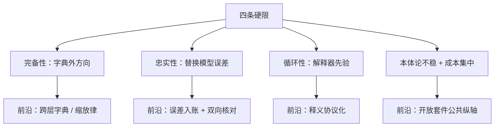

# 局限与前沿

解释产生证据，不产生证明；看清这条方法链在哪些地方必然断开，才知道哪些结论可以出、哪些话永远不能说。

<footer>—— 据 Templeton et al., 2024 的不完备声明与 Elhage et al., 2021 的方法框架整理</footer>

[上一课](/llm/xai-toolchain-repro)把口径钉成了规范。规范管「是不是同一个实验」，管不了方法本身的断点。本课程第九课，把前八课在各自边界里露头的限制收拢成一张全局清单，再给当前的前沿各归其位。每条断点说明它为什么是**硬限**而非工程债，前沿说明它补的是哪条缝。

## 问题

判定「解释成立」没有自动判据：释义、干预、归因图都产出证据，不产出证明。具体展开是四条。

**完备性未知。** 字典没覆盖的方向照旧活在前向里，全部漏进误差节点；Templeton 等人 2024 年在公开报告里明确承认特征集不完备。误差占比随宽度下降是健康信号，但不等于归零，更不等于「剩下的不重要」。

**忠实性无检验。** 替换模型上的因果不等于原模型上的因果：转码器与字典是代理，代理算得通的故事，原模型未必在用——两个模型的干预不一致时，应报替换误差而不是挑好听的讲。

**循环性。** 用大模型解释大模型，评分闭环内的一切一致都可能是解释器的先验；协议能压（第 2 课），压不到零。

**本体论不稳与成本集中。** 特征编号绑定具体字典与 checkpoint；前沿级字典与追踪的训练费只有少数机构付得起——开放生态在补，但公共字典的覆盖面远小于私有模型的总量。

## 方法

前沿按补的是哪条缝归位。补**完备性**的：更大的字典与缩放律、跨层转码器与交叉层字典——让一个概念不必在每层复制一份；补**忠实性**的：替换误差显式入账（[Circuit Tracing 课](/llm/circuit-tracing)的做法）、替换模型干预与原模型修补的双向核对；补**循环性**的：释义协议化——激活预测评分、留出集、换域重测变成工具默认（第 2 课的协议正在变成评测层组件）；补**覆盖**的：开放套件与特征浏览器把私有纵轴变成公共纵轴。

另有两条在缝外的方向值得点名：注意力侧的归因自动化——现有追踪偏重 MLP 与残差，「为何看向那个位置」的 QK 通路刚开始进入同一套工具；以及解释学和安全论证的接口——监控（第 5 课）与机制评测（第 7 课）是解释学变成安全论据的两条通道，目前都到不了「证明」级。

## 机制

这四条为什么是硬限而非工程债，各有一条机制理由。完备性受**表示本身**限制：若叠加无限密，任何有限字典都丢信息，加宽度只是降低丢失率。忠实性受**代理原理**限制：替换模型的全部意义就是把不可解释组件换掉，换掉的那一刻，误差就与解释同在。循环性受**同类解释者**限制：解释器与被解释者共享训练分布与先验，一致性证据永远混着先验的份额。本体论不稳受**方法论选择**限制：特征是字典的函数，字典是一次工程决定——除非模型「本来」就按这个字典分解，而这恰是无法保证的事。

由此得出使用判据：解释性产出的正当角色是**假设生成器、风险探测器、训练工具**；把同一产出当成「模型无害」的证书，是这四条硬限共同禁止的越界。

把 Templeton et al., 2024 的自认贴在任何解释性产出的首页：特征集不完备、缺少「字典忠实刻画计算」的严格检验。这句话防住的过度声明，比整章方法论加起来还多。

## 边界

本课的清单本身有时效：硬限随方法演进，今天的缝可能是明天的组件；不变的判断标准只有一条——任何应用方案都应说明自己在哪条缝上承担风险、用哪种证据垫底。课程不覆盖的相邻方向（表示几何、因果抽象）不在此展开。最后一条边界是社会的而非数学的：解释能力的成本集中意味着「谁能解释模型」本身是权力；开放生态是对策，也是它自己的新问题。

## 小结

- 四条硬限：完备性未知、忠实性无检验、循环性压不到零、本体论不稳加成本集中。
- 每条硬限有机制理由，分别卡在表示、代理原理、同类解释者与工程决定上。
- 前沿按补缝归位：跨层字典、误差入账、释义协议化、公共字典。
- 解释性产出是假设、探测器与工具；不是「模型无害」的证书。
- 出处：Templeton et al., 2024（不完备声明）；Elhage et al., 2021（方法框架）；Ameisen et al., 2025（追踪流水线）。
