# 可解释性应用收束

收束不是把九课再讲一遍，而是回答一个问题：周一早晨拿到一个具体需求，先打开哪一课、按什么顺序走、哪里必须停。

<footer>—— 据 Bricken et al., 2023、Templeton et al., 2024、Elhage et al., 2021 与 Zou et al., 2023 的方法谱系，按本课程整理</footer>

[上一课](/llm/xai-limits-frontier)把硬限与前沿收拢成清单。本课做收束该做的事：方法工程单元给了四件工具——字典（[第 1 课](/llm/xai-sae-practice)）、验证协议（[第 2 课](/llm/xai-feature-validation)）、自动化电路（[第 3 课](/llm/xai-circuit-automation)）、表征读写（[第 4 课](/llm/xai-representation-engineering)）；应用单元给了五个场景——监控（[第 5 课](/llm/xai-deception-monitoring)）、训练引导（[第 6 课](/llm/xai-guided-training)）、机制评测（[第 7 课](/llm/xai-mechanistic-eval)）、工具链（[第 8 课](/llm/xai-toolchain-repro)）、边界（第 9 课）。本课把它们装配成一张地图和一张决策单。**本课程到此收束。**

## 问题

解释性团队最贵的浪费是错配：想检测问题却去训大字典——字典是工具不是答案；想改行为却只做推理期加向量——可开关的控制挡不住有心人；想验收模型却只跑行为基准——[规约博弈](/llm/specification-gaming)的缝隙恰好留在机制里。各场景局部最优会互相拆台：监控的探针没过验证协议（第 2 课），告警没有公信力；训练引导没跑特征画像 diff（第 6 课），伤能力不可见。收束要给的是先把需求放进哪个格子、再按什么顺序调用工具的先后表。

## 方法

**决策单**，按「先定格子、检测先行、读数必验、误差入账」排序：

1. **定格子**：理解（电路）、检测（监控与评测）、改造（训练引导与读写）——三格的工具链不同，先答「要的是什么」。
2. **检测先于改造**：动手之前先有读数基线，否则改造的效果与副作用都无法归因。
3. **一切读数过验证协议**：探针、特征、方向，未过第 2 课验收的不进决策依据。
4. **误差与失败案例入账**：误差节点占比、未找到的审计结论、验证失败清单，与正面结果同权。
5. **口径随结论走**：位点、宽度、版本、字典元数据（第 1、8 课）附在任何对外结论后面。

永不碰的三件事：把「欺骗方向激活」当意图判决；把未验读数写进训练目标；把解释性产出当「模型无害」的证书（第 9 课的越界）。

```mermaid
flowchart TD
  NEED["需求"] --> GRID{"定格子"}
  GRID -->|理解| CIRC["自动化电路：粗筛 + 细验 + 干预闭环"]
  GRID -->|检测| MON["监控与机制评测：分层读数 + 审计"]
  GRID -->|改造| GUIDE["训练引导：数据 / 损失 / 消融 + 双验收"]
  CIRC --> VAL["验证协议：释义 + 干预 + 对照"]
  MON --> VAL
  GUIDE --> VAL
  VAL --> LEDGER["误差与失败案例入账"]
  LEDGER --> OUT["结论附口径：位点 · 宽度 · 版本"]
```

## 机制

地图的骨架是三条不变量，与前九课一一扣合。**不变量一：干预优先于相关。** 释义、探针、归因都先产出相关候选，升级为结论只发生在干预之后——特征验证（第 2 课）、电路闭环（第 3 课）、读写验收（第 4 课）用的是同一个闭环。**不变量二：读数不是判决。** 内部证据始终是可证伪假设，处置要过人审与行为复核——监控（第 5 课）与机制评测（第 7 课）的判分原则同源。**不变量三：口径绑定一切。** 位点、宽度、checkpoint、解释器版本变了，结论就换了地盘——工程实践（第 1 课）与复现规范（第 8 课）守的是这一条。三条不变量定了，字典换代、追踪器升级，决策单的顺序不动。

一张自检表：如果只做三件事——给高危流量挂已验证的轻量读数，把特征画像 diff 加进发布门槛，让每条对外结论自带字典元数据。多数团队在这三步内就能把解释性从演示变成工序；后面的每一步都要求先证明前面拿不出来了。

## 边界

这张图有时效与方法界。方法界：全部工具默认白盒——有权重、能 hook、能重训；API 模型只剩行为侧的降级版。能力界：工具只见线性可读的表征，四条硬限（第 9 课）原样压在地图上，地图不承诺覆盖。时效界：字典与追踪流水线仍在换代，编号与图谱会过时，三条不变量与决策单的顺序是本课程打算留下的部分。地图之外由相邻课程接棒：模型之上的编排、工具与生产化，是 Agent 工程的主题，本课程不再跟进。

## 小结

- 决策单五步：定格子 → 检测先行 → 读数必验 → 误差入账 → 口径随结论走。
- 三条不变量：干预优先于相关、读数不是判决、口径绑定一切；工具换代，顺序不动。
- 永不碰：读数当意图判决、未验读数进训练目标、解释当无害证书。
- 白盒是默认前提，四条硬限压在整张地图上；解释性是纵深防御的一层，不是终点。
- 出处：Bricken et al., *Towards Monosemanticity*, 2023；Templeton et al., *Scaling Monosemanticity*, 2024；Elhage et al., 2021；Zou et al., 2023。
