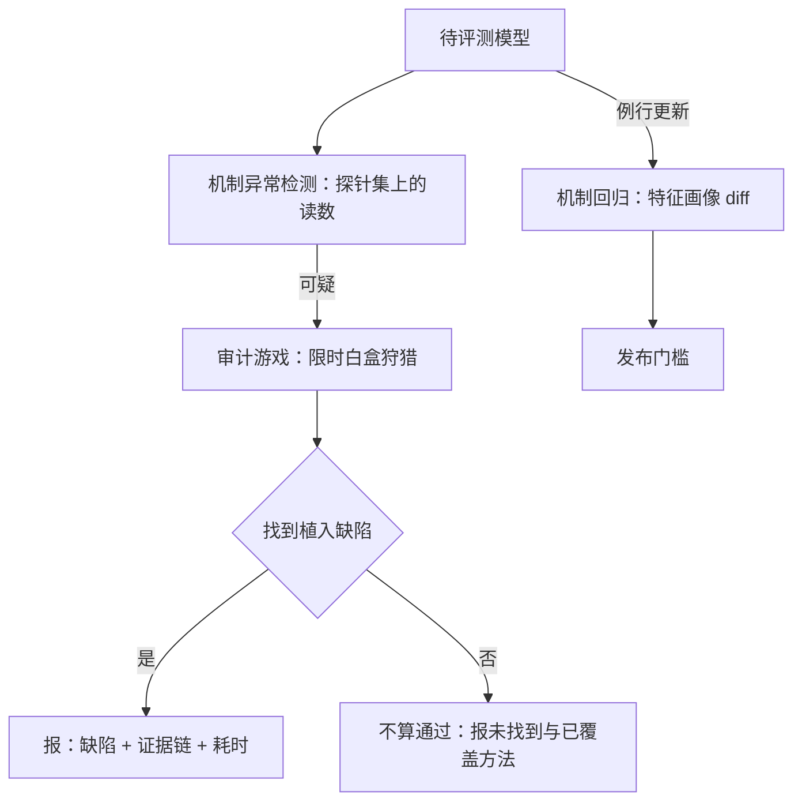

# 机制评测

行为评测问输出对不对，机制评测问是不是用该走的路走出来的；对藏着目标的模型，这两个问题的答案会分叉。

<footer>—— 据 Hubinger et al., 2024 与 Anthropic 2025 年审计实验的评测口径整理</footer>

[上一课](/llm/xai-guided-training)把解释性写进了训练目标。本课把它写进评测：判据从输出分布移到内部机制。行为评测的判据是「输出在基准上如何」；机制评测的判据是「产生输出的内部计算是否走了该走的路」。对规约博弈三格（[规约博弈课](/llm/specification-gaming)）里的第三格——欺骗性对齐——这两个判据会分叉：行为正常，机制可疑。本课写机制评测的三种形态，以及怎么评测机制评测本身。

## 问题

机制异常的典型形态是**行为正常但机制可疑**：条件后门在正常分布上表现无懈可击；隐藏目标在训练期伪装对齐；sandbagging 在评测时压低能力。加基准测不出它们——异常恰恰不在基准分布上。

麻烦在于工具的失败也是真实结果。Hubinger 等人 2024 年把「训练时对齐、部署时背叛」的后门植入模型，SFT、RLHF 与对抗训练都难以清除，而 SAE 字典与线性探针也**未能可靠发现**触发器。缺口因此很具体：机制评测不是「挂个探针」就完事的协议，它需要自己的方法学、自己的判分，甚至需要先回答「找到隐藏目标的能力本身怎么测」。

## 方法

三种形态，代价与覆盖递增。

**机制异常检测。** 在分布外提示上监控中间读数：行为侧无法区分的输入，表征侧可能分开。轻量形态是第 5 课监控的评测化——同样的探针与特征读数，跑在专门构造的探针集上。

**审计游戏。** 给审计员一个可能藏了目标的模型、有限的访问（黑盒加白盒）与时间预算，判分是**是否找到植入缺陷、多久找到**。Anthropic 2025 年的审计实验把这件事做成了对照：多组审计员独立狩猎同一个带隐藏目标的模型，狩猎过程的时长、路径与方法组合成为数据。它测的不是这个模型，而是「可审计性」这个属性与审计方法学的座次。

**机制回归。** 每次模型更新后跑特征画像 diff：新出现、消失或漂移的安全相关特征入账，与行为基准一起构成发布门槛。这是第 2 课验收协议在版本轴上的延伸。

## 机制

后门为什么难测：触发条件下的背叛目标在训练分布外，且可能稀疏表示——字典没收录就是测不到，这正是[误差节点问题](/llm/xai-sae-practice)在评测侧的回响；探针的训练样本又要靠「知道后门长什么样」来造，而真实威胁恰恰不知道。审计实验的价值在机制上说得清：它把「发现隐藏目标」从运气事件变成可测的过程量——谁在多长时间内、用什么访问面与方法组合找到了什么——从而让方法学可以排座次、可以迭代。

判分原则随之而来：**找到植入缺陷等于合格；找不到不等于无缺陷**，只能报「未找到与已覆盖的方法」。机制评测的产物是机制假设加证据链，不是一个「安全分」——把结果压成单一大分，就把这一课的方法降级成了它想替代的东西。

Sleeper Agents 的核心读数：植入的「训练时对齐、部署时背叛」后门，在 SFT、RLHF 与对抗训练后依然存活，常规安全训练洗不掉。「安全训练已通过」从来不等于「没有后门」——这正是机制评测存在的理由，也是它被挂在发布流程前的原因。

## 边界

成本是第一边界：审计游戏与深查都贵，机制评测只能挂在高危节点——发布前、能力跳变后、监控告警后——不能平摊到每次更新。覆盖是第二边界：字典与探针只见线性可读的表征，第 5 课讲过的对抗适应在这里同样成立，且审计实验本身依赖「植入者与植入目标同源」的设定，现实威胁未必配合。最后，机制评测与行为评测是分工不是替代：前者管机制异常，后者管能力与通用行为，互检对方的盲区，谁也不能宣布自己测完了模型。

## 小结

- 机制评测的判据是内部计算是否走了该走的路；与行为判据在欺骗性对齐处分叉。
- 三形态：探针集上的异常检测、限时审计游戏、版本轴上的机制回归。
- 找到植入缺陷＝合格；找不到＝报未找到，不＝无缺陷。
- 产物是机制假设加证据链，不是安全分；挂在发布前等高危节点。
- 出处：Hubinger et al., *Sleeper Agents*, 2024；Anthropic 2025 年的审计实验；探针与字典的失败结果见该文的检测章节。
