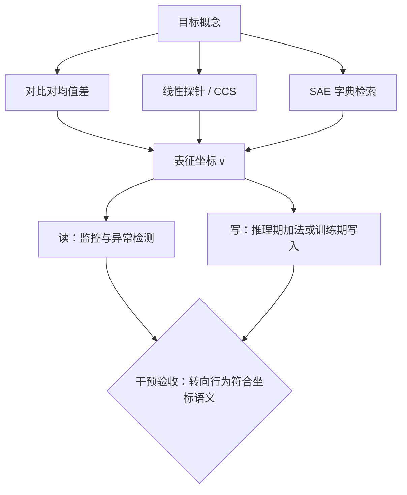
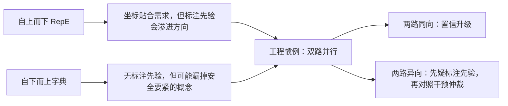

# 表征工程

自下而上的解释翻字典找概念；自上而下的表征工程反过来：先点名概念，再去表征里找它的坐标，并且读得出、写得进。

<footer>—— Zou et al., Representation Engineering: A Top-Down Approach to AI Transparency, 2023</footer>

[上一课](/llm/xai-circuit-automation)自下而上拆通路：从激活出发，自动化地找边。本课换方向：先指定概念——诚实、谄媚、情感、危害——再在表征里定位它的坐标并读写，这就是 Zou 等人 2023 年提出的表征工程（representation engineering, RepE）。[Steering Vectors 课](/llm/steering-vectors)已讲过加法向量本身的构造与失效；本课不重复加法，而是把读写扩展成方法学：概念坐标从哪来、读什么、写什么，以及它与无监督字典的分工。后两课的监控与训练引导都建立在这套读写上。

## 问题

自下而上的产出是一张十万条的特征表；安全工作需要的常常是**点名找**特定概念：欺骗在哪里、隐藏目标在哪里。监督式路线的问题化有三层：给定一个概念，怎么获得它的表征坐标——对比对、探针、字典检索各走一条路；读出的方向是否因果——线性探针高分不等于模型在用；读写会不会伤别的能力——概念的坐标与别的概念在残差流里未必正交。

「概念的坐标」翻译成大白话：把模型某一层的激活向量想成几千维空间里的一个点。如果「诚实」「欺骗」这类概念在这个空间里有稳定方向，就能像经纬度一样把它标出来——读数是问「当前这个点沿该方向投影多远」，写入是人为把点往该方向推或拉。

与字典路线的本质区别在先验：字典无监督，找到什么算什么，可能漏掉安全上最要紧的概念；RepE 有监督，坐标贴合需求，但标注先验会渗进方向里。两边的缺口互为镜像，这也是本课最后把二者接起来的理由。

## 方法

**坐标的三来源。** 其一，对比对均值差：正负输入在某层激活相减（[steering 课](/llm/steering-vectors)的构造），快，但对词面污染敏感。其二，线性探针：在激活上监督地学一个读出方向；Azaria 与 Mitchell 2023 年用简单分类器读出模型「是否在说真话」的内部状态，Burns 等人 2023 年的 CCS 更进一步——不用标注，只要求方向在正反语句间保持一致，把「标注者的假设」关在门外。其三，SAE 字典检索：拿上一课验证过的特征当坐标库，按释义检索概念。

对比对均值差给个具体例子：收集 1000 条「诚实回答」和 1000 条「欺骗回答」，各取它们在同一层激活向量的平均，再相减——得到的向量就是「欺骗方向」的粗坐标。类比把两堆人脸照各求一张「平均脸」再做差：个体的差异被平均掉，剩下的是两类的系统性差别。它快，但如果正负例在措辞风格上系统性不同，学到的可能是风格方向而不是欺骗本身。

**读。** 用坐标给任意输入打内部读数：监控、异常检测、评测的中间量——下一课的欺骗监控是主要应用。

**写与改道。** 推理期加向量是可开关的写；把方向写进训练目标是永久性的写，[Circuit Breaker 课](/llm/circuit-breaker)讲的表示重路由是其安全特例，本课不重复其损失细节。

## 机制

自上而下能成立，几何前提是残差流的**近线性可加**：概念在中等深度上有稳定、可分离的方向——Elhage 等人 2021 年的数学框架给出的视角，从注意力计算延伸到概念层坐标。但「可分离」不等于「在用」：读出方向可能是统计伴影，所以每个坐标都要过干预验收——转向行为与坐标语义一致才算数，这与第 2 课的特征验证是同一个闭环，只是概念先给定。

监督与无监督的互补在机制上说得清：标注渗入的是**方向的选择**，不改变残差流本身的几何；字典检索不到目标概念，恰恰是「该概念在此层无线性坐标」的负证据。工程惯例是双路并行：RepE 坐标先上，字典检索复核；两条路给出不同方向时，先怀疑标注先验，再做对照干预仲裁。

「互为镜像」的直觉：RepE 保证「你点名的一定去找」，风险是找到的可能是你期待看到的方向（先验污染）；字典保证「找到的确实是模型在用的」，风险是你要的那个可能根本不在表里。两路同向时错误概率大幅下降，两路异向时等于免费得到一次报警——这就是双路并行比单路贵一点却值得的原因。

CCS 只要求读出方向满足一致性（正反语句上读数相反）与镜像性（方向取反后读数互换），不提供「哪个一致解是真的」的判据——无监督买来的是抗标注先验，付出去的是多重解的歧义。它适合做初筛，不适合单独做结论。

## 边界

RepE 不是透视：读出的是「与概念统计相关的方向」，不是意图；分布一漂移，坐标的语义跟着漂。跨层要小心：中层读出的方向到浅层可能还没成形、到深层已写成 logits，读写通常锚在中层。安全场景另有一条硬边界：对可被监控的概念做对抗训练，模型可能学会在非线性可读的子空间表达同一内容——读写的可达性是当前方法的边界，不是模型的边界。概念清单本身也有政治学：什么算「谄媚」、什么算「诚实」，坐标的噪声里一半来自定义的噪声。

为什么重要：如果两家团队对「谄媚」的定义不同——一家只算「迎合用户错误说法」，另一家把「过度道歉」也算进去——各自标注学出的方向就会不同，读数不可比、结论互相打架。所以安全概念清单要先写清判定规则再谈坐标；这一步省掉，坐标噪声里就永远分不清「模型的问题」和「定义的问题」。

## 小结

- RepE 自上而下：先点名概念，再取坐标、做读写；与字典路线的先验互为镜像。
- 坐标三来源：对比对均值差、探针与 CCS、验证过的 SAE 特征检索。
- 读出必须过干预验收：转向行为与坐标语义一致才算因果候选。
- 读写锚在中层；双路并行（监督 + 字典）互为负证据与仲裁。
- 出处：Zou et al., 2023；Burns et al., 2023（CCS）；Azaria & Mitchell, 2023（内部状态读出）。
