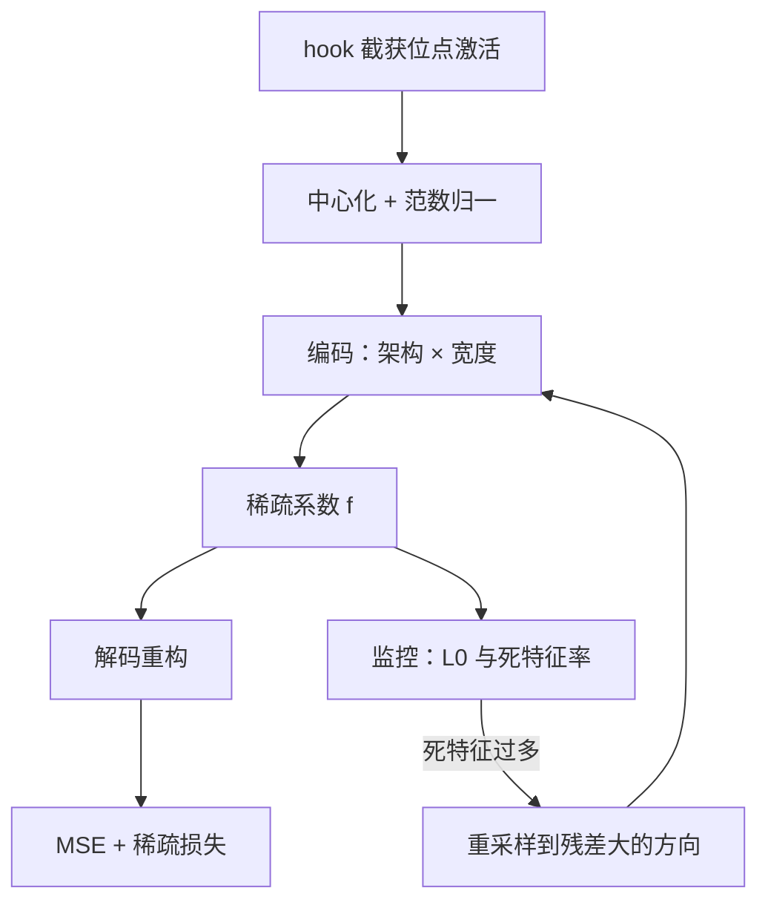

# 稀疏自编码器的工程实践

字典学习的想法三行讲完；把一个能用的字典训出来，是位点、数据、宽度与健康监控层层做对的工程。

<footer>—— 据 Bricken et al., 2023 与 Templeton et al., 2024 的实验配置整理</footer>

[上一课](/llm/aeval-map)把对齐评测收成九步决策单与四条不变量：政策先行、成对报告、版本冻结、最坏值给门禁，行为侧的深钻交了卷。本课是「可解释性应用」的第一课，沿用同一条纪律：读数要验收，解释不是故事，是产出要验收的工程。[SAE 的损失与验收门](/llm/sae-sparse-autoencoder)已把原理讲清；本课只写把它跑成项目的那一半——位点、激活数据管线、宽度与架构的决策顺序、训练健康度。后面的特征验证、电路自动化、表征读写都默认你手里有一个口径清楚、训练健康的字典。

## 问题

把 SAE 写成目标函数只要三行，跑通一个项目要先答一串账：激活从哪个位点抓、抓多少、怎么流；字典多宽、什么架构、超参按什么顺序定；训练是健康的，还是「损失在降、字典在死」。这些账不是实现细节。位点选错，特征的语义类别整体漂移；管线上没做中心化与归一化，重构损失与稀疏度在不同运行之间没有公共纵轴；死特征率失控，有效字典比账面窄一个量级，解释力随之虚高。

SAE 一句话翻译：它是个「解释器」小网络——输入是模型内部的一个激活向量，中间层维度远大于输入（叫「过完备」），但每次只许少数几个单元亮着。直觉上像病历：病人的状态只有一个，但描述它的「病因条目」有几万条，一次只勾中两三条。这两三条勾选，就是我们要的「稀疏特征」。

上一课的教训在这里原样成立：口径不清的字典比没有字典更糟——拿一支没对过焦的透镜看模型，还以为自己看见了东西。

## 方法

按四个决策走，顺序不能换。

**位点先行。** 残差流是下游读写的总线，可加性好；MLP 输出带特权基，语义有但叠加密；注意力输出是第三套混合。位点决定特征的语义，不同位点的字典互不通用，选定后不能中途换。残差中层是多数套件的主实验面，[Scaling Monosemanticity](/llm/scaling-monosemanticity) 即是如此：太浅多词法，太深已近解嵌。

初学者容易以为在 MLP 输出训的字典，可以顺手套去解释残差流——不行。位点不同，激活的语义与几何都不同，特征编号即使原样搬过去，含义已经完全对不上。这就像把心电图的判读手册拿来读脑电图：波形都在，词汇表作废。

**数据管线。** 用 hook 截获选定位点在大量 token 上的激活，流式喂训练：先中心化（减均值或把均值吃进 $b_{\mathrm{dec}}$），再按范数归一，让重构误差跨运行可比。[Towards Monosemanticity](/llm/towards-monosemanticity) 用了 80 亿个激活样本——稀疏特征的长尾靠它铺开。

80 亿个激活样本是什么概念：每个 token 过一层产生一个激活向量，80 亿样本相当于记录约 80 亿个 token 位置的内部状态——几部小说体量的语料远远不够，得按「让模型读半个互联网」的量级准备数据。原因：稀有概念（冷门语言、生僻代码模式）的长尾特征，出现频率太低，样本少了它们根本没机会被字典学到。

**宽度与架构，缩放律先行。** 先在小宽度上扫架构（ReLU、JumpReLU、Gated、TopK）与稀疏系数，用损失与平均 $L_0$ 拟合缩放律，再外推目标宽度的超参。大宽度上网格搜索不可行；没有缩放律的大字典只是一个无法解释的单点。

**健康监控。** 重构 MSE、平均 $L_0$、死特征率三条曲线同盯；死特征用重采样拉回——重新初始化到重构残差大的方向；拉不回的部分计入误差账。

## 机制

缩放律为什么先行：编码器是把迭代稀疏推断换成一次矩阵乘，训练目标非凸，超参在宽度之间不平移，只能靠小宽度上的标度关系外推。死特征是结构性现象与工程失误的叠加：过完备字典必然有空转原子，[字典学习课](/llm/dictionary-learning-interp)讲过分裂与合并的几何；而学习率与重采样节奏决定空转面有多大。监控要区分二者：重采样救得回的是工程面，救不回的结构面应写进报告，而不是用高膨胀倍数遮过去。

这张图回答「四步为什么不能换序」：每一步的输出是下一步的前提——位点决定抓什么数据，归一决定指标可比，缩放律决定大宽度超参从哪来，健康监控决定敢不敢把字典交付给后面的验证与电路分析。跳过任何一步，返工的都不是那一步本身，而是它下游的全部工序。

重构残差同理。字典没覆盖的方向全部堆进误差项，误差占比应随宽度下降；不降，说明字典在错的地方变宽。训练完成后，位点、宽度、架构、数据量、checkpoint 一并写进字典的元数据——下一课的验收、后课的电路分析都按这份元数据解释结果。

Templeton et al., 2024 在 Claude 3 Sonnet 中层残差训到三千四百万特征。按 $d_{\mathrm{model}}$ 四千量级粗算，单个解码矩阵约 $1.4\times10^{11}$ 参数，bf16 下数百 GB：字典本身就是需要调度的大模型，「缩放律先行」不是风格偏好，是算力账。

## 边界

本课不做验证：训出来的特征是不是真的、怎么规模化验收，下一课。位点与宽度一经选定就绑定语义——换 checkpoint 或换宽度，特征编号整体作废，跨字典比较必须重走验收。自训与开放套件（[Gemma Scope](/llm/gemma-scope)）是预算题：开放套件覆盖主流开源模型、省下本课全部工序，但位点与宽度受限；自训自由，代价是四步全走并自己兜住口径。工程也换不来完备性：字典再宽，误差节点里的方向仍可能是模型在用的。

## 小结

- 工程顺序钉死：位点 → 数据管线 → 缩放律外推超参 → 健康监控，顺序换了后面全返工。
- 三条健康曲线同盯：重构 MSE、平均 $L_0$、死特征率；误差占比要随宽度下降。
- 死特征与分裂是结构性现象，重采样只救工程面；救不回的写进报告。
- 位点、宽度、checkpoint 绑定特征语义；跨字典比较必须重走验收。
- 出处：Bricken et al., *Towards Monosemanticity*, 2023；Templeton et al., *Scaling Monosemanticity*, 2024；损失与验收口径见本栏 SAE 基础课。
