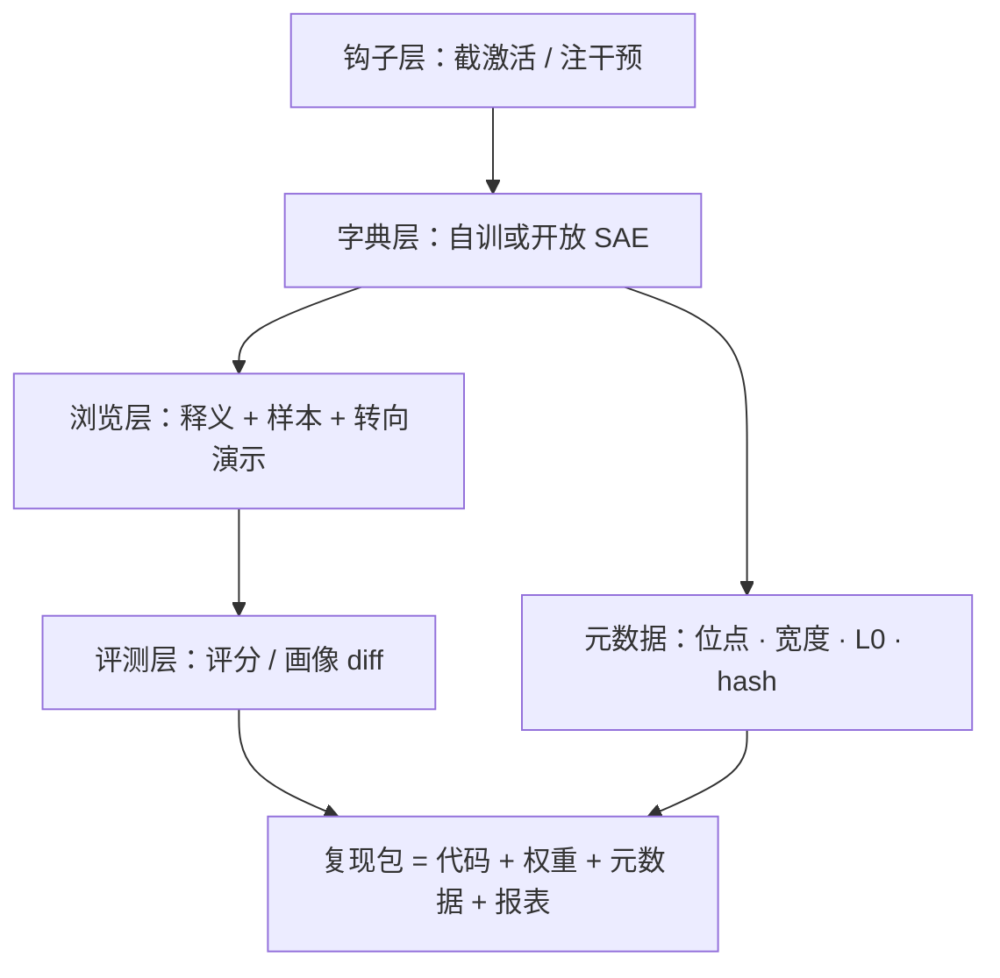
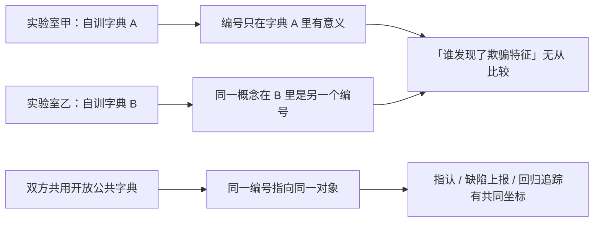

# 工具链与复现规范

前八课每一步都踩在工具链上；可解释性实验比一般 ML 更难复现，因为结论绑定的不只是代码与数据，还有一层特征编号的临时本体论。

<footer>—— 据 Lieberum et al., 2024（Gemma Scope）与 Templeton et al., 2024 的开放实践整理</footer>

[上一课](/llm/xai-mechanistic-eval)把机制做成了评测判据。判据要有公信力，前提是任何人能用同样的工具、同样的口径走到同一个结果——这正是可解释性最薄弱的环节。本课写两件事：工具链的分层，以及把前九课散落的口径钉成复现规范。它也是本课程从「方法与场景」走向「边界与收束」前的最后一节工程课。

## 问题

复现可解释性实验有三重困难。**编号不可移植**：换 seed、换宽度、换 checkpoint，特征编号整体作废，「第 1024 号特征」离开它的字典毫无意义。**解释循环依赖解释器**：释义评分随解释器版本漂移，第 2 课压住循环性的协议，换个人跑可能没有。**自由度爆炸**：位点、层号、宽度、架构、稀疏系数、数据量、中心化方式——「同一个 SAE」在这七个自由度下没有定义。

「临时本体论」翻译一下：本体论本是哲学术语，指「一套东西的清单与命名」。特征编号就是这样一套命名——它只对某一次具体训练出来的字典有效，重训一次就整体换名。这和化学元素表完全不同：氧是自然种，换个实验室还是氧；「第 1024 号特征」不是自然种，离开那支字典就是空签。

一般 ML 复现只要 pin 代码与数据；这里还要 pin 一套临时本体论——哪些方向算「找到过」、叫什么名字。缺口因此不是工具不够多，而是层与层之间的接口没有被当成规范来写。

## 方法

工具链四层，每层的接口就是复现规范的一半。

**钩子层。** 前向截获激活、注入干预的库（TransformerLens、nnsight 一类），对齐的是模型实现：模型版本、权重 hash、hook 位点与层号。

「hook（钩子）」是什么：在模型前向计算流经某一层时「拦截」一下——抄走这一刻的激活，或把它换成别的值再放行。类比流水线上装一个观察窗加一只机械手：既能记录每一件过路产品（读激活），也能伸手改一件（干预），后面的工序拿到的是改过的货。

**字典层。** 自训用 SAELens 一类训练库，或直接用开放套件——[Gemma Scope](/llm/gemma-scope) 把主流开源模型的全层 SAE 放进公共领域，等于把第 1 课的整条工序外包给了公共字典。对齐的是第 1 课的元数据：位点、宽度、架构、平均 $L_0$、训练 token 量。

**浏览层。** 特征浏览器（Neuronpedia 一类）把「释义 + 最大激活样本 + 转向演示」摆在一起，供人读与跨团队指认。对齐的是第 2 课的报表格式。

**评测层。** 释义评分、干预脚本、特征画像 diff 的执行器。对齐的是解释器版本与判分协议。

## 机制

复现锚点为什么是「释义 + 激活样本 + 转向效应」三元组而不是编号：编号在重训里必然变，三元组不依赖具体运行——重训后按语义重新对齐，特征画像 diff 就是在做这件事。这是「临时本体论」的唯一稳定指称方式：特征不是自然种，是字典的函数，指称它的稳定方式只能经过它的证据。

开放套件的机制价值因此不止省算力：公共字典是跨团队的**公共纵轴**。两家实验室各自训字典，比较「谁发现了欺骗特征」无从谈起；都用同一套开放字典，特征指认、缺陷上报、回归追踪才有共同对象。这也是开放生态被当成可解释性基础设施、而不只是福利的原因。

「公共纵轴」类比坐标系：两人各带一把刻度不同的尺子，报出的长度没法对账；约定同一把尺子后，测量才有比较的意义。开放字典就是解释性社区的公尺——它未必是最准的尺，但让「你说的 1024 号」和「我说的 1024 号」第一次指向同一个东西。

复现一条特征的最低清单：位点与层号、宽度与膨胀倍数、架构与平均 $L_0$、激活函数、训练 token 量、checkpoint hash、释义加十条最大激活样本、转向 $\alpha$ 与效应记录。少任何一项，复现者就是在对另一支透镜——而没人告诉他焦距差多少。

## 边界

规范不能让本体论稳定：字典一更新，旧编号的语义漂移，跨字典的「同一特征」最多是语义近似。私有模型没有公共字典，只有内部纵轴，跨组织的缺陷通报要附带完整复现包才可检验。工具链也不兜底方法错误：口径完全对齐的两个团队，可能一起用同一种带偏差的评分器得出同一个错误结论——复现解决「是不是同一个实验」，不解决「实验对不对」。最后，规范有成本：元数据与报表的完备性是工程税，团队会在进度压力下砍它；把它做成工具的默认输出而不是自觉，是这一课真正的落点。

常见误区：「实验可复现 = 结论正确」。两个团队用同一把刻度偏了的尺子，量出同一个错的数——完全可复现，但都错。复现回答的是「你们做的是不是同一个实验」，对错要靠第 2 课的对照与验收去压。把这两件事混为一谈，会出现「已复现，所以可信」的空担保。

## 小结

- 工具链四层：钩子、字典、浏览、评测；每层接口即规范的一半。
- 复现锚点是「释义 + 激活样本 + 转向效应」三元组，不是特征编号。
- 开放字典是跨团队的公共纵轴，缺陷通报与回归追踪都踩在它上面。
- 复现保证「同一个实验」，不保证「实验正确」；方法偏差要靠第 2 课的对照压。
- 出处：Lieberum et al., 2024（Gemma Scope）；Templeton et al., 2024 的开放与不完备声明；工具名以公开仓库为准。
