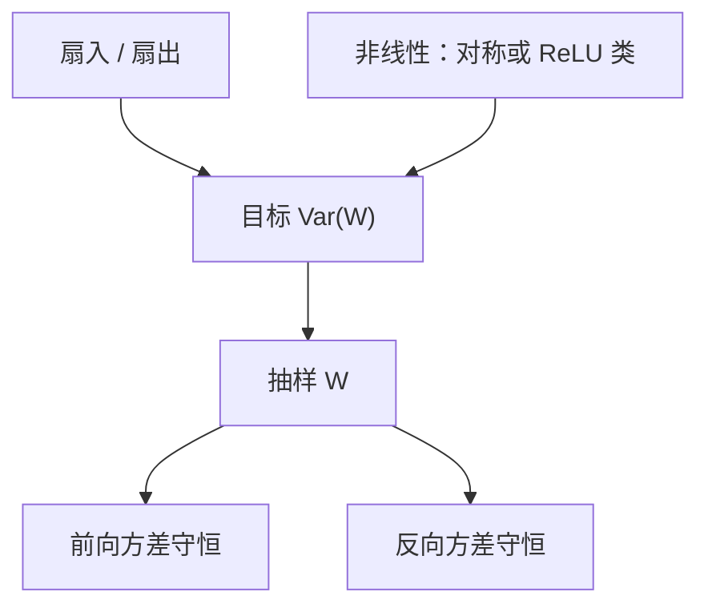

# Xavier / Kaiming 初始化

若每层把输入方差乘上一个随扇入扇出漂移的因子，深度会把信号送进饱和；初始化方差应按扇入（或扇出）除掉，使前向与反向的方差在层间近似守恒。

<footer>—— Glorot & Bengio, AISTATS 2010；He et al., Delving Deep into Rectifiers, ICCV 2015</footer>

[上一课](/llm/autograd-graph)保证框架会按图回传 VJP。缺口是：若线性层把激活方差逐层放大或缩小，softmax 与后续非线性会在第一步就饱和，图返回的梯度接近 0。本课补线性层的**方差守恒初始化**：Xavier（Glorot）对对称饱和非线性，Kaiming（He）对 ReLU 一类半边激活。后课的残差深度缩放、嵌入与输出头，都在这一层公式上再改，不再从「随机小数」讲起。

## 问题

设 $y=Wx$，$W\in\mathbb{R}^{n_{\mathrm{out}}\times n_{\mathrm{in}}}$，分量独立、零均值。若 $\mathrm{Var}(x_j)=v$，则

$$
\mathrm{Var}(y_i)=n_{\mathrm{in}}\,\mathrm{Var}(W_{ij})\,v.
$$

要 $\mathrm{Var}(y)\approx\mathrm{Var}(x)$，须 $\mathrm{Var}(W)\approx 1/n_{\mathrm{in}}$。反向 $dx=W^\top dy$ 给出对称条件 $\mathrm{Var}(W)\approx 1/n_{\mathrm{out}}$。Glorot 与 Bengio 取折中

$$
\mathrm{Var}(W)=\frac{2}{n_{\mathrm{in}}+n_{\mathrm{out}}},
$$

在 tanh / sigmoid 假设（激活在 0 附近近似线性、关于 0 对称）下，让前向与反向方差都不随深度指数爆炸。他们指出：饱和区 Jacobian 接近 0，深度前馈在错误初始化下根本走不动。

ReLU 把负半轴清零，有效扇入大约减半。He 等人把前向守恒改成 $\mathrm{Var}(W)=2/n_{\mathrm{in}}$（Kaiming normal），反向对应 $2/n_{\mathrm{out}}$。漏掉这个 2，ReLU 栈的激活范数随层衰减，看起来像「学不动」，其实是方差预算写错。

Transformer 的 FFN 用 GELU / SwiGLU，不是 tanh，也不是纯 ReLU。Kaiming 仍常被当起点，因为 GELU 在 0 附近近似半边线性。它不是定理，是把扇入除掉之后再让后课去调乘数。

## 方法

实践里对每个 GEMM 选一种：

- **Xavier uniform**：在 $\bigl[-\sqrt{6/(n_{\mathrm{in}}+n_{\mathrm{out}})},\sqrt{6/(n_{\mathrm{in}}+n_{\mathrm{out}})}\bigr]$ 上均匀。
- **Xavier / Glorot normal**：$\mathcal{N}(0, 2/(n_{\mathrm{in}}+n_{\mathrm{out}}))$。
- **Kaiming normal（fan-in）**：$\mathcal{N}(0, 2/n_{\mathrm{in}})$，匹配 ReLU 前向。
- **Kaiming fan-out**：把 $n_{\mathrm{in}}$ 换成 $n_{\mathrm{out}}$，更顾反向。

注意力的 $W_Q,W_K,W_V,W_O$ 与 FFN 的两（或三）个矩阵都按各自的 $n_{\mathrm{in}},n_{\mathrm{out}}$ 独立抽样。不要用「全网一个 std=0.02」代替扇入：那个常数在 GPT-2 一类配方里出现，已经把深度与宽度的经验折进 0.02，换宽度必须重标，这正是 [μP](/llm/mup) 要系统化的事。本课只钉扇入扇出这一层。

偏置通常初始化为 0。LayerNorm / RMSNorm 的增益初始化为 1、偏置为 0，使起步时归一化是恒等尺度。把 LN 增益也用 Xavier 打乱，等于第一步就破坏归一化的单位尺度假设。

## 机制

方差守恒只在「线性 + 独立分量 + 指定非线性」下近似成立。残差 $x\leftarrow x+F(x)$ 把 $F$ 的方差**加**进流里：即便 $F$ 内部 Xavier 正确，深度 $L$ 层之后流的方差可到 $1+L\cdot\mathrm{Var}(F)$。这是下一课深度缩放要补的缺口，本课不提前用 $1/\sqrt{L}$ 打补丁。

与 [SDPA](/llm/sdpa) 的 $1/\sqrt{d_k}$ 分工：缩放管的是点积维度，初始化管的是投影矩阵把表示放到什么范数。两者同时错，logits 要么饱和要么均匀。只调学习率去补错误的 $\mathrm{Var}(W)$，在窄模型上偶尔能混，加宽后会爆，因为方差错误随 $n_{\mathrm{in}}$ 线性放大。

## 边界

Xavier / Kaiming 不管嵌入表、不管 tied 输出头的 logit 尺度、不管残差深度。后三课分别补。也不管 Adam 的 $\varepsilon$ 与更新——那是稳定性单元。把 BERT 的 `normal(0, 0.02)` 抄到一个 $d_{\mathrm{model}}=8192$ 的模型上，没有扇入重标，等于拒绝本课的公式。

正交初始化、Fixup、ReZero 是同一问题的其他答案：有的保谱范数，有的把残差分支起步乘 0。本课停留在方差启发式，因为它仍是大多数实现的默认；换成谱方法时，要在配方里显式替换，不能与 Xavier 叠乘两套系数。

## 小结

- Glorot：$\mathrm{Var}(W)=2/(n_{\mathrm{in}}+n_{\mathrm{out}})$，让对称饱和非线性的前向与反向方差不随深度指数漂。
- He：ReLU 类用 $2/n_{\mathrm{in}}$（或 fan-out），补上负半轴被清零的那一倍。
- 注意力与 FFN 的每个 GEMM 按自己的扇入扇出抽样；全网固定 std 不是本课的公式。
- 残差会把每层方差累加进流，深度缩放是下一课的缺口。
- 出处：Glorot & Bengio, AISTATS 2010；He et al., ICCV 2015。
