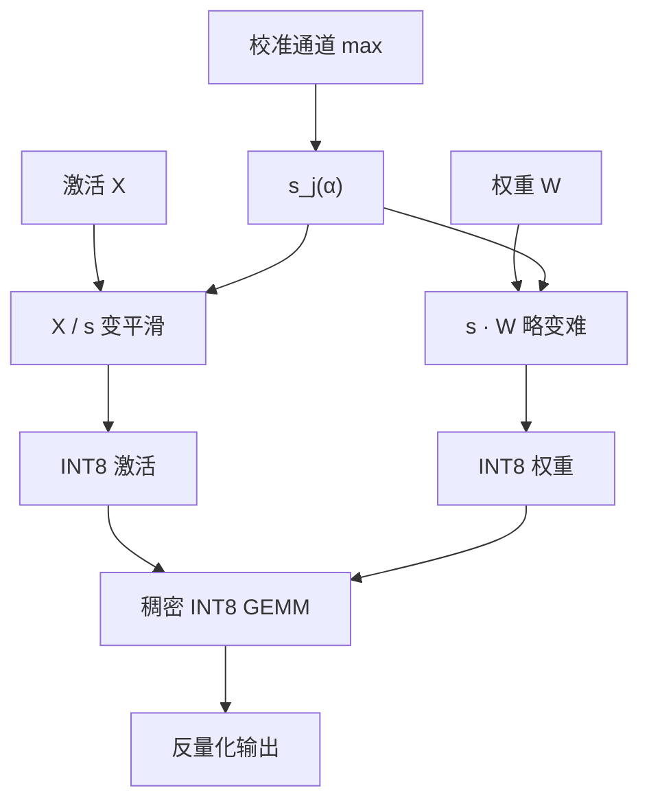

# SmoothQuant 原文

    
激活的通道异常值把 INT8 的格子撑爆，权重却相对平滑；把难度沿通道迁到权重上，两边都变得可量化，矩阵乘才能真正走 INT8 核而不是假 8-bit。

    <footer>—— Xiao、Lin、Han、Demouth 等，SmoothQuant，ICML 2023</footer>

Guangxuan Xiao、Ji Lin、Mickael Seznec、Hao Wu、Julien Demouth 与 Song Han 的 ICML 2023 论文（arXiv:2211.10438）是第一批把 **175B 级稠密 W8A8** 写成「几乎不掉点 + 真 INT8 GEMM」的工作。算法机制见 [SmoothQuant](/llm/smoothquant)。本篇按原文写：OPT / BLOOM 上的内存与墙钟合同、$\alpha$ 迁移了什么、他们如何对照 [LLM.int8()](/llm/llm-int8)，以及静态平滑绑死了哪一块校准假设。MIT 与 NVIDIA 的合作位置解释了文中为何同时谈精度与 Tensor Core：没有整数核，W8A8 只是半份压缩。

## 问题

只量化权重的 W8A16 能减加载，但 GEMM 仍按 16-bit 算，prefill 加速有限。要走 INT8 Tensor Core，必须同时给出整数权重与整数激活。权重离线量化一次即可；激活每个 token 都在变。LLM 的麻烦是少数**通道异常值**：若干维度的幅度可以比中位数高一个数量级，逐张量的 max 尺度被它们绑架，其余通道等效比特远低于 8。

当时 [LLM.int8()](/llm/llm-int8) 已经证明：把异常通道拆到 FP16、其余走 INT8，175B 可以不掉点。原文承认这条路精度成立，但核变成「稠密 INT8 + 稀疏 FP16」，异常通道比例一高就退回几乎全 FP16，吞吐承诺消失。SmoothQuant 要保持**稠密 INT8 GEMM**，用离线等价变换把异常值摊平，而不是在线分流。对象是 OPT-175B、BLOOM-176B 一类 2022–2023 年的开源稠密模型，不是后来的 RMSNorm + GQA 全家桶自动成立。

### 迁难度，不是消难度

缩放不消灭异常值携带的信息，只是让它由权重侧的较大系数来表达。权重被放大后，其 8-bit 误差增加；设计目标是两边误差都可接受，而不是激活完美、权重崩溃。迁移比例由超参 $\alpha$ 控制。$\alpha=0$ 等于不迁，激活仍难；$\alpha=1$ 把通道完全按激活 max 去压，权重可能饱和。论文在中间取值（OPT 常用 0.5，BLOOM 可略高），使两者的量化难度相当。这是一篇 PTQ 预处理论文，不是新的训练损失。

引用写 Xiao, Lin, Seznec, Wu, Demouth, Han，ICML 2023。不要把 AWQ 的 W4A16 数字写回这篇，也不要把后来 RMSNorm 模型上重扫的 $\alpha$ 当成原文默认。变换一旦融进权重与 LayerNorm，推理图就是标准 W8A8。

## 方法

对线性层 $Y=XW$（按实现转置约定调整），取正对角 $s$，令

$$
Y=\bigl(X\,\mathrm{diag}(s)^{-1}\bigr)\,\bigl(\mathrm{diag}(s)\,W\bigr).
$$

通道 $j$ 上常用

$$
s_j=\frac{\max(|X_j|)^\alpha}{\max(|W_j|)^{1-\alpha}},
$$

$\max(|X_j|)$ 来自校准激活。变换后 $X'$ 通道更平滑，$W'$ 动态范围变大但仍常比原激活好量化。然后对 $X'$、$W'$ 做 INT8 仿射量化，用 INT8 GEMM 累加到 INT32 再反量化。$s$ 可吸收进 LayerNorm 的缩放或上一层输出，避免额外内核。权重常用逐通道对称 INT8，激活常用逐 token 对称 INT8——平滑先抹通道轴，以免逐 token 仍被固定大通道支配。

端到端：OPT-175B 上论文报告相对 FP16 约 **2×** 的权重内存下降、约 **1.5×** 量级的推理加速（A100、实现与 batch 相关），困惑度与零样本在「几乎对齐 FP16」的区间。这些数字绑定平滑之后的 INT8 配方，以及当时的 PyTorch / FasterTransformer 一类整数核。用后来 FP8 或 W4A4 的墙钟回溯夸这篇，不符合原文硬件合同。

### OPT-175B 的 W8A8 合同

主舞台是 OPT 与 BLOOM 的语言建模困惑度、零样本常识推理，以及 175B 在单卡 / 少卡上能否装下。作者强调「几乎无损」必须带着校准域：WikiText / 校准句上的 PPL 对齐，不等于任意指令模型、任意上下文长度。175B 之前的小模型上，通道异常值较弱，平滑的必要性下降——这也解释了为何这篇和 LLM.int8() 都把「尺度涌现」写成故事的一半。没有 175B 这一档，W8A8 的精度障碍看起来像调参问题，而不是结构问题。

## 机制

INT8 格子是均匀的。激活若近似亚高斯，8-bit 的信噪比足够让一层线性的相对误差落在残差能吞下的范围；异常值破坏的是「近似亚高斯」这条假设。平滑是把非高斯的尾巴改写成权重侧的较大系数。问题不在 8-bit 这个位宽，而在**共享一个尺度的那群元素是否同质**。对角变换在浮点里精确等价；量化之后误差由两边分摊，而不是消失。

与 [AWQ](/llm/awq) 对比：同为对角 $s$，AWQ 放大显著权重、激活仍高精度，服务 decode 带宽；SmoothQuant 压平激活、权重变难一点，服务 prefill / 大 batch 的整数算力。屋顶线不同，见 [W8A8](/llm/w8a8) 与 [W4A16](/llm/w4a16)。不要在引用时写成「SmoothQuant 是更好的 4-bit 方法」。

累加必须高于 8-bit。INT8×INT8 的部分和会超出 8-bit 范围，硬件用 INT32 累加再缩放。先把两边反量化回 FP16 再乘，只得到一份「看起来像 8-bit」的存储，算术密度与 FP16 相同，论文里的加速条款作废。

### 与 LLM.int8() 的对照怎么引用

原文把 mixed-precision 分解列为精度成立、但核复杂的基线。SmoothQuant 赢的是「全部走 INT8 Tensor Core」这一条，不是在所有质量指标上逐项击败分流。异常通道极少时，LLM.int8() 的 FP16 尾巴开销很小，墙钟差距会收窄；异常通道变多时，分流退回 FP16，平滑的稠密路径更值钱。引用加速倍数必须写清：对照的是未平滑的 INT8（会崩点）还是 mixed-precision 8-bit（较准但核重）。没平滑的 INT8 基线崩掉，不能用来衬托任意 8-bit 方案。

## 边界与工程取舍

### 静态平滑绑死了校准域

离线 $s$ 假设校准集上的通道 max 能代表推理。若推理改用逐 token 动态 INT8，个别 token 上的尖峰会部分吐回平滑的收益。若全程静态激活尺度，遇到校准没见过的超长上下文或新域，可能饱和。服务栈里把动态激活量化随便打开，不能继续引用 ICML 表格。$\alpha$ 对 OPT 与对后来的 RMSNorm 模型不一定能共用，要按家族扫。

没有 INT8 GEMM 核的设备上，SmoothQuant 只省权重存储。$s$ 必须能融进现有归一化，否则多一次逐通道除法会吃掉加速。W8A8 对层数深、残差尺度不稳的模型更敏感，常常要把 softmax 输入、RMSNorm 内部留在较高精度，只把 GEMM 操作数降到 8-bit。KV 缓存另算：把 K、V 存成 INT8 不是这篇的命题。指令微调后的对话模型，要用生成质量重新签字，不能把 OPT-175B 的「无损」直接抄过去。

出处：Xiao et al.，*SmoothQuant: Accurate and Efficient Post-Training Quantization for Large Language Models*，ICML 2023（arXiv:2211.10438）。后续 AWQ 同实验室，但位宽与屋顶线都换了，分篇引用。

## 小结

- ICML 2023 用逐通道对角缩放把激活异常值的量化难度迁到权重上，使 175B 级稠密 W8A8 可行。
- $\alpha$ 控制迁移多少；校准只估通道统计，不做 Hessian 重构。
- 目的是 INT8 Tensor Core 与 prefill / 大 batch 算力墙，不是 4-bit 加载。
- 相对 LLM.int8() 的卖点是稠密整数核，不是全面质量碾压。
- 出处：Xiao et al.，ICML 2023。
