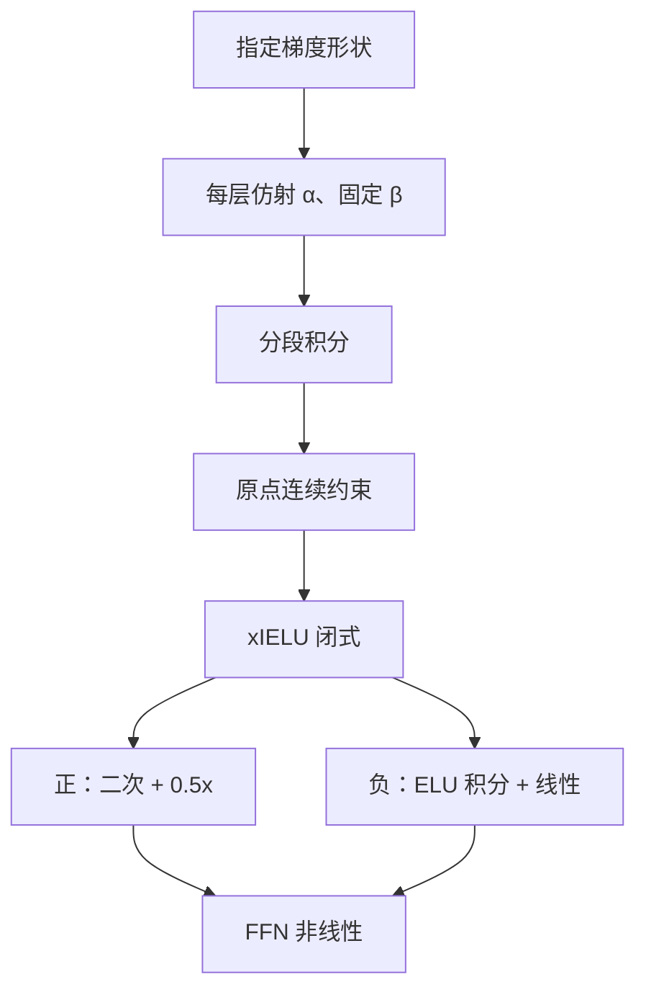

# xIELU 激活

先规定梯度该有什么形状，再积分得到激活：正半轴要线性变陡，负半轴要允许负梯度，深度方向上非线性还可以自己收。 

<footer>—— Huang & Schlag, Deriving Activation Functions Using Integration, arXiv:2411.13010</footer>

LLM 的 FFN 非线性长期在 GELU、SiLU 与 SwiGLU / ReLU$^2$ 之间换。后两者经验上更强：ReLU$^2$ 在正半轴梯度随 $|x|$ 线性增长，大激活能被认真学习；SwiGLU 用门控换参数与 FLOPs。ReLU$^2$ 的缺陷与 ReLU 相同——负半轴梯度为零，单元会死。Huang 与 Schlag 不从「再发明一个 $\sigma$」入手，而从**梯度性质**入手：对 ELU 做可训练仿射再积分，得到 **xIELU**（Expanded Integral of the Exponential Linear Unit）。正半轴像 ReLU$^2$，负半轴像 xSiLU 那样允许负梯度，且每层一组可学 $\alpha$，深层可以自动把非线性收浅。1.1B 与 3B 的 Llama 式模型在 FineWeb-Edu 的 125B token 上，等计算与等参数时困惑度低于 ReLU$^2$ 与 SwiGLU。本篇写积分推导与预训练取舍，不把后来融合核里的纯二次近似当成原文公式。

## 问题

激活函数一旦写进内核，梯度形状就锁死。GELU / SiLU 的正半轴梯度有上界，大预激活被压成饱和；ReLU$^2$ 正半轴是 $2x$，对大正值更敏感，但负值完全静音。SwiGLU 用两路线性再门控，参数大约 3 倍中间维而不是 2 倍，等参数对照时宽度其实更窄。可训练激活（PReLU、Swish 的 $\beta$）在 LLM 里几乎没成为默认，因为多几个标量往往赢不过换一种固定非线性。

作者的观察来自 xSiLU：真正拉开 GELU/SiLU 与 ReLU 的，常常是**负值梯度可以小于零**，而不只是「负值有输出」。于是设计问题变成：指定一个基函数 $g(x)$ 当梯度原型，再学仿射 $\alpha g(x)+\beta$，积分得到 $f$。正半轴选「线性增长」，负半轴选「ELU 那种有界、可积的指数」，并要求 $f$ 与 $f'$ 在原点连续，以免优化在拼缝处抖。

### 为什么从 ELU 积而不是从 ReLU 积

ELU 的负支是 $\alpha(e^x-1)$，积分仍是初等函数，实现里最多一次 `expm1`。若负支用无界多项式，深层预激活为负时输出可以无界下钻，残差更难控。论文也试过别的有界/无界组合，主结果钉在 ELU 积分这一支。概念上，xIELU 被说成「ReLU$^2$ 的负半轴补完」。

SwiGLU 的「强」混有门控结构与非线性形状两笔账。等参数对照应缩 SwiGLU 的中间维；等 FLOPs 对照才比较激活本身。论文强调 matched compute and parameter count，读表时不要用宽 SwiGLU 去打窄 xIELU。

## 方法

分段规定梯度（正支乘 2 只为积分干净）：

$$
\frac{d}{dx}\,\mathrm{xIELU}(x)=
\begin{cases}
2\alpha_p x+\beta_p & x>0,\\
\alpha_n(e^x-1)+\beta_n & x\le 0.
\end{cases}
$$

$\alpha_p,\alpha_n$ 每层可学；$\beta$、$C$ 全网固定。积分并令 $\beta_p=\beta_n=0.5$、$C_p=0$、$C_n=-\alpha_n$，得到原点处函数与导数都连续的闭式：

$$
\mathrm{xIELU}(x)=
\begin{cases}
\alpha_p x^2 + 0.5\,x & x>0,\\
\alpha_n(e^x-1)-\alpha_n x + 0.5\,x & x\le 0.
\end{cases}
$$

正支是二次加线性，梯度 $2\alpha_p x+0.5$；负支含指数，梯度可在部分区间为负，取决于 $\alpha_n$。深层若把 $\alpha$ 学小，非线性变浅，符合「高层表示更线性」的经验。实验：Llama 结构 1.1B 与 3B，FineWeb-Edu 125B token，对照 ReLU$^2$、SwiGLU 等常用激活。

### 工程上的指数与二次近似

原文负支有 `exp`。有的推理栈发现 `expm1` 即使 `torch.compile` 也会掉吞吐，于是改成纯分段二次（正负都是 $a x^2+b x$），用收敛后的逐层系数写死，换零开销。那是部署近似，**不是** arXiv:2411.13010 的定义。Swiss AI 的 Apertus 等模型在开源推理里登记了 xIELU 层，加载时要核对：可学 $\alpha$ 是否进检查点、负支是指数还是二次。预训练若用指数、推理用二次，等于换了激活。

与 GLU 的组合是开放题：可以替换 SwiGLU 的 SiLU 门，也可以只在非门控 FFN 里当一元激活。论文主实验按「一个非线性」对照，不要默认 xIELU+SwiGLU 双加倍一定更好。初始化 $\alpha$ 应使初期接近温和的 ReLU$^2$ / ELU，而不是随机二次导致第一步激活爆炸。

## 机制

正半轴线性增长的梯度，让大预激活对应大更新，避免 SiLU 在正无穷处把梯度钉在 1。负半轴非零且可负，提供「抑制」方向：预激活为负的单元仍能被拉回，降低死 ReLU。可学 $\alpha$ 是按层的温度：浅层需要更弯的决策面，深层特征已经线性可分时，弯度会浪费并放大噪声。积分设计保证你先选中这些梯度性质，而不是先画一条 S 再事后解释导数。

「可训练激活在 LLM 无效」说的是只加一个全局 $\beta$ 的年代。xIELU 的 $\alpha$ 按层、且直接乘在梯度原型上，容量用在形状而不是又一层隐向量。即便如此，收益仍是困惑度表上的差，不是新的涌现能力叙事。

### 和 ReLU²、SwiGLU、xSiLU

ReLU$^2$：正支亲戚，负支切断。SwiGLU：结构不同，对照必须匹配参数。xSiLU：同一「积分仿射梯度」方法论用在 SiLU 上，负梯度范围由 $\alpha$ 扩到 $(-\alpha,1+\alpha)$。xIELU 选 ELU 当负支原型，是为了积分便宜与有界。So 等的 Primer / ReLU$^2$、Shazeer 的 GLU 变体是经验前史；本方法把经验收成梯度公理。

## 边界与工程取舍

125B token、3B 级不是满训练定律。换到万亿 token、门控 FFN、MoE 专家内部，符号与 $\alpha$ 的学习率都要重扫——激活参数相对 $W$ 极小，却能改每层动态范围，应用独立、较小的学习率或与 RMSNorm 的 $\gamma$ 同组。混合精度下负支 `exp` 要在较高精度或先 clip 输入，否则与 ELU 相同的溢出。

不要把 xIELU 写成「替代注意力」。它只改 FFN 逐点非线性。量化感知训练若把二次系数冻死，应使用与推理核同一组 $a,b$。评测只报困惑度时，下游差一分可能来自学习率而不是激活；论文以 matched 对照为准，复现必须抄宽度与 token 数。

出处：Allen Hao Huang, Imanol Schlag, *Deriving Activation Functions Using Integration*，arXiv:2411.13010。ELU：Clevert et al. 2015；ReLU$^2$：So et al. Primer；SwiGLU：Shazeer 2020；xSiLU：Huang 2024。Apertus / vLLM 中的层是实现，公式以预印本 (9) 为准。

## 小结

- xIELU 由对 ELU 的可训练仿射梯度积分得到：正支二次，负支指数可积，原点连续。
- 目标是同时保有 ReLU$^2$ 的正半轴陡梯度与可负的负半轴梯度，并按层收非线性。
- 1.1B/3B、125B FineWeb-Edu、等计算等参数时低于 ReLU$^2$ 与 SwiGLU 的困惑度。
- 推理核里的纯二次是近似；与检查点里的 $\alpha$ 和 $\exp$ 必须一致。
- 出处：Huang & Schlag，arXiv:2411.13010。
