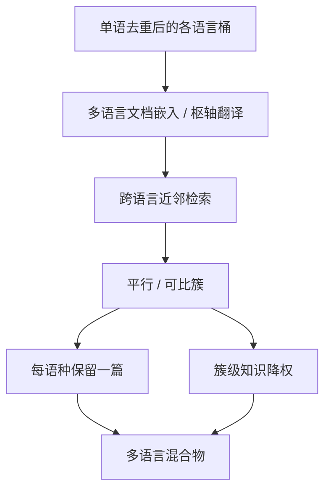

# Cross-lingual 去重

    
同一篇文章的十种译文，在各自语言桶里都是「唯一」的；对模型来说，它们往往是同一组事实的十次上采样。

    <footer>—— 多语言网页管线的工作假设；单语骨架见 Wenzek CCNet</footer>

CCNet 按语言分桶之后，英语与法语里可以同时留下同一维基条目、同一路透社电讯的译本。MinHash 跨语言几乎无重叠：shingle 字母表不同，Jaccard 近零。SemDeDup 若用单语编码器，同样看不见这对平行文档。Cross-lingual 去重要回答的是：在什么度量下两篇不同语言的文档算重复，以及删掉之后你究竟想保留什么——是每种语言的独立流利度，还是世界知识的唯一拷贝。Wenzek 的管道不管这个问题；Soldaini 的 Dolma 与 Penedo 的 FineWeb 以英语网页为主，压力较小；真正的多语言模型混合物必须单独记账。

## 问题

平行与可比文档在网页上极多。维基跨语言、新闻社通稿、欧盟与联合国文件、产品说明书的本地化、机器翻译站的镜像。单语去重之后，知识频率仍按「有多少语种版本」加权。高资源实体被放大，低资源独有的地方知识相对变弱——看起来像多语言配比，其实是把英语世界的内容复制进了每个桶。

度量比单语更难。翻译不是释义：词序、实体译名、省略都变。字符 $k$-gram 无用。需要跨语言句子或文档嵌入（LaBSE、SONAR、多语言 E5），或「翻译成英语再 MinHash」的枢轴法。前者贵、阈值要按语对校准；后者依赖翻译系统，会把翻译错误当成「不重复」。还要区分：真正的平行文档（应去重或降权）与「同一主题的独立写作」（应保留）。新闻电讯接近前者，各国本地报道接近后者。

### 流利度监督与知识监督是两笔账

每种语言都需要足够的原生 token 才能学会该语的句法与措辞。把所有译本删到只留英语，法语流利度会塌。把所有译本都当独立文档，实体知识被上采样。正确的处理往往是降权而不是删除：平行簇内保留各语种各一篇，但知识向的上采样系数从 $L$ 降到 $1$。CCNet 头档按语种切分，已经在优化「像该语维基」。跨语言去重若在头档上把译本全删，等于用英语维基覆盖其他语言的书面语监督。至少应在句法桶里保留各语种文本，只在「百科事实」层降权——这需要文档级对齐，而不是语言识别标签。

机器翻译污染让问题更脏。Crawl 里充满 MT 站与浏览器翻译缓存。它们对目标语 KenLM 可能仍「像该语言」，但平行于已有英语页，且带 MT 伪影。跨语言近邻检测对抓 MT 镜像特别有效：嵌入极近、模板结构相同。这一刀对质量的帮助，可能大于对「人文译本」的去重。

## 方法

三条实用路径。枢轴：把非英语文档译成英语（或译成语言无关的句子向量空间），再跑 MinHash 或嵌入近邻；成本是翻译。多语言嵌入：文档编码后按语对或全球 ANN 检索，余弦超过 $\tau_{\ell,\ell'}$ 则进入平行候选，再聚类。对齐挖掘：先用句子级 bitext mining（margin scoring）找出平行句比例高的文档对，再升到文档级。第三种对新闻与维基召回高，对松散可比文档较稳，实现最重。

候选必须分桶校准。英语-法语的 $\tau$ 不能直接用于英语-中文：嵌入空间里不同语对的典型余弦不同。应用对照平行语料（维基对齐、Europarl）画 ROC，按目标精度选阈值。聚类后的保留策略：每语种留一篇最高质量（该语分类器），并给簇一个全局知识权重。不要全球只留英语——那会把多语言训练变成「英语知识 + 少量句法」。

### 与 SemDeDup、MinHash 的层叠

顺序应是：语言内精确哈希 → 语言内 MinHash → 语言内 SemDeDup → 跨语言平行簇。前三刀砍掉桶内冗余，缩小跨语言检索的 $N$。跨语言一刀只对中长文档做，短菜单、短句在嵌入空间不可靠。代码与公式应排除：标识符跨语言相同会造成假平行。Dolma 若同时含维基多语与网页，维基跨语言对齐已经存在，应直接用维基语言链接当正例监督来校准 $\tau$，而不是在网页上盲目扫。

URL 模式能当弱监督：同一路径不同语言子域（`/en/`、`/fr/`）高度提示平行页。可先用 URL 规则召回，再用嵌入确认，降低 ANN 成本。但许多译本换了域名，URL 召回只是子集。

## 机制

设同一语义的文档在语言 $\ell$ 下为 $d_\ell$。单语去重后训练分布仍近似 $\sum_\ell w_\ell p(d_\ell)$，若 $d_\ell$ 是翻译，则事实 $x$ 的有效计数正比于出现它的语种数。跨语言聚类把 $\{d_\ell\}$ 收成一个语义对象，令 $p_{\mathrm{fact}}(x)$ 与语种数解耦，同时保留 $\sum_\ell p_{\mathrm{syntax}}(\cdot\mid \ell)$。实现上只能近似：嵌入簇既可能把译本收在一起，也可能把独立报道收在一起。后者会伤害「同一事件的多视角」。阈值应偏严，宁漏译本，勿杀独立报道——漏网译本只是多一点上采样，误杀视角是信息损失。

枢轴 MinHash 的机制更粗：翻译把文本映到同一字母表，Jaccard 恢复意义。误差来自翻译漏实体、漏数字。数字与专名应在枢轴前单独对齐（日期、金额），否则「同一新闻不同数字」会被当成不重复，而那正是最需要去重的转载。

### 低资源语种的不对称风险

低资源桶很小，ANN 会把它们绑到最近的高资源近邻上。若阈值按英-法校准，英-某低资源语对的假阳性会爆，低资源独有文本被当成「某英语页的烂翻译」删掉。必须按语对设 $\tau$，并对低资源设保护：只允许与高置信平行证据（维基链接、URL 对齐）去重，不做全球 ANN 强制匹配。CCNet 已经警告低资源 KenLM 不稳；跨语言去重在低资源上应更保守，而不是更激进。

## 边界与工程取舍

没有广泛接受的「跨语言 Jaccard」。所有阈值都是嵌入与校准集的函数，必须写进数据卡片。FineWeb 式英语配方可以不做这一刀；宣称多语言公平的混合物不能不做，否则公平只是 token 计数假象。翻译系统若与待训模型同族，枢轴法会把模型自己的译腔写成「重复定义」，应换独立 MT 或只用编码器。

法律上，译本可能有不同许可与作者；去重保留哪一篇涉及版权，不是相似度能决定的。技术上每语种留一篇最高质量，法律上可能应留许可最宽松的一篇，二者冲突时要单列规则。PII：同一人的简介译成多语，降权后仍可能留下多份电话号码，隐私过滤必须在聚类之后对整簇运行。

跨语言去重不会创造低资源数据。它只阻止高资源内容在低资源桶里假膨胀。低资源缺口仍要靠原生抓取、人工与谨慎回译去补；回译本身又会制造新的平行簇，需要标记为合成，以免下一轮再被当成「独立原生」。

## 小结

- 单语 MinHash / SemDeDup 看不见译本；多语言混合物必须另做平行簇。
- 目标通常是知识降权、各语种保留句法，而不是全球只留英语。
- 方法：多语言嵌入 ANN、枢轴翻译 + MinHash、或句子级 bitext 再升文档。
- 阈值按语对校准；低资源只做高置信对齐，不做全球强制匹配。
- 先语言内去重再跨语言；代码与短文档排除。
- MT 镜像是这一刀的高收益对象；独立本地报道是高误伤对象。
- 出处：跨语言问题在 Wenzek CCNet 分桶之后出现；嵌入去重思想见 Abbas SemDeDup；多源混合物见 Soldaini Dolma；英语网页配方见 Penedo FineWeb。
