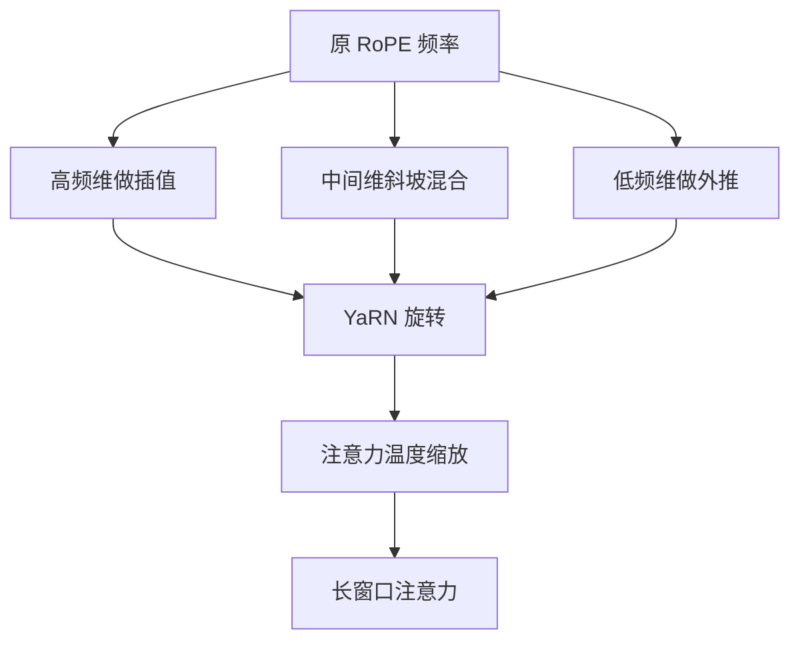

# YaRN

把神经正切核的频率缩放、位置插值与注意力温度放在同一套旋转变换里，RoPE 模型的上下文窗口可以高效延长。

<footer>—— Peng 等，YaRN，2023</footer>

RoPE 把位置写进查询与键的旋转角，相对位移进入点积的相位。训练窗口之内这套几何很稳；窗口之外，相位走出训练分布，注意力熵塌缩或发散，困惑度在某个长度突然变坏。Chen 等人的位置插值把下标按比例压回原窗口，bloc97 的 NTK-aware 方案则改 RoPE 的基数以保住高频。Peng 等人 2023 年的 YaRN 把这两条线索收成一套可实现的方法：按频率分段处理，再给注意力 logits 乘一个与尺度有关的温度。它针对的是「已经用 RoPE 训好、现在要把窗口拉长」的模型，而不是从零改位置编码。

## 问题

设原训练长度为 $L$，目标长度为 $L'=sL$，$s>1$ 为尺度。朴素外推仍用原来的 $\theta_i$ 去旋转位置 $L$ 到 $L'-1$。高频维度的角度增量本来就大，再乘更大的下标，旋转会在单位圆上走得太快，相邻 token 的相对相位变得像随机噪声。模型在训练里学到的「相对 $k$ 步」对应某一段弧长，推理时这段弧长被拉长或卷绕，点积统计失真。

线性位置插值走相反方向：把位置换成 $p/s$，所有频率一起被压慢。低频的全局结构还在可插值的慢变区，高频的局部结构却被过度压缩——「差一个 token」与「差几个 token」在高频维度上变得难以分辨。NTK-aware 插值提高基数，让高频少受压缩，但又会让部分低频维度承担过多外推。单独用其中任何一种，都会在某一频段留下缺口。

YaRN 要解决的就是这个频段冲突：延长 RoPE 上下文窗口时，既不能让高频糊掉，也不能让低频相位溢出，还要处理尺度变大后注意力分布变尖或变平的问题。RoPE 的每一维对应一个频率。插值与外推不能对所有维做同一件事：高频负责邻域，低频负责长程。YaRN 的核心判断是「按维分类处理」，而不是再选一个全局缩放系数。

## 方法

YaRN 把旋转维度分成三段。设第 $i$ 维的波长为 $\lambda_i=2\pi/\theta_i$。相对原窗口，若波长相对于新长度已经足够长，该维更接近外推；若波长很短、对应局部细节，该维更应该插值；中间一段用斜坡在两种策略之间过渡。论文称之为 NTK-by-parts：不是单一的 NTK 基数缩放，而是按维混合「插值」与「NTK 式外推」。

在此之上再加注意力温度。尺度 $s$ 变大后，即使相位关系被校正，softmax 前的 logits 分布宽度也会变。YaRN 用与 $s$ 有关的因子缩放注意力分数，经验形式为

$$
t = 0.1 \ln s + 1
$$

再把 $q^\top k/\sqrt{d}$ 除以或乘以与 $t$ 相关的系数，使熵不随窗口拉长而系统性塌缩。温度不改变相对位置几何，只改变「有多尖」。

可以只在推理时启用动态缩放，也可以在目标长度上做少量续训。Peng 等人强调：相对从头按长窗口预训练，续训步数可以少几个数量级，这是「高效延长」的工程含义。

## 机制

### 频率分组：插值与外推并存

RoPE 点积里，第 $i$ 对维度贡献一项正比于 $\cos(\theta_i\Delta)$ 的相对相位，其中 $\Delta=p_q-p_k$。$\theta_i$ 大则 $\Delta$ 稍变，余弦就抖；$\theta_i$ 小则只有大 $\Delta$ 才看得出变化。线性插值令 $\Delta\leftarrow\Delta/s$，所有 $\theta_i\Delta$ 同时缩小，高频的 $\theta_i\Delta$ 从「能分辨邻域」掉到「几乎常数」，局部位置分辨率损失。NTK-aware 提高基数、降低高频 $\theta$，本意是让高频在新窗口里仍有足够转角，但同一套公式也会改变低频，使部分长程维的相位超出训练弧长。

NTK-by-parts 按波长与 $L$、$s$ 的关系决定该维用插值、外推还是斜坡。高频维吃插值，保住「差一个 token」的可分辨性；低频维吃外推，避免被无意义地压得更慢；中间维连续过渡，减少硬切带来的频谱裂缝。这不是三套独立的位置编码，而是同一旋转矩阵里不同对角块的不同 $\theta$ 重映射。

### 注意力温度

即使相位校正了，窗口从 $L$ 变到 $sL$，参与 softmax 的键数量增加，logits 的极值统计会变。常见现象是注意力过度集中在少数 token，或反过来摊得过平。温度把 logits 的有效尺度写成 $s$ 的慢变函数，使训练时学到的「几条主要键 + 一长串小质量」这一形状，在更长窗口里仍大致成立。温度解决的是熵，不是相位。只调温度而沿用错误的 $\theta$，高频照样糊；只改 $\theta$ 而不调温度，相对几何对了，分配却可能全部塌到最近邻或注意力汇点上。YaRN 把两件事拆开。

### 与纯 PI、纯 NTK 的关系

位置插值是 YaRN 高频端的特例：那些维的位置被按 $s$ 压缩。NTK-aware 是低频端与部分中间维的近亲：通过改基数改变波长。YaRN 不发明第三种位置编码，而是规定何时用第一种、何时用第二种。因此它是 RoPE 的续训与推理补丁，不能移植到 ALiBi 或绝对嵌入上——那些方法没有可分段的旋转频谱。

## 边界与工程取舍

YaRN 依赖原模型的 RoPE 实现细节：旋转作用在哪些维度、基数 $\theta$ 的默认值、是否对部分维关闭旋转。错误的维顺序或错误的 $s$ 会让分段阈值对不上，表现为某一长度之后重复或长程遗忘。动态 YaRN 在推理时按当前序列长度改 $s$，对缓存友好，但若同一批次混有极短与极长样本，温度与 $\theta$ 需要按样本或按请求选择。

少量续训通常优于纯推理补丁，尤其是目标长度远大于 $L$ 时。续训数据若全是短样本再靠 YaRN 硬拉，模型仍可能不会用新增的窗口。YaRN 提供的是可用的位置几何，不是自动出现的长程算法。

与从头长窗口预训练相比，YaRN 省的是算力与数据，不是评测。需要在目标长度上量困惑度、大海捞针与真实文档任务；只看「能跑 128k」没有意义。分段阈值与温度系数来自论文的经验选择，换模型族时值得扫一遍，而不是当成物理常数。

### 不该与 ALiBi 混用的场景

已经用 ALiBi 训练的模型没有 RoPE 频率可分，YaRN 无的放矢。反过来，RoPE 模型想「训短测长」却不肯改旋转、只加线性偏置，会与已有相位双重计算位置，行为难以解释。二者择一作为主位置通道，再决定是架构级外推还是续训级延窗。

## 小结

- YaRN 面向已用 RoPE 训练的模型，用分段频率重映射延长上下文窗口。
- 高频维倾向插值以保留局部分辨率，低频维倾向外推以避免过度压缩。
- 注意力温度校正窗口变长后的 softmax 熵，不代替相位校正。
- 可推理时动态启用，也可在目标长度上少量续训，后者通常更稳。
- 它是 RoPE 补丁，不能套到 ALiBi 或绝对位置嵌入上。
- 能跑更长不等于会用更长；下游仍需在目标长度上评测。
- 出处：Peng 等，*YaRN: Efficient Context Window Extension of Large Language Models*，2023；方法上衔接 Chen 等位置插值（2023）与 bloc97 的 NTK-aware 社区方案（2023）。
