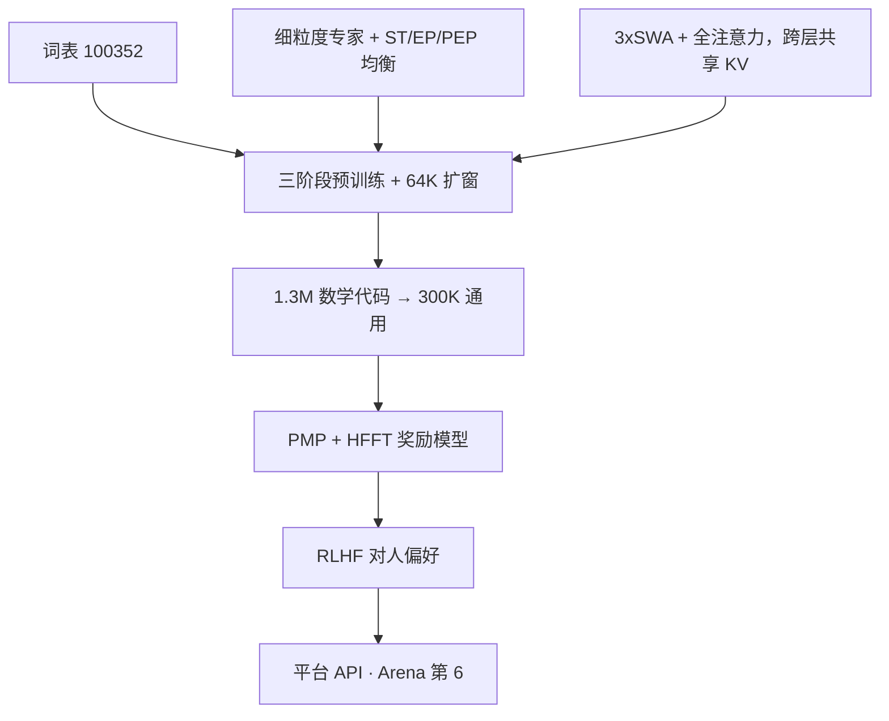

# Yi-Lightning

    
细粒度 MoE 加上分层的专家并行负载均衡；注意力以三层滑窗配一层全图，并跨层共享全图 KV，把旗舰做成可服务的 Arena 模型。

    <footer>—— 01.AI，Yi-Lightning Technical Report，arXiv:2412.01253</footer>

Yi-Lightning 是零一万物 2024 年 10 月的闭源旗舰，**不是** Yi-1.5 的开源续作。报告强调 2024-10-16 登上 LMSYS Chatbot Arena 总分第 6（与 Grok-2 并列一档），中文、数学、代码、Hard Prompts 分项约第 2–4。架构是改进 MoE：细粒度切专家、多层负载均衡、混合滑窗与全注意力、跨层 KV 复用。训练走多阶段预训练、两段 SFT、PMP+HFFT 奖励模型与 RLHF。安全用 **RAISE**（Responsible AI Safety Engine）四段贯穿预训练到推理。权重走开放平台 API，本篇写 2412.01253 的原文设计，不把 [Yi-1.5](/llm/yi-15) 的 500B 继续训故事当成 Lightning 的预训练。

## 问题

稠密 34B 在 Arena 上不够打闭源旗舰，把稠密再加宽则训练与 decode KV 一起爆。标准 MoE 把 FFN 切成少数大专家后，**专家内部仍然稀疏激活**，参数利用率差；切得太细，All-to-All 的 token 派发又把吞吐打崩。Switch 式按专家的辅助损失能防崩，但逐专家约束过死，EP 组之间的通信负载仍会抖。

长上下文若每层满注意力，KV 按层线性涨。观察是：多数头只看局部，少数头看全局。若仍为每一层存满 KV，服务成本配不上 Arena 要的低延迟。数据上，静态学术榜与人类对战分叉——刷 MATH 不一定涨 Elo。问题变成：在可训练吞吐的约束下切多细的专家、如何把负载均衡从「每个专家」放松到「EP 组 / 组内分区」，以及如何用混合注意力砍 KV 而不把长依赖砍死。

### 学术榜不是优化目标

报告专节写：公开榜仍有竞争力，但与 Arena 人类偏好存在可见落差，因此他们把配方偏向实战体验而不是死磕静态分。读 Lightning 不要只用 MMLU 判断「是否成功」。

词表扩到 100352（相对 Yi 的 SentencePiece），数字切成单个 digit，罕见字符走 unicode byte。这是 Lightning 相对 Yi-1.5 明确写出的 tokenizer 差分，部署不能复用 1.5 词表。

## 方法

细粒度专家：把每个专家 FFN 切小、中间维变窄、每 token 激活更多小专家，组合数上升。实践中切到「还不明显伤训练吞吐」为止，而不是切到理论最细。路由先用 Switch 辅助损失 $\mathcal{L}_{\mathrm{ST}}$ 做全局均衡；再提出 **EP 组负载均衡** $\mathcal{L}_{\mathrm{EP}}$，把约束从单个专家放松到专家并行组；再 **PEP**（partitioned EP），在组内分区上均衡，专门打 All-to-All 派发不均。三者同时优化，系数报告为 $\alpha_{\mathrm{PEP}}=10^{-3}$，$\alpha_{\mathrm{EP}}=10^{-4}$，$\alpha_{\mathrm{ST}}=10^{-6}$——分区最重，逐专家最轻。

注意力：三个 [滑窗](/llm/sliding-window-attention) 层加一个全注意力层循环；全注意力层之间 **跨层复用 KV**，全图部分的 KV 内存减半。合起来报告称长序列上最高约 **82.8%** 的 KV 相关内存下降。长窗扩展：fast-decay 之后再用升基数的 RoPE 做长上下文训练到 **64K**，约 20B token，并按 8–16K / 16–32K / 32–64K 区间上采样，声称不伤短榜。

预训练三阶段：初始（学习率升到峰值再降到一半，强调多样性）；中期（提高高质量与推理、低资源语种，动态 batch）；**fast-decay** 约占 token 的 12.5%，快速降学习率并上采样高质量，可迭代以适配部署。语料含 2024 年初前的网页、书、论文、代码、问答；数学用迭代分类从 CC 召回，代码清洗类似 DeepSeek-Coder；30-gram 去污染对准 MATH/GSM8K/HumanEval/MBPP。语义聚类后把相似文档拼成 8192 再切，高质量子集留给长窗。细粒度主题分类器决定配比。

### 样本打包与假多轮

SFT 两段：1.3M（数学代码合成）再 300K 通用高质量；小到大扩样本（例如第二段从约 1 万种子扩到 30 万）。合成用文档增强、自进化、翻译；难题用 MCTS/DFS 加结果/过程奖励。实现上 sample packing 配 **block causal attention** 避免假多轮，并用样本重加权避免长样本主导损失。打包把多条样本拼进同一序列以提高 GPU 利用率，若不加块因果掩码，模型会把相邻无关样本当成多轮对话来学，这是报告明确要修的工程缺陷。

### RAISE 四段不贡献 Elo

RAISE-1 预训练安全分类过滤；RAISE-2 后训练安全奖励；RAISE-3 推理输入过滤；RAISE-4 输出检测（价值、偏见、合规、准确性、适宜性）。安全是服务闭环，不是 Arena 分数来源。输入输出过滤会增加拒答与延迟，第三方用 API 复现 Arena 对话时已经经过 RAISE-3/4，与本地跑开源 Yi-1.5 不是同一条件。

奖励模型：先 PMP（公开偏好集清洗后按自有榜筛选），再 HFFT（多人标、多维度，取最高最低分构成对）。对齐数据含合成难题提示。RLHF 把优化对准人类成对比较，这与 Lightning 在 Arena 上的叙事一致：静态 MATH 分可以略让，对战 Elo 不能让。fast-decay 占 token 约八分之一且可迭代，意味着旗舰可以在冻结大部分预训练的前提下，用一小段高密度数据对准产品口味，而不必每次从零再训 MoE。

## 机制

PEP 针对的是通信图：专家切细后，每个 token 要派到更多专家，All-to-All 体积涨，若某 EP 组接到过多 token，计算与通信尖峰会让整步等待。组级与分区级损失让「均衡」发生在硬件拓扑上，而不只发生在逻辑专家下标上。$\alpha$ 的数量级差说明：他们宁可先把分区填平，也不要用很大的 $\alpha_{\mathrm{ST}}$ 把路由逼成均匀随机（过均匀会伤专业化）。

混合注意力把「局部模式」交给便宜的滑窗，「少数全局头」交给全注意力；跨层共享假设相邻全图层的 KV 可复用，是容量换内存。这与 MLA 压缩不是同一机制，也与 GQA 少 KV 头不同。64K 由专门 20B 长文本得到，不是滑窗自动外推到 64K。

RAISE-1 预训练安全分类过滤；RAISE-2 后训练安全奖励；RAISE-3 推理输入过滤；RAISE-4 输出检测（价值、偏见、合规、准确性、适宜性）。安全是服务闭环，不是 Arena 分数来源。

报告未开源总参 / 激活 / 专家数一张完整对照表。写容量规划只能引用「MoE + 82.8% KV 降 + 64K」，不能编造「等效 200B」。

## 边界与工程取舍

Lightning **无开源权重**，复现止于报告级。细粒度切多少、滑窗宽度、EP 度数未全部数值化。Arena 名次随时间失效；引用须钉 2024-10-16 快照。静态榜与 Elo 分叉是作者自己的警告：不要用学术分打脸「第 6」或反过来。tokenizer 与 Yi-1.5 不兼容。RAISE 的输入输出过滤会改变延迟与拒答率，评测若走 API 已含安全层。

基础设施章节（并行、调度、存储、网络）支撑 goodput，但不是算法贡献的主体。MCTS 合成数据可能把过程奖励的偏差写进 SFT。

API 定价与「比 Yi-Large 快 40%」属产品叙述，技术报告正文以架构与训练为主；延迟对比必须声明硬件与 batch，报告里的 82.8% 是内存项不是 token/s。

## 小结

- Yi-Lightning 是闭源 MoE 旗舰，Arena 2024-10-16 总分第 6；开源线仍是 Yi-1.5。
- 原文架构：细粒度专家、ST+EP+PEP 负载均衡、3×滑窗+全注意力与跨层 KV 共享、词表 100352、64K 扩窗。
- 训练：三阶段预训练、两段 SFT、PMP/HFFT RM、RLHF；安全 RAISE 四段。
- 作者明确：静态榜与人类对战不完全一致。
- 出处：01.AI，*Yi-Lightning Technical Report*，arXiv:2412.01253，2024。
