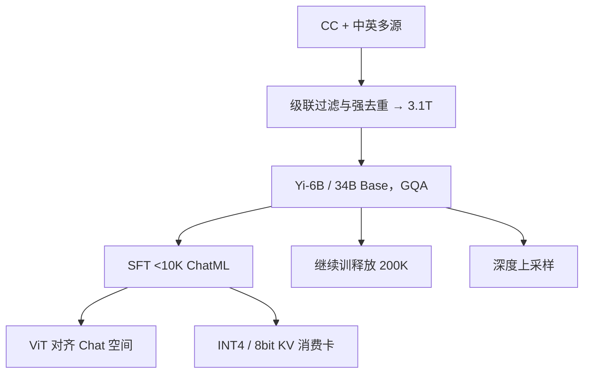

# Yi 技术报告

    
34B 小到能在 24GB 卡上 INT4 推理，却用 3.1T 高质量中英语料过训；对齐不堆百万指令，而是把不到一万条样本逐条打磨。

    <footer>—— 01.AI，Yi: Open Foundation Models by 01.AI，arXiv:2403.04652</footer>

零一万物 2023 年 11 月开源、2024 年 3 月成文的 **Yi** 是 6B / 34B 稠密解码器家族：Base、Chat、200K 长窗、深度上采样、视觉语言。报告把成绩主要归因于 **数据工程**，而不是改 Transformer 公式。预训练 **3.1T** 中英，级联去重与质量过滤；SFT **少于 10K**，每条由工程师多轮修订。本篇只写 2403.04652；[Yi-1.5](/llm/yi-15) 的 500B 继续训与 [Yi-Lightning](/llm/yi-lightning) 的 MoE 是后话，不要读进这篇。

## 问题

消费卡 24GB 装不下 70B，Chinchilla 最优又暗示 34B 只该吃约 1T。01.AI 的选择是：**把模型定在 34B**（INT4 后可进 4090），**把 token 加到 3.1T**，走进「过训、推理更便宜」的区间。中英双语不能靠英文 Common Crawl 滤完再翻译；中文网页黄赌毒与广告比例高，启发式不够，必须上学习型过滤器。

对齐若走 FLAN / UltraChat 百万级，单条质量无法人工看完。报告站在 [LIMA](/llm/lima) 一侧：宁少而精。还要把窗口从预训练 4K 拉到 200K 针测，并把视觉编码器接到 Chat 语义空间，同时试深度上采样——三条都是「继续训释放已有能力」，不是从零换骨架。

### 过训是为了服务成本

34B×3.1T 的 FLOPs 高于计算最优，换来的是同质量下更小的 decode 权重流。量化后「几乎不掉点」是报告的部署主张。6B 证明同一套数据管线在小模型上也成立，并同样上 [GQA](/llm/gqa)——Llama 2 只在 70B 用 GQA，Yi 从 6B 就开始用。

词表 64000，BPE + SentencePiece，数字切 digit，罕见字符走 byte，不用 dummy prefix（中英句首引号会破坏「词前空白」假设）。与后来 Lightning 的 100352 词表不是同一套。

## 方法

数据管线：Common Crawl 经 CCNet 做语言识别与困惑度 → 启发式（URL/词表黑名单、长度与符号比、重复 n-gram）并匿名化 PII → 学习型过滤器（KenLM 困惑度、类维基质量分类器、文档连贯性、安全）→ 语义聚类打质量标签 → MinHash 文档去重加子文档精确去重 → 主题模型降采样广告。报告强调删除比例高于 CCNet / RefinedWeb / RedPajama，原则是 **3T 精料优于 10T 粗料**。配比图为中英多源，与纯英文 Llama / Falcon 混合物不同。

结构基于 Llama 实现：Yi-6B 隐藏 4096、32 查询头 / **4 KV 头**、32 层、预训练长 4096、峰值 LR $3\times 10^{-4}$；Yi-34B 隐藏 7168、56 / **8** KV 头、60 层、峰值 LR $1.5\times 10^{-4}$。SwiGLU 中间维按 $8/3\,h$ 收，补回 GQA 少掉的参数。RoPE，长窗用 **ABF** 调基频。

### 少于 10K 的 SFT

多轮对话，全部人工打磨多迭代。提示走 WizardLM 式复合进化以减样本；回答默认引言–要点列表–收束；思维链用 Step-Back 先抽象再解题。去幻觉：删掉模型知识范围外却写得像事实的回答；去重复：改写微调数据里被忽略的循环句。能力面用标签体系做多样性采样，配比在 $\{1,1/2,\ldots,1/64\}$ 上近似网格搜。格式用 **ChatML** 区分 system / user / assistant。损失只算回复 token。AdamW，序列 4096，batch 64，**300 step**，恒定 LR $1\times 10^{-5}$，Yi-34B-Chat 用 NEFTune 噪声尺度 45（6B 为 5）。

### 200K、视觉与深度上采样

长上下文：在约 **5B**（正文亦写从混合中取约 10B、实际上 1–2B 已能把 4K–200K 损失压低）长度上采样的书等数据上轻量继续预训练，再轻量微调，针测接近满分。报告倾向认为 **超 4K 依赖是基座已有的内禀能力**，继续训只是释放。视觉：Chat 语言模型 + ViT，多阶段把视觉表示对齐到语言语义空间。深度上采样：加层后继续训，确认还能涨点。这与单纯加宽不同，计算图变长、服务 KV 也按层涨，只适合作为研究型检查点，不是 34B 默认交付。基础设施：跨云弹性调度、故障自动恢复、拓扑感知分配；微调框架可在同一作业里混 Megatron 与 DeepSpeed（DPO 参考模型）；推理 4bit 权 + 8bit KV，PagedAttention 与动态 batch。

## 机制

GQA 从 6B 就上，说明他们把 KV 字节当成 24GB 卡的硬约束，而不是 70B 才需要的优化。过训改变的是 **每个参数见过的 token 数**：34B 在 3.1T 上把通识密度打满，推理期不必上 70B。SFT 少样本能工作，前提是基座已经从 3.1T 里学到格式与知识，10K 只校准「怎么说」；这与百万合成指令刷基准是反方向。

长窗机制：ABF 改 RoPE 基频 + 少量长序列继续训。作者把「1–2B token 即收敛」解读为能力内禀——这是他们的理论倾向，不是社区已证明的定理。深度上采样增加层深、在原检查点上继续训，走的是「加深度比加宽度更便宜地换表达力」的经验，报告未声称取代继续堆 3.1T。

Base 表：Yi-34B MMLU 76.3、C-Eval 81.4、CMMLU 83.7（报告分组表）。Chat 另报 AlpacaEval 与 Arena。不要用 Base MMLU 去对 Chat 的人类偏好。

## 边界与工程取舍

Yi 第一代默认窗是 4K，200K 是独立检查点。代码与数学在 2024 年 3 月的表上相对通识偏弱，这正是 1.5 用 500B 去补的缺口。视觉与深度上采样是扩展章，不是 6B/34B 默认权重。许可证以当时 01.AI 仓库为准（后续 1.5 才全面 Apache 2.0 叙事）。

不要把 Lightning 的细粒度 MoE、100352 词表、RAISE 写进本篇。量化「几乎不掉点」依赖于他们的评测协议；业务上的长尾中文仍要以本机抽测为准。基础设施章节还写了跨云抢占、故障自动恢复与拓扑感知排卡，用来支撑「千卡月级」预训练；微调侧把参考模型前向缓存下来，使 DPO 的墙钟接近 SFT。这些是系统贡献，不改变 3.1T 与 10K 指令这两条算法主线。Chat 在 Arena / AlpacaEval 上的人类偏好，是少样本打磨加基座过训的联合结果，缺任一端都复现不了「接近 GPT-3.5」的叙事。视觉多阶段对齐只把 CLIP 形编码器接到冻结或半冻结的 Chat 空间，并不把 Yi 改成原生多模态预训练。

SFT 300 step、batch 64、少于 10K 条：总更新次数很少。换一套未打磨的 10K 公开指令，不能复现 Arena 体验。

## 小结

- Yi-6B/34B：3.1T 中英精料、全系列 GQA、RoPE ABF；对齐 <10K 人工指令 + ChatML。
- 34B 过训是为了 INT4 消费卡推理，而不是追求 Chinchilla 最优。
- 200K、VL、深度上采样都是轻量继续训扩展，默认 Base 仍是 4K。
- 出处：01.AI，*Yi: Open Foundation Models by 01.AI*，arXiv:2403.04652，2024。
