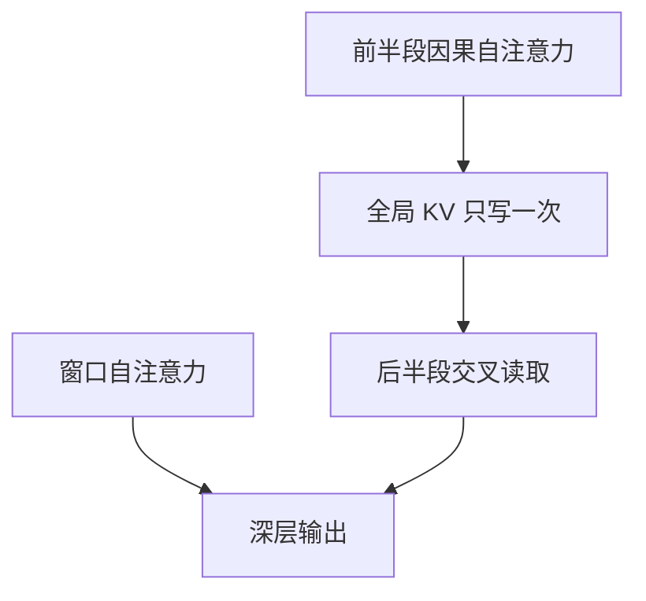

# YOCO

自注意力只在前半段产生一份全局 KV，后半段当解码器去读它；缓存只写一次。

<footer>—— Sun et al., You Only Cache Once: Decoder-Decoder Architectures for Language Models, 2024</footer>

[上一课](/llm/cross-layer-kv-sharing)把相邻层绑成 KV 组，组数仍随深度涨。YOCO 把共享推到极端：整网只物化**一份**可供全局读取的 KV，后面的层不再各自缓存。名字里的 decoder-decoder 指两段都是解码器栈，不是编解码器的交叉注意力课。后课多 token 注意力改的是一次读取看几个位置；本课改的是**谁负责写缓存**。

## 问题

CLA 的 $g=2$ 仍留下 $L/2$ 份缓存。GQA 只收头。长上下文解码的内存墙是「层 × 头 × 长度」。缺口是一种计算图：让早期层（或专门的自注意力段）把过去写成一张全局记忆，晚期层只带轻量的局部或无 KV 的模块去读它，从而 **You Only Cache Once**。

若晚期层完全不再做自注意力，表达力会掉回「深层是前馈叠在固定记忆上」。YOCO 必须在「只缓存一次」和「深层仍能混合新 token」之间划槽位。

这不是 [编码器–解码器注意力](/llm/encoder-decoder-attention) 的翻译架构。源与目标没有分开的双向编码器；前半段也是因果的，只是它的 KV 被后半段当记忆反复读。

## 方法

Sun 等人的解码器–解码器：前半 $L/2$ 层标准因果自注意力，产出并缓存全局 KV；后半 $L/2$ 层用交叉注意力读这份 KV，自身的自注意力改成窗口或高效变体，不再存全局缓存。生成第 $t$ 个 token 时，全局记忆仍是前半段对 $1..t$ 的 KV，长度随 $t$ 涨，但层维是 1 而不是 $L$。

训练与推理的掩码仍因果：前半段看不到未来；后半段读前半段记忆时，记忆本身已按因果写成。没有「用未来摘要编码文章」的泄漏。

### 和 CLA、GQA 的组合

全局那一份 KV 仍可 GQA 少头。CLA 发生在前半段内部则再度减层维，但 YOCO 的主收益已经来自后半段不缓存。工程上优先 YOCO 的两段划分，再决定前半段要不要 CLA。

## 机制

深度被重新解释：浅层负责**写**可检索记忆，深层负责**读**并做局部精炼。这与人类读文档时「先做索引、再反复查」同构，也与编解码器「编码器写记忆」同构，只是记忆是因果前缀而不是双向源。后半段若完全没有自注意力，当前 token 与最近邻居的混合全靠读全局 KV，近距模式可能变差，所以常留窗口自注意力——窗口 KV 长度固定，不随上下文线性涨，或涨得很慢。

计算上预训练仍要跑前半段的全局注意力，YOCO 不是训练线性化；它是推理缓存策略与层功能分化。解码第 $t$ 步时，全局 KV 长度仍是 $t$，只是层维为 1：省的是「层 × 长度」，不是把长度变成常数。与 [CLA](/llm/cross-layer-kv-sharing) 的 $L/g$ 份相比，YOCO 赌后半段根本不必拥有自己的全局表。

前半段若太浅，记忆质量不够，后半段再深也是在读差索引。切分点是超参，与后课混合 SSM/注意力的层比是同一类问题：谁写状态、谁读状态。

## 边界

检查点与推理引擎按「每层一份 KV」写的接口要改。投机解码、前缀缓存的块对齐以全局记忆为准。把已有均匀层模型切成 YOCO 需要再训或蒸馏，不能只在推理图里丢掉深层 KV（那是 eviction，深层从未学过当纯读者）。窗口太大，ONCE 名不副实；窗口太小，局部句法受损。

## 小结

- YOCO 让前半段写一份全局 KV，后半段只读它并辅以窗口混合，缓存沿层只留一次。
- 两段都是因果解码器，不是双向编码器加解码器。
- 切分点决定记忆质量；窗口决定近距能力与是否真的只缓存一次。
- 不能把均匀层模型在推理时直接丢掉深层 KV 来冒充 YOCO。
- 出处：Sun et al., 2024。
