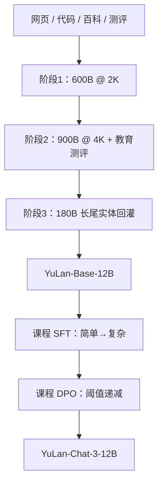

# YuLan

预训练约 1.7T token 分三阶段把能力铺开；指令微调与人类对齐都按由易到难的课程组织，长尾知识靠检测缺口再回灌语料，而不是再堆一轮随机网页。

<footer>—— 人民大学高瓴人工智能学院，YuLan: An Open-source Large Language Model，arXiv:2406.19853</footer>

玉兰是中国人民大学校花，也是高瓴人工智能学院（GSAI）开源大模型线的名字。2023 年 6 月起，团队先在 [LLaMA](/llm/llama-1) / [LLaMA-2](/llm/llama-2) 上做双语继续预训练与指令微调，放出 Chat-1（13B / 65B，delta 权重）与 Chat-2-13B；2024 年 7 月才交出**从头训**的 **YuLan-Base-12B** 与 **YuLan-Chat-3-12B**。本篇按 arXiv:2406.19853 写 12B 这条从零预训练报告：架构兼容 LLaMA 工具链、三阶段预训练、课程式 SFT 与课程式 [DPO](/llm/rafailov-dpo)。更早的 LLaMA 差值权重、以及 2024 年底的 YuLan-Mini（2.42B，另文 2412.17743）只作谱系标注，不把 Mini 的合成长思维链写进 12B 贡献。

## 问题

2023–2024 年开源中文模型大量是「英文底座 + 双语继续训」。继续训能补中文词表与语料，却继承原词表切字碎、上下文短、以及底座许可证对权重分发的约束。Chat-1 因此只发与官方检查点的差值；Chat-2 可以整包下载，但仍不是一份可复现的从零配方。报告要回答的是：在高校算力下，能否公开 **12B 从零预训练** 的数据构成、阶段划分与对齐课程，而不是只给聊天权重。

第二个问题是能力平台期。600B token 的标准下一词预测之后，MMLU 一类综合选择题仍接近随机：网页里很少出现「带解析的四选一」。再往后，指令微调会暴露长尾实体答不出——损失已经下降，但百科里的低频人物与制度缺口仍在。这不是再随机混一批网页能自动补上的。

### 兼容 LLaMA 工具链，而不是新注意力

结构明确跟 LLaMA：40 层解码器，注意力头 **38**，隐维 **4864**，FFN **13056**，合计约 12B。[RoPE](/llm/su-rope)、[SwiGLU](/llm/swiglu)、Pre-[RMSNorm](/llm/rmsnorm)（$\varepsilon=10^{-6}$）。词表在 LLaMA 英文子词上用 WordPiece 从中文预训练子集扩到 **51,190**，英文 token 保留，避免中文一字多片吃光 2K 窗口。Chat-3 上下文 **4096**。没有 GQA、没有 MoE：这是一份标准多头解码器，卖点在数据课程与对齐课程。

README 写「超过 1.6TB 词元」，论文摘要写大约 1.7T。阶段表是 600B + 900B + 180B。引用预训练规模时钉论文表，不要和磁盘上的 TB 混写成两个不同的训练量。

## 方法

预训练语料按源分成网页（OpenWebText2、C4、RefinedWeb、CC-100、自处理的 2021–2023 Common Crawl WET 等）、代码（The Stack、GitHub）、百科（Wikipedia 与百度百科）、论文（arXiv、peS2o）、问答（Stack Exchange、知乎）、书籍与教材、新闻、法律文书、专利、以及教育测评。语言配比与窗口按阶段变，而不是全程同一锅。

### 三阶段预训练：标准、能力增强、长尾回灌

阶段 1（标准预训练）：英:中:多语 $=76:22:2$，上下文 2048，**600B** token，学习率 $3\times 10^{-4}$ 余弦到 $3\times 10^{-5}$，全局 batch 约 4M token。同源文本拼成长序列再切成等长样本，避免零填充。阶段 2（能力增强）：把窗口拉到 4096，配比改为 $90:10:0$，**900B**，学习率落到 $2\times 10^{-5}$ 平台；关键增量是**教育测评**——选择题格式与带解析的闭卷推理，用来打破 MMLU 平台期。阶段 3（长尾知识）：配比 $62:33:5$，仍 4096，**180B**。先用一小撮指令数据得到临时聊天模型，对百科实体合成问答、用评判模型打分，找出 $s_v$ 低于阈值的实体；再用 TF-IDF 从预训练库检索相关段落回灌，迭代五轮。中文数据在此阶段几乎都走检索策略，英文约一半仍随机采样，以免把通用分布冲掉。

指令微调把已有指令集与合成多轮对话按复杂度分成简单 / 复杂两档，先简单后复杂。人类对齐用 [DPO](/llm/rafailov-dpo)，但难度不是人工标死：用当前策略相对上一课程的奖励

$$
r = \beta\log\frac{\pi_\theta(y_w\mid p)}{\pi_{\theta_o}(y_w\mid p)}-\beta\log\frac{\pi_\theta(y_l\mid p)}{\pi_{\theta_o}(y_l\mid p)}
$$

低于阈值 $\delta$ 的样本留到下一轮，$\delta$ 逐步下降，形成由易到难的偏好课程。这与「一次 DPO 吃完所有偏好对」不同：难负例（隐晦攻击、细偏置）要等模型先能分开容易的正负。

## 机制

扩词表的机制是压缩率：中文若被切成字节片，同样 4K 位置能装的语义更少，继续预训练也会把梯度浪费在拼字上。保留英文原词、只加中文词，是为了不破坏已有英文子词统计。三阶段预训练的机制则是**分布调度**：阶段 1 用网页把损失拉下来；阶段 2 用测评把「选择题 + 解析」这种预训练里稀缺的格式补进下一词预测；阶段 3 承认随机采样对长尾实体的覆盖是次线性的，必须先检测再检索。TF-IDF 不是新检索模型，它的作用是在 1.7T 库上可算——用稠密检索会另起一套索引工程。

### 课程对齐只改变样本顺序，不改变损失形状

SFT 仍是条件语言建模，DPO 仍是那条 logistic 偏好损失。课程改变的是**何时看见哪一类样本**。复杂度阈值把多轮、长约束指令留到模型已经会跟单轮指令之后；DPO 的 $\delta$ 把「还分不开的对」留下来反复练。若把同一堆数据一次性打乱，报告认为长尾与难负例会被头部简单样本淹没。这与 Aquila2 用 HeuriMentor 按下游指标改配比是同一类「训练期反馈」，只是 YuLan 的反馈发生在对齐阶段、用的是实体问答与 DPO 奖励，而不是预训练损失尖峰。

Chat-1 基于 LLaMA 只发 delta，合并脚本见仓库 `apply_delta.py`。Chat-2 基于 LLaMA-2-13B，词表同样扩到 51,190，窗口到 8,192。不要把 Chat-2 的 8K 写成 Chat-3 的默认窗；12B 从零线的报告窗是 4K。

## 边界与工程取舍

12B 报告没有公开与工业 7B 同量级的 10T+ 数据，C-Eval / 高考子集上的优势来自双语与测评回灌，不宜外推成「12B 已经超过当时所有 13B」。阶段 3 用 ChatGPT 生成实体问、用 Baichuan-2-13B 做对错评判，长尾清单依赖这两套教师，复现成本不是「下个开源网页包」。DPO 课程的 $\delta$ 与复杂度公式以论文为准，开源 Chat 模板是 `[|Human|] / [|AI|]`，和 Vicuna 的 `USER:` 不是同一套。

许可：仓库标 MIT，但说明数据和代码仅供学术研究；基于 LLaMA 的一代还要叠加 Meta 许可。不要把 Chat-3 的 MIT 理解成训练数据可再分发。YuLan-Mini（2412.17743）是另一条 2.42B、1.08T 的数据效率实验：56 层、隐维 1920、GQA 30/6、退火到 28K，大量合成数据。它证明实验室规模也能把小模型打满同档，**不是** 12B 的蒸馏版，也不共享 12B 的三阶段配比。

YuLan-Chat-3 在仓库评测表上 C-Eval 约 50.5、MMLU 约 55.7，相对同表 LLaMA-2-13B 的中文分有抬升。这些是仓库协议下的数，不要和 OpenCompass 当时 Chat-2「第五」的快照混成一行。

## 小结

- YuLan-12B 是人大高瓴从头预训练的开源解码器：40 层、隐维 4864、词表 51,190，约 1.7T token。
- 预训练三阶段：2K 标准混数 → 4K 能力增强（教育测评）→ 长尾实体检测与 TF-IDF 回灌。
- 对齐是课程 SFT 加课程 DPO，由易到难，而不是一次打乱偏好对。
- Chat-1 / Chat-2 是 LLaMA 系继续训谱系；Mini 是 2.42B 另文，不要倒填进 2406.19853。
- 出处：YuLan Team，*YuLan: An Open-source Large Language Model*，arXiv:2406.19853；Mini 见 Huatong Song 等，arXiv:2412.17743。
