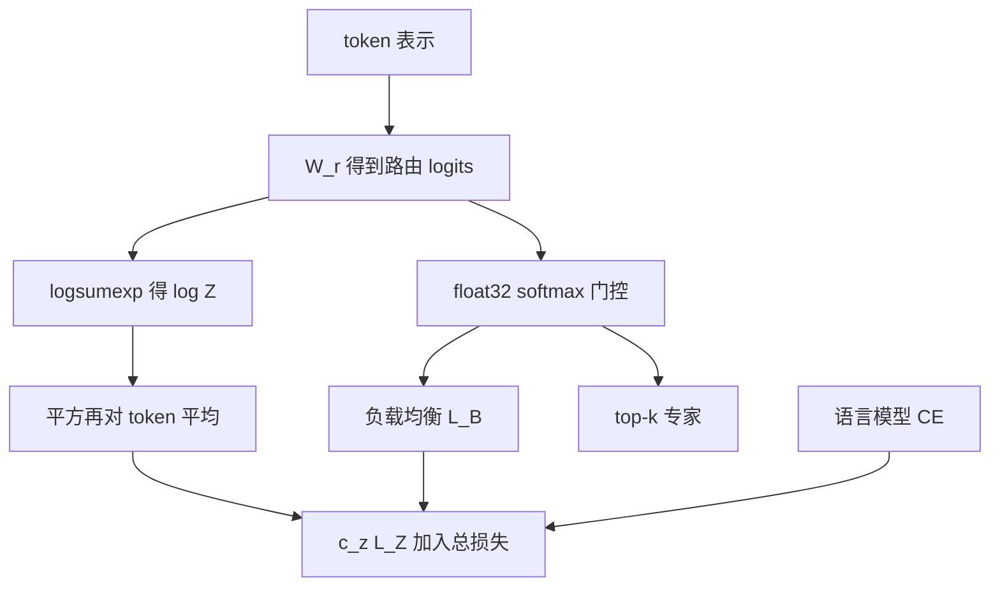

# MoE z-loss

路由器又多了一组要进指数的 logits；在 bfloat16 里把它们撑得很大，舍入误差会改相对门控，训练就会在稀疏层炸开。惩罚 $\log^2 Z$ 把幅度按回去，而不必把更新裁到伤质量。

<footer>—— Zoph, Bello, Fedus et al., ST-MoE: Designing Stable and Transferable Sparse Expert Models, arXiv:2202.08906</footer>

Switch Transformer 已经把路由 softmax 提到 float32（selective precision），并加上 [负载均衡损失](/llm/moe-load-balance)。Fedus 等人仍在更大的稀疏编码器–解码器上碰到预训练发散。Zoph、Bello、Fedus 与 Google Brain 同事把稳定手段扫了一遍：去掉乘法交互、加噪声、收紧 Adafactor 更新裁剪——多数能稳，但质量掉得不能用。他们留下的推荐项是 **router z-loss**：对路由器 logits 的 log-sum-exp 平方求平均，系数约 $c_z=0.001$。这是 Mesh TensorFlow 里词表 softmax z-loss（Shazeer 等）搬到门控上的版本。ST-MoE-32B（269B 稀疏、约等于 32B 稠密 FLOPs）靠它才把高质量微调推到 SuperGLUE 一类任务。本篇只写 MoE 路由器上的 $L_Z$，词表 z-loss 只对照，不混成同一个超参。

## 问题

路由器计算 $h(x)=W_r x$，再

$$
p_i(x)=\frac{e^{h_i}}{\sum_j e^{h_j}}.
$$

指数对输入扰动极度敏感。bfloat16 比 float32 少 16 个尾数位，同一量级上舍入大约差 $2^{16}$ 倍；数越大，相邻可表示点越稀。论文举过：一组 logits 在 128 附近差 0.5，softmax 质量可以相对错 30% 以上，因为实现里先减 max。稀疏模型比稠密多出**每一层专家门**的指数，编码器–解码器还要再乘一套。Switch 的 float32 路由在最大档仍不够。

不稳表现为训练损失发散，而不是缓慢变差。小模型很少炸，T5-XL FLOP 对齐的 32 专家稀疏模型在多语 mC4 上大约三分之一 seed 不稳，正好拿来做稳定–质量权衡。目标是：**提高稳定比例，且英语负对数困惑度不掉。**

### 负载均衡管的不是这件事

$\mathcal{L}_{\mathrm{aux}}=\alpha N\sum_i f_i P_i$ 推的是专家被选频率与平均概率接近均匀。z-loss 推的是 **$h$ 的绝对幅度小**。一个均匀但 logits 全是 1e4 的路由器，均衡项可以很小，$Z$ 的对数仍然巨大，舍入照样毁第二专家的相对阈值（Switch / MoE 常用「第二专家概率至少是第一的 1/5 才派」这类规则）。反过来，幅度很小但塌到单专家，z-loss 满意、aux 会报警。二者要一起看。

PaLM / Chameleon 的词表 z-loss 形式同为 $\log^2 Z$，作用对象是最终分类器。MoE z-loss 的 $N$ 是专家数，不是词表。系数 $10^{-4}$ 与 $10^{-3}$ 不能互抄。OLMo 2 的 $10^{-5}$ 打在稠密 logits 上，更不是路由项。

## 方法

对一批 $B$ 个 token、 $N$ 个专家，令 $x^{(i)}\in\mathbb{R}^N$ 为第 $i$ 个 token 的路由 logits：

$$
L_Z=\frac{1}{B}\sum_{i=1}^{B}\Bigl(\log\sum_{j=1}^{N}e^{x_j^{(i)}}\Bigr)^2.
$$

实现用稳定 logsumexp：先减行 max。总损失

$$
L_{\mathrm{tot}}=L_{\mathrm{CE}}+c_B L_B + c_z L_Z.
$$

ST-MoE 取 $c_z=0.001$（扫过之后质量最好的一档）。表 4：基线 6 seed 里 4 个稳定，质量 $-1.755\pm0.02$；更新裁剪到 0.1 则 3/3 稳定，质量崩到 $-4.206$；router z-loss 3/3 稳定，质量 $-1.741$，略升。作者还试过注意力 logits 上的 z-loss，稳且不伤质量，但正文推荐项是路由器。

### 为什么不直接 clip logits

Clip 发生在舍入之后，本身是又一次不连续的量化；z-loss 从目标上要求模型**产生小 logits**，指数输入落在尾数更密的区间。论文强调所有要做指数的张量仍应升到 float32。Clip 与 z-loss 不是等价实现。

Mesh TensorFlow 的词表 z-loss、PaLM 的 $10^{-4}\log^2 Z$ 是同一家族的正则：压配分函数，减轻半精度下的 logit 漂移。Chameleon 在混合模态分类头上用 $10^{-5}$。写配方时应分三行：注意力 QK-Norm、路由 z-loss、词表 z-loss。

监控上建议同时画三条曲线：训练 CE、$L_B$ 距离下界有多远、以及 $L_Z$ 本身。只看总损失会把「路由器 logits 在涨」误读成语言模型变难。ST-MoE 的附录把 $c_z$ 扫到 $10^{-2}$ 以上时，$L_Z$ 会被压到接近零，那是过正则的信号：门控变得又小又平，top-$k$ 接近随机，专家槽位还在，分工没有了。健康的状态是 $L_Z$ 稳定在一个小正数，既不发散也不贴零。多语预训练比单语更容易炸，论文把不稳定实验放在 mC4 上，是因为多语放大了同一套数值病；英语 C4 上「看起来稳」不能外推到多语或混合模态门控。

## 机制

$L_Z$ 对均匀缩放 $x\leftarrow c x$（$c>1$）近似按 $c^2$ 变大，是对幅度的二次罚。它不直接规定谁该赢，只规定「赢也要用小 logit 赢」。于是 softmax 工作在梯度与舍入都更温和的区域，第二专家的相对门控不再被 0.5 的 bf16 误差翻转。稀疏层对舍入更敏感，还因为门控标量会乘到专家输出上：概率错了，残差里整段专家计算被错缩放。

$c_z$ 过大时 $L_Z$ 被压到近零，路由器接近均匀小 logits，top-k 变随机，专家无法分工——与 aux 过大的失败模式相似，但监控指标不同：应画 $\mathrm{mean}((\log Z)^2)$，而不是只画 $\sum f_i P_i$。

### 和更新裁剪、和去掉 GLU

收紧 Adafactor 更新范数能稳，却把有效学习率砍到模型学不动。去掉 GEGLU / RMSNorm 一类乘法组件也能稳，但作者认为质量与乘法交互正相关，后来还在专家里加乘法偏置换约 4% 收敛加速，**靠 z-loss 把不稳按住**。所以 z-loss 的工程定位是：允许你保留对质量有利、对稳定不利的结构。

## 边界与工程取舍

ST-MoE 是 T5 式编码器–解码器、Adafactor、专家每四层出现一次、容量因子 1.25。解码器-only、AdamW、每层 MoE、DeepSeek 式无 aux 偏置路由，系数都要重扫。DeepSeek-V3 主打无辅助损失的负载偏置，没有把 ST-MoE 的 $c_z$ 写成必需；不稳时仍值得加路由 z-loss，而不是先把专家数砍掉。

微调阶段稀疏模型更容易过拟合小任务；z-loss 是预训练稳定项，不是微调正则。专家 dropout、只更新非 MoE 参数，才是 ST-MoE 第四节的微调故事。推理不计算 $L_Z$，但训练末期 $W_r$ 的尺度已经被罚过；若推理把路由改成另一温度或另一精度，门控分布会偏，表现为负载与质量同时变，而不是损失曲线上的尖峰。

容量因子与 drop 率也不该从 z-loss 里读出来。$L_Z$ 小只说明 logits 幅度可控，热专家仍可能打满容量、多余 token 走残差。那是 aux 与 CF 的表，要把 drop 率、专家最大 $f_i$ 和 $L_Z$ 画在同一块仪表盘上。GShard / Switch 式 all-to-all 对瞬时不均敏感：即使长期 $L_Z$ 好看，某一步全是代码 token 仍会打向同一批专家。z-loss 不承诺逐步均匀，只承诺指数输入别飞出 bf16 的舒适区。把「训练从此永不 drop」写成 z-loss 的效果，是张冠李戴。

出处：Zoph et al., *ST-MoE: Designing Stable and Transferable Sparse Expert Models*，arXiv:2202.08906。词表 z-loss 谱系：Shazeer 等 Mesh TensorFlow；Chowdhery 等 PaLM。Switch 的 selective precision：Fedus et al. 2021。不要把 aux loss 的 $\alpha$ 当成 $c_z$。

## 小结

- MoE z-loss 是 $L_Z=\frac{1}{B}\sum(\log\sum_j e^{x_j})^2$，加在路由器 logits 上，典型 $c_z=0.001$。
- 它压的是幅度与舍入，不替代负载均衡；与词表 z-loss 同形、不同张量。
- ST-MoE 上相对更新裁剪：同样稳住，质量不崩甚至略升。
- 指数仍应在 float32 做；不要用 clip 当等价物。
- 换优化器与路由算法后必须重扫 $c_z$。
- 出处：Zoph, Bello, Fedus et al.，arXiv:2202.08906。
