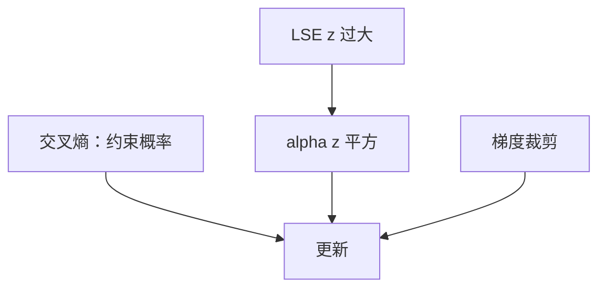

# z-loss 稳定训练

交叉熵不约束 logits 的公共偏移；大规模训练里要把 log-sum-exp 的尺度单独钉住，半精度与门控才有余量。

<footer>—— PaLM、Gopher 等大规模语言模型报告中的 logit / 训练稳定性叙述；MoE 上见 Switch / ST-MoE 的 router z-loss</footer>

[Expert Choice 原文](/llm/expert-choice-paper) 改路由几何。数值上，无论 token-choice 还是 EC，softmax 的输入都可以漂到溢出区。主干 [z-loss](/llm/z-loss) 已写公式。本附录对照 **文献里这项护栏出现的方式**：PaLM（Chowdhery 等）、Gopher（Rae 等）把 logit 尺度当作稳定训练问题；Switch / ST-MoE 把同类项用在路由器上。不编造单独一篇「z-loss 专论」的编号，也不把某次博客当第一文献。

## 问题

CE 对 logits 平移不变，$z=\mathrm{LSE}(\ell)$ 可以在损失仍下降时增长，直到 BF16 指数与路由置信锁死。万亿稀疏或密集大模型的长训把这件事从「偶尔 NaN」变成必须写进配方的项。作者们报告的是现象 + 小系数二次惩罚，不是新的语言建模目标。

Gopher 讨论大模型训练不稳定性与 logits；PaLM 明确使用 z-loss 控制输出尺度。MoE 文献中 router z-loss 惩罚路由 LSE，服务对象是门控而非词表。

### 两项不要混系数

词表 $z$ 与路由 $z$ 维数差几个数量级。Switch 配方里的小系数不能无说明地贴到 256K 词表头上。没有要求你引用一个虚构的 arXiv。写「PaLM / Gopher 式 z-loss」或「ST-MoE 的 router z-loss」即可。系数以你复现的代码与报告表格为准。

## 方法

### 稳定 LSE 上的二次项

$L_z=\alpha \mathbb{E}[z^2]$ 加在 CE 上，$z$ 用稳定 LSE 计算。$\alpha$ 很小。Router 变体把 $\ell$ 换成 $N$ 个专家 logits。与梯度裁剪、损失跳过、混合精度一起构成稳定清单，而不是互相替代——主干 NaN skip 课已接这条清单。

## 机制

二次项把绝对尺度往下拉，间隔更多靠压低错误类实现，可能改校准。报告里若只写「更稳、更少 spike」，不一定测了温度解码。工程对照应补 LSE 分位数日志，否则你不知道 $\alpha$ 有没有真在干活。

与 μP、AdamW 衰减的分工见主干：z-loss 不是宽度定标。大模型报告往往同时改很多旋钮，归因到「就是 z-loss」会过满。附录能钉的是：他们把 **logit 尺度列为独立故障模式**，并给出可抄的惩罚形式。

ST-MoE（Zoph 等）把稀疏专家的稳定设计写成更长的清单，router z-loss 是其中一项。引用 MoE 稳定时优先点名清单，而不是只说 Switch 标题。

### 在对照链中

下一篇离散扩散与 MoE 无关；本篇结束「表示 / MoE 数值」对照，扩散是另一生成范式。读者应从这里带走：稀疏与稠密大模型共享 logit 尺度问题。

## 边界与工程取舍

推理不加 $L_z$，但训练钉住的尺度留在 lm_head，影响量化。报告若未谈量化，不要替他们引申太多。$\alpha$ 过大伤害 CE 的论述来自实践，原文未必给完整消融。

不要把 z-loss 写成 PaLM 的主贡献。PaLM 的主叙事是 Pathways 上的尺度；z-loss 是配方脚注级、但对复现关键的那种。Gopher 同理：主叙事是规模与评估，稳定性是能训完的前提。

文献：Chowdhery 等 *PaLM: Scaling Language Modeling with Pathways*；Rae 等 *Scaling Language Models: Methods, Analysis & Insights from Training Gopher*；Fedus 等 Switch；Zoph 等 ST-MoE。

## 小结

- 大模型报告把 LSE 尺度增长列为独立故障，用 $\alpha z^2$ 钉住。
- 词表 z-loss 与 router z-loss 同形异对象。
- 与 clip、skip、精度组成清单；不是新任务损失。
- 引用 PaLM / Gopher / ST-MoE 的稳定性叙述，不编造专论编号。
- 出处：上述报告与 Switch / ST-MoE 配方。
