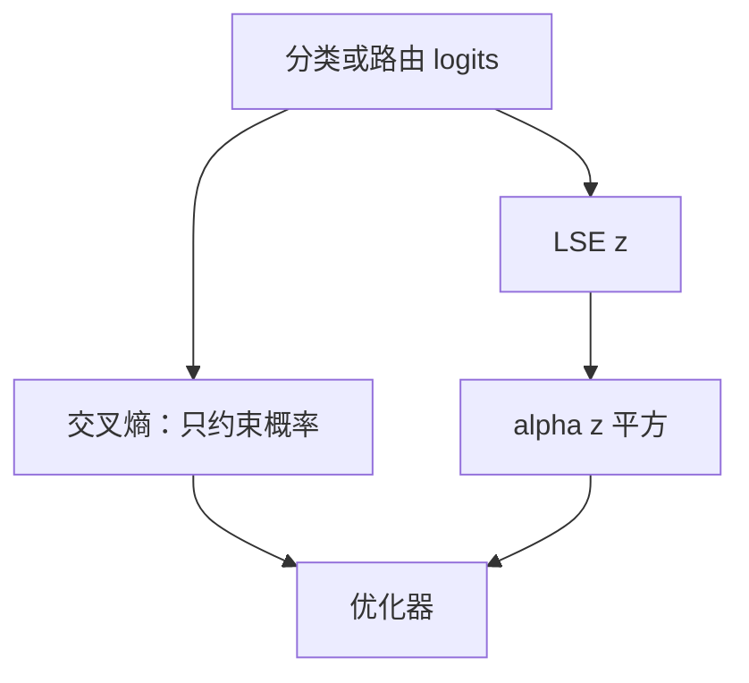

# z-loss 与 logit 稳定

当分类头的 log-sum-exp 无界增长，softmax 仍可给出合法概率，但半精度与路由器会先在这个尺度上溢出或锁死。

<footer>—— PaLM、Gopher 一类大规模训练中的 logit 正则；MoE 上的 router z-loss 见 ST-MoE / Switch 稳定性讨论</footer>

[上一课](/llm/weight-decay-mup) 管权重范数与宽度定标。本课管的是 **logits 的绝对尺度**。交叉熵只约束概率，不约束 $z=\log\sum_j e^{\ell_j}$：把全部 logits 同时加一个大常数，$p$ 不变，$z$ 变。混合精度、[Cut cross-entropy](/llm/cut-cross-entropy) 的片上归约、以及 MoE 路由 softmax，都会在 $z$ 过大时先坏掉。z-loss 给 $z^2$ 一个小系数，把尺度钉住。后课的 NaN skip 假定你已经知道哪些尖峰来自尺度爆炸而不是数据损坏。

## 问题

下一 token 损失 $\ell_i=- \ell_{y_i} + \mathrm{LSE}(\ell)$ 对 $\ell$ 的平移不变。优化器可以让 $\|\ell\|_\infty$ 与 LSE 一起漂到 $10^4$ 量级，训练损失看起来仍在降。BF16 的指数在大约 $88$ 以上溢出；即便用稳定的 $\mathrm{LSE}=\mathrm{max}+\log\sum e^{\ell-\mathrm{max}}$，max 本身进半精度缓冲时仍可能 Inf。PaLM 把一项 $\alpha z^2$ 加进损失，明确惩罚过大的 log-partition。Gopher 同样强调大模型训练里的 logit 增长与稳定性技巧。这不是新的语言建模目标，是数值护栏。

MoE 路由器的 logits 更短、更容易两极分化。[路由器梯度](/llm/moe-router-gradient) 在 $p\approx 1$ 时锁死；router z-loss 惩罚路由 LSE，等于把门控从饱和区拉回。Switch / ST-MoE 把这项写成稳定性组件。词表 z-loss 与 router z-loss 公式同类、作用对象不同，不要共用一个系数就以为都罩住了。

### 平移不变性是漏洞不是特性

从概率模型看，过参数化的 logits 有多余自由度。从浮点与门控看，这个自由度会吃掉指数的动态范围，并让「乘 $p$」的梯度消失。μP 管的是宽度变化时**更新幅度**；z-loss 管的是**绝对 logit 尺度**。两者同时需要：只 μP 不钉 $z$，宽模型仍能把输出头推到溢出；只 z-loss 不定标，窄扫到的 $\eta$ 迁不走。z-loss 的 $z$ 是 $\log\sum\exp(\ell)$，不是权重衰减里的 $\|W\|^2$。有人把输出头权重变大误叫成 z 爆炸。应直接记录 LSE 或 $\|\ell\|_\infty$ 的滑动均值，不要用 $\|W_{\mathrm{lm}}\|$ 当代理——RMSNorm 之后两者可以脱钩。

## 方法

### 词表项与路由项怎么写

对每个位置（或对路由 logits）计算：

$$
z_i=\log\sum_{j=1}^{|V|}\exp(\ell_{i,j}),\qquad L_z=\alpha\,\mathbb{E}_i[z_i^2].
$$

$\alpha$ 很小，PaLM 一类配方用 $10^{-4}$ 量级。加在主 CE 上。实现必须用稳定 LSE，否则 z-loss 自己先 NaN。Cut CE 若在片上算 LSE，应把 $z_i$ 一并回传，避免再物化整表只为算这项。

对 MoE 路由，$|V|$ 换成专家数 $N$，只在路由 softmax 上加。系数可以与词表 $\alpha$ 不同：路由维更小，同样 $\alpha$ 对尺度的拉力更强。DeepSeek 式偏置均衡不替代 z-loss：偏置改的是相对负载，z-loss 改的是 logits 的公共偏移与范数。

## 机制

$L_z$ 的梯度把所有 logits 往下拉（当 $z>0$），近似于给输出一个指向「整体变小」的公共力，而不改变（到一阶）相对差——相对差仍由 CE 管。实际耦合是：CE 想拉大正确类与错误类的间隔，间隔变大往往抬高 LSE；z-loss 反对抬高。结果是间隔靠**压低错误类**而不是**抬高正确类**来实现。这会影响后期校准：模型可能更「低估」绝对 logit，温度缩放的最优温度会变。解码温度若按未加 z-loss 的模型来抄，会偏锋利或偏平。

与梯度裁剪的关系：clip 卡的是更新步长，不卡 $\ell$ 的水平。尖峰时 clip 先触发，logits 已大的状态下每步被砍，训练变慢，但 $z$ 不一定回来。z-loss 是水平拉力，clip 是速度限制，不是替代。

输出范数增长有时来自嵌入与 $\gamma$ 的共同放大。z-loss 作用在 logits，会倒逼这些增益。若同时把嵌入从衰减里豁免（AdamW 分组），两边在打架。分组课已经警告过；这里表现为 $L_z$ 降不下去、CE 仍正常。

### 何时 z-loss 会伤害质量

$\alpha$ 过大，模型不敢把正确类 logit 拉到足以压过巨大词表里的竞争项，CE 平台抬高。词表越大，同样间隔需要的绝对尺度可以更大，应略调 $\alpha$ 或对 $z$ 减一个目标偏置（惩罚 $(z-z_0)^2$）。不要把 PaLM 的 $\alpha$ 原样贴到 256K 词表上当真理。长序列下每个位置一项，$L_z$ 的 batch 均值稳定，但某几个位置的 $z$ 仍可爆；应看分位数，不只看均值。

## 边界与工程取舍

推理通常不加 z-loss（它不是解码目标），但训练钉住的尺度会留在权重里。量化、FP8 推理对 logit 动态范围敏感：训练期 z-loss 等于给激活量化留了余量。关掉 z-loss 的长训检查点，后期再量化更易在 lm_head 爆炸。这是和压缩课的接口，本课只点到。

Router z-loss 过强会把路由推向均匀，类似加大均衡 $\alpha$，专项化变差。应与专家负载日志一起看：负载已均且熵很高时，先降 router z-loss，而不是再加专家。词表 z-loss 不应用来当「额外正则提高下游」——它是稳定项；下游涨了算副作用，没涨也不说明实现错了。

不要编造 z-loss 的 arXiv 编号。写配方时引用 PaLM（Chowdhery 等）、Gopher（Rae 等）的稳定性叙述，以及 MoE 上 ST-MoE / Switch 的 router z-loss。系数以你复现的代码为准。

## 小结

- 交叉熵对 logits 平移不变；z-loss 惩罚 LSE 的平方，钉住绝对尺度。
- 保护半精度指数、Cut CE 归约、以及 MoE 门控不饱和。
- 与 μP、权重衰减、梯度裁剪分工不同：尺度 / 宽度定标 / 范数 / 步长。
- $\alpha$ 过大抬高 CE；词表变大时不要照抄小词表系数。
- 词表 z-loss 与 router z-loss 分开记、分开调。
- 出处：PaLM、Gopher 的大规模训练实践；Switch / ST-MoE 的路由稳定性。
