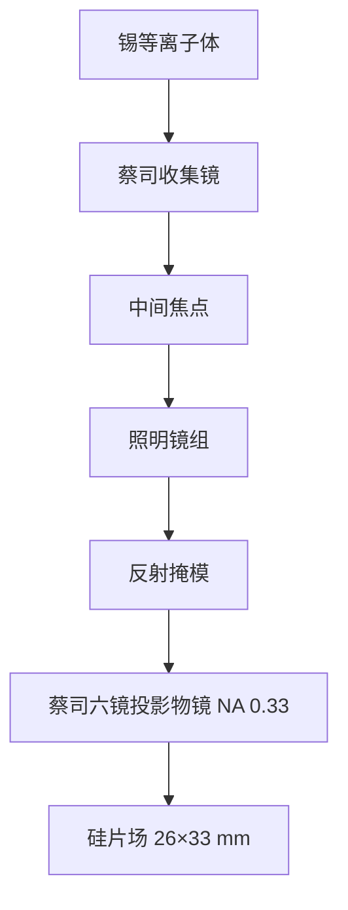

# 蔡司投影物镜与收集镜

投影物镜必须在原子量级上抛光与装调；Carl Zeiss SMT 为 ASML 提供 EUV 收集镜与投影光学。

<footer>—— 改写自 Carl Zeiss SMT 与 ASML 公开说明</footer>

EUV 没有玻璃透镜组。成像链上每一面都是[Mo/Si 多层膜](/llm/euv-multilayer-mirror)非球面，由 Carl Zeiss SMT 制造并装进 ASML 的扫描机。靠近等离子体的那一面是收集镜（collector）：大立体角、椭球共轭，把锡等离子体成像到中间焦点。扫描机里的投影物镜（projection optics box, POB）在 [NXE](/llm/asml-nxe) 上以 NA 0.33、六面反射完成 4× 缩微；照明镜组把 IF 整形为狭缝与光瞳。本篇写蔡司这两类镜子的分工、面形与波前合同，以及为什么物镜是 EUV 供应链里最难复制的一段。[High-NA](/llm/asml-high-na) 的变形光学在专文展开。

## 问题

光源再亮，若收集立体角小或投影波前差，硅片上也没有对比。收集镜必须在等离子体旁边活着：接受离子轰击、氢化学、热负荷，同时保持多层膜周期与面形，把光送到直径毫米量级的 IF。投影物镜则必须在更高真空、更干净的环境里，把反射掩模上的图形以纳米套刻和极低像差印到硅片——场是 26 mm × 33 mm 量级，扫描狭缝还在动。DUV 物镜可以用透射玻璃补偿，EUV 只能靠反射面形和装调自由度。

供应商结构是绑定的：ASML 做整机与光源，Zeiss SMT 做 EUV 光学。镜子的口径、非球面度、多层膜应力与波前测量，构成一条独立于「会不会镀 Mo/Si」的工艺链。缺蔡司这一段，有等离子体也没有可卖的扫描机。

### 收集与投影为什么不能做成同一类镜子

收集镜看的是近似点源的等离子体，物方 NA 极大、像方送到 IF，波前要求低于投影镜，但抗污染和可更换性是一等指标。投影镜看的是掩模场，必须在全场、全光瞳上把像差压到亚纳米 RMS 波前，镜子不可当作定期耗材。材料、冷却、帽层、装调公差因此分叉：收集镜为寿命和立体角优化，投影镜为成像传递函数优化。把收集镜的损伤预算套到 POB 上，或把 POB 的洁净要求套到等离子体舱，都会立刻失败。

「蔡司镜头」在 EUV 里容易让人想到相机镜头。实物是真空腔里的多层膜非球面反射组，没有屈光元件。说「镜头 NA 0.33」指的是硅片侧数值孔径，不是某块玻璃的折射率。

## 方法

收集镜采用正入射多层膜，基底做成椭球或分段近似，等离子体与 IF 互为焦点。角范围宽，周期沿径向渐变以跟踪布拉格条件。氢自由基原位刻锡，见[DGL](/llm/euv-hydrogen-dgl)；镜子仍有更换周期。IF 之后，照明组把光变成扫描狭缝，并提供偶极、四极等光瞳填充，供 SMO 使用。掩模是反射式的，主光线带有非零入射角，阴影效应进入 CD。

NXE 投影物镜公开为六面多层膜非球面，硅片侧 NA 0.33，缩微倍率 4×。每一面的入射角、孔径和多层膜配方不同。面形用离子束修形、干涉测量（包括 EUV 波前）迭代到原子层量级。装调后的系统波前决定对比度、焦深和套刻里的光学项。热负荷虽远小于收集镜，瓦级吸收仍足以让镜子膨胀：材料选择、镀膜应力和冷却路径是成像稳定的一部分，不是机械售后。

### 波前、杂散光与偏振

像差预算按 Zernike 或等价场相关基展开，扫描方向与狭缝方向权重不同。多层膜的残余粗糙引起散射，降低对比并抬高杂散光，对暗场图形尤其伤。大角度下 s/p 反射率分叉，照明偏振成为设计量。蔡司的合同是把这些量在出厂波前和杂散光指标里收掉，而不是留给晶圆厂用剂量硬扛。High-NA 把镜子做大、做成变形，测量与装调的自由度进一步增加，但角色不变：仍是 SMT 的投影光学。

## 机制

能量在光学链上按反射率相乘衰减。收集镜先吃立体角与 $R_{\mathrm{col}}$；照明再乘若干面；掩模反射一次；POB 六面再乘一次。整机透过率低，是 IF 必须数百瓦的原因，已在多层膜专文算过。蔡司能做的是把每一面的 $R$ 贴近 70% 上限，并把带宽与光源 UTA 对齐，而不是发明一种不吸收的 13.5 nm 玻璃。

成像机制仍是部分相干投影：光瞳填充、掩模衍射、物镜传递、硅片上干涉。与 DUV 的差别是全反射、真空、窄带多层膜，以及掩模三维。焦深随 NA 平方下降，NXE 的 0.33 已经薄；工件台调焦与[磁浮扫描](/llm/euv-maglev-stage)必须把焦面维持在这个薄层里。光学厂负责把像差做成「可被工件台和套刻模型消化」的残差，而不是零像差神话。

收集镜寿命下降首先表现为 IF 功率掉和光瞳填充变形，不是突然没有光。产能模型要把收集镜当消耗品：清洗、更换、再镀或再抛，与激光器墙插功率同样进入成本。

### 测量闭环：从抛光到装机

面形测量必须能看见镀膜前后的应力引入形变。可见光干涉测基底，EUV 或短波长测镀后有效波前，因为多层膜的等效反射面埋在堆栈里，并不等于几何表面。装进 POB 后还要在系统级测场相关波前，用执行器（镜面微调、波长/温度）做最终补偿。出厂后的漂移由扫描机的热与污染决定，氢清洗策略必须与帽层化学兼容，否则「清洗」本身会改周期、改应力。

## 边界与工程取舍

蔡司光学不包含光源等离子体配方，也不包含硅片台伺服。它规定的是可收集的立体角和可印的光学传递函数。镜子张数是取舍：更多镜子可以校正像差、抬 NA，但 $R^N$ 把透过率打死；NXE 停在六面 0.33，是透过率、像差与机械包络的折中。High-NA 若再加镜，必须用更大的镜子和变形倍率把掩模侧角度压住，否则多层膜和掩模阴影先坏。

国产替代叙事里，「会镀 Mo/Si」远不等于会做 POB。缺的是米级口径非球面、亚纳米面形、镀膜应力控制、EUV 波前计量和与 ASML 机台的机械—热接口。公开材料足够用来写清分工，不够用来复制工艺窗口。引用应写 Carl Zeiss SMT 与 ASML 的产品说明，以及 Bakshi 书中对多层膜物镜的综述，而不是把相机蔡司与 SMT 混成一家产线。

pellicle 在掩模前，光学上是额外的薄膜，会改透射、热变形和可能的波前；它通常不由投影物镜厂负责，但物镜设计必须容忍其存在。见 [EUV pellicle](/llm/euv-pellicle)。

## 小结

- Zeiss SMT 提供 LPP 收集镜与 NXE/EXE 投影光学，ASML 做整机集成。
- 收集镜追求立体角与寿命，投影物镜追求全场亚纳米波前，二者不可互换。
- NXE 投影为六面多层膜非球面，NA 0.33，4× 缩微，场约 26 mm × 33 mm。
- 单面反射率约 70% 相乘后，物镜透过率约一成，规定了光源功率。
- 面形、镀膜应力、EUV 波前计量和热管理是光学合同的本体，不是镀层附加。
- High-NA 在同一供应商结构上改变形光学与口径，不改「全反射多层膜物镜」这一命题。
- 出处：Carl Zeiss SMT、ASML 公开说明；Bakshi, *EUV Lithography*。
