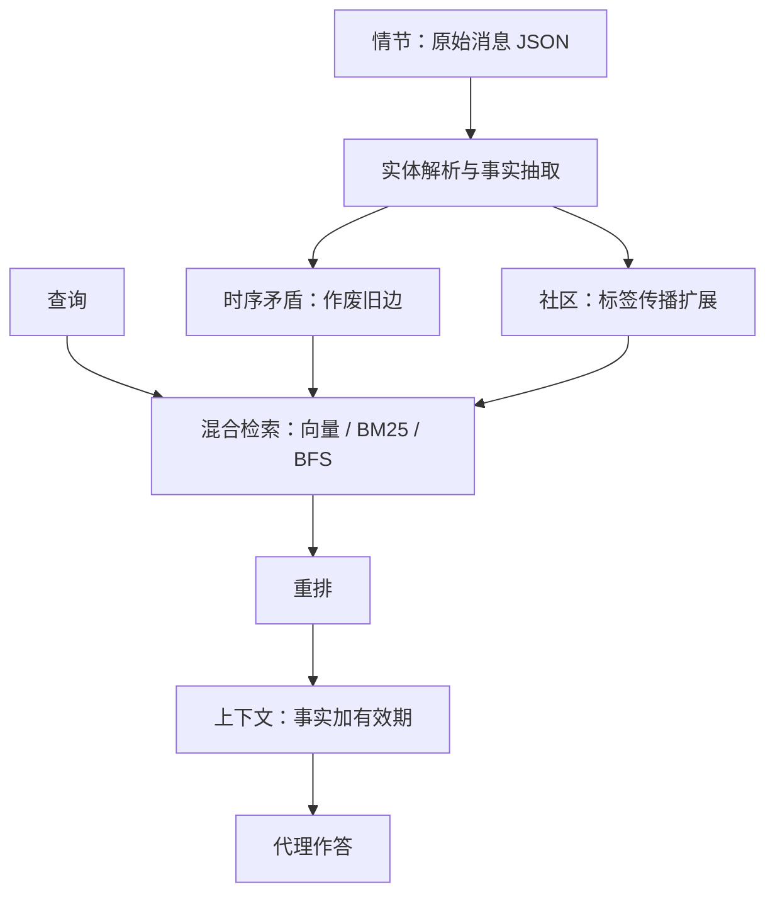

# Zep / Graphiti 时序知识图谱记忆

    
用时序可知的知识图谱引擎持续吸入对话与业务数据，事实被标上有效期：过时的边作废而不是删掉，以便代理问「当时什么为真」。

    <footer>—— Rasmussen、Paliychuk、Beauvais、Ryan、Chalef，Zep: A Temporal Knowledge Graph Architecture for Agent Memory，arXiv:2501.13956</footer>

Zep AI 的 Preston Rasmussen、Pavlo Paliychuk、Travis Beauvais、Jack Ryan、Daniel Chalef 把 **Zep** 写成代理记忆服务，核心引擎 **Graphiti** 是开源时序知识图谱库（`getzep/graphiti`）。静态 RAG 假设语料很少改；企业代理面对的是不断演进的对话与业务记录。Graphiti 增量构建三层子图：情节（原文消息）、语义实体与事实、社区摘要；边上同时存世界有效时间与系统摄入时间。DMR 上 Zep + gpt-4-turbo 94.8% 对 MemGPT 报告的 93.4%；作者同时指出 DMR 过易、全文也能 94.4%。更有信息量的是 LongMemEval$_s$（约 115k token/对话）：gpt-4o 上 Zep 71.2% 对全文 60.2%（+18.5% 相对量级的准确提升叙述见摘要），延迟约降 90%，检索上下文约 1.6k token。本篇写双时序与检索组装，对照 [GraphRAG](/llm/graphrag)、[Mem0](/llm/mem0-layer)。

## 问题

Lewis 式 RAG 服务静态文档。代理记忆要合并：正在进行的对话、结构化业务对象、过时事实的历史。MemGPT 证明外部档案 + 函数换页，但 DMR 只有约 60 条消息、单跳事实题，现代窗口能塞下全文。LongMemEval（Wu 等）把对话拉到十万 token 级，并分单会话用户/助手/偏好、跨会话、知识更新、时间推理。Zep 的主张是：记忆检索应返回带有效期的事实与实体摘要，而不是切块。

图 $\mathcal{G}=(\mathcal{N},\mathcal{E},\phi)$ 分三层。情节节点存原始消息/文本/JSON，边连到提及的实体，保证非损失来源。语义层：实体节点 + 实体间事实边。社区层：强连通簇的摘要，借鉴 GraphRAG 的全局感，但检测用标签传播以便动态加节点，而不是每次 Leiden 全图重跑。心理学术语上对应情景记忆与语义记忆；这是组织类比，不是脑模型。

### 双时序不是一枚时间戳

情节带参考时间 $t_{\mathrm{ref}}$，用于解析「下周四」「两周前」。边存四类时间：$t'_{\mathrm{created}}$、$t'_{\mathrm{expired}}$ 属系统时间 $T'$（审计）；$t_{\mathrm{valid}}$、$t_{\mathrm{invalid}}$ 属世界时间 $T$（事实何时为真）。新边与旧边冲突时，LLM 判定矛盾并在重叠区间把旧边 $t_{\mathrm{invalid}}$ 设为新边 $t_{\mathrm{valid}}$；沿 $T'$ 优先新摄入。查询「去年谁是经理」应走 $T$，不是摄入顺序。

Graphiti 是库，Zep 是托管记忆服务。论文实验经 Zep API 建图与检索。自托管 Graphiti 常用 Neo4j / FalkorDB；延迟数字含波士顿到 us-west-2 的网络，基线全文没有这段 RTT，比较时要读原文实验设置。

## 方法

摄入消息：当前句 + 最近 $n=4$ 句做 NER 上下文，说话人必为实体；反射式二次抽取减幻觉。实体名 1024 维嵌入 + 全文检索候选，LLM 做实体解析。事实在实体对之间抽取，去重搜索限制在同一实体对上的边，降复杂度。社区：新实体看邻居社区多数票加入，并更新摘要；周期性全量刷新，因动态扩展会漂移。社区名嵌入供检索，查询期**不用** GraphRAG 式对所有社区 map-reduce——这是与 Edge 等的关键差异。

检索 $f(\alpha)=\chi(\rho(\varphi(\alpha)))$：搜索 $\varphi$ 混合余弦、BM25、BFS（从近情节种子扩 $n$ 跳）；重排 $\rho$ 含 RRF、MMR、情节提及频次、到质心距离、交叉编码器；构造 $\chi$ 把事实及有效期、实体摘要、社区摘要格式化成短上下文。实验取 top 20 边与实体节点。嵌入与重排用 BGE-M3；构图 gpt-4o-mini。

### LongMemEval：全文不是上界

表 2：gpt-4o-mini 全文 55.4% / 31.3s / 115k token，Zep 63.8% / 3.20s / 1.6k；gpt-4o 全文 60.2% / 28.9s，Zep 71.2% / 2.58s。时间推理、跨会话、偏好类升幅大；**单会话助手题下降**（gpt-4o 94.6%→80.4%）：助手自己说过的话可能没被抽进「用户世界」事实，或检索没优先最近助手轮。知识更新在 mini 上略降、在 4o 上略升，说明时序无效化对模型能力敏感。DMR 上 Zep 仅微赢全文，作者用来论证基准过时，而不是宣称碾压 MemGPT。

他们未能把 MemGPT 以公平方式跑通 LongMemEval（档案摄入路径），故不把「Zep 在 LME 上击败 MemGPT」写成表格事实。摘要里 18.5%、90% 延迟应对应该 4o 设定。

## 机制

非损失情节层让语义边可回溯引文，这是相对纯向量记忆的审计优势。作废而非删除让知识更新题成为可能：新事实不擦掉旧边，查询过滤器在 $T$ 上切片。BFS 补上「同一段对话里一起出现」的上下文相似，这是词面与句向量都不直接保证的。社区给全局主题，但 Zep 检索是点查+邻域，不是 GraphRAG 全局 QFS；「这批客户总体在抱怨什么」仍可能更该用 GraphRAG 索引。

构图全是 LLM 抽取，错误会永久进图。反射降低但不消除幻觉实体。动态社区是启发式，久了要全图刷新，费用与 GraphRAG 索引类似，只是可推迟。交叉编码器最准也最贵，生产常用 RRF+向量先短列表。

多租户必须一张用户一张图或严格属性隔离。混合检索的入口仍受嵌入召回上界约束：实体没被抽到，后续 BFS 与社区都救不回来。抽取提示要领域化，与 GraphRAG 相同。

### 与 Mem0 图层、A-Mem 笔记网

Mem0$^g$ 也是实体—关系图 + 冲突处理，评测主场 LOCOMO；Zep 主场 DMR + LongMemEval，并强调业务 JSON 与双时序四时间戳。A-Mem 是原子笔记动态链接，不做社区与 bi-temporal 边。选型：要「何时为真」与增量社区用 Graphiti；要轻量对话事实用 Mem0；要演化标签笔记用 A-Mem。可叠：情节原文在 Graphiti，窗口放置仍可由 MemGPT 管。

## 边界与工程取舍

论文是生产系统描述加两公开基准，不是消融到每一个重排器的学术全表。single-session-assistant 回归必须在产品里补「最近助手消息」通道。无公开基准很好测「对话 + CRM 表」联合推理，作者自己列出这一空白。社区刷新周期、BFS 跳数、$n=4$ 上下文都是会改准确率的旋钮。GraphRAG 的 Leiden 全局摘要与这里的标签传播动态社区不要混引数字。

出处：Rasmussen, Paliychuk, Beauvais, Ryan, Chalef，*Zep: A Temporal Knowledge Graph Architecture for Agent Memory*，arXiv:2501.13956。Graphiti：https://github.com/getzep/graphiti。LongMemEval：Wu 等。DMR/MemGPT：Packer 等 arXiv:2310.08560。GraphRAG：Edge 等 arXiv:2404.16130。BGE-M3 见 Chen 等。

## 小结

- Zep 用 Graphiti 增量建情节 / 实体事实 / 社区三层图，边双时序，矛盾边作废不删除。
- 检索混合向量、词面与图邻域，输出带有效期的短上下文。
- DMR 已饱和；LongMemEval 上准确率升、延迟约降 90%，但单会话助手题会退步。
- Graphiti 开源、Zep 是服务；与 GraphRAG 全局 QFS、Mem0 对话层分工不同。
- 出处：arXiv:2501.13956。
