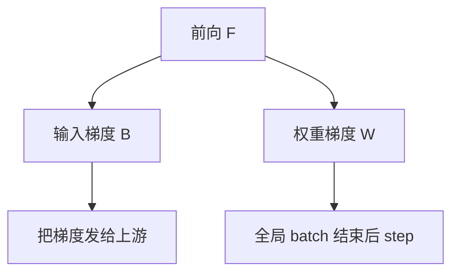

# 零气泡流水

把反向拆成「对输入的梯度」和「对权重的梯度」两拍，让依赖更细，流水线在稳态可以没有空算。

<footer>—— Qi 等，Zero Bubble Pipeline Parallelism</footer>

[上一课](/llm/1f1b-interleaved)用 1F1B 与虚阶段交错去填空拍，气泡仍与 $P$、$M$、$v$ 绑定，稳态往往不是零。Qi 等人指出：标准反向把 $B$ 当成原子，其实 $B$ 里对激活的梯度 $B$ 与对权重的梯度 $W$ 依赖不同。本课不重讲 1F1B 日历。缺口是把 $B$ 拆开，得到零气泡（ZB）调度，以及它多出来的权重版本与内存账。DualPipe 会走双向；本课先走单向拆反向。

## 问题

1F1B 的反向必须等下游阶段把完整 $B$ 做完。但 $W$（对权重的梯度）只依赖本阶段保存的激活与已经到来的输出梯度，不必等更浅层的 $B$ 全部结束才能开始。若调度器仍把 $B+W$ 绑死，设备在等下游时只能空转。零气泡把每层工作写成 $F$、$B$、$W$ 三种任务，用更细的依赖图填洞。

代价是：为了打乱 $W$ 的时间，可能要暂存多份权重或梯度，内存从 1F1B 的优势里吐回去一块。还有数值：更新时刻若与 1F1B 不同，必须保证全局 batch 的语义仍是同步 SGD，否则不可复现。

### 不是异步 SGD

ZB 的目标是日历更满，不是接受过期梯度。完成一个全局 batch 时，权重更新应与非拆分反向一致（或在论文声明的等价范围内）。若实现把 $W$ 跨 batch 重叠，就滑向 PipeDream 异步，预训练通常不接受。

重计算与 $B/W$ 拆分叠加时，重算属于 $B$ 的前奏，不能把 $W$ 提前到重算之前用错激活。

## 方法

把自动微分图里每个阶段的反向切成：先算传给上游的输入梯度（$B$），再算本地参数梯度（$W$），或按论文给出的允许顺序。调度器在稳态插入 $W$，使每张卡每拍都有 $F$、$B$ 或 $W$ 之一。Qi 等人给出 ZB-H1 / ZB-H2 等变体，区别在于用多少额外内存换更满的日历。落地时选一个变体，用小规模对拍：同一数据、同一精度，ZB 与 1F1B 的损失曲线应重合。

与交错的关系：可以只做 ZB 不做 $v>1$，降低实现复杂度；也可以两者都上，但依赖图更难审。应先 ZB、$v=1$，再考虑交错。

### 通信插入点

阶段边界的激活发送仍在 $F$ 后；梯度发送在 $B$ 后。$W$ 是本地 GEMM，正好拿来覆盖这些通信——这已经碰到重叠课。ZB 提供可重叠的本地活；真正把通信藏进去是后两课的事。

优化器 step 必须发生在该全局 batch 所有 $W$ 完成之后。提前 step 会造成静默的错误更新。

## 机制

正向依赖链长度仍是 $P$，但反向被拆细后，关键路径上可插入不挡别人 $F$ 的 $W$。稳态利用率趋向 1，前提是 $F$、$B$、$W$ 的耗时可比。若 $W$ 很短（参数少的阶段）而 $F$ 很长，洞填不满，零气泡名不副实。不平衡的流水切分（各段 FLOPs 不齐）会同样破坏 ZB，应先做负载均衡再换调度器。

## 边界

ZB 对流水切分质量更敏感，对 MoE 阶段（时间抖动）不友好，需要后课的 All-to-All 与落后者策略。它也不减少 TP 的层内通信。内存回升时，可能还不如「普通 1F1B + 更大 $M$ + 重计算」。下一课 DualPipe 用双向管道与双组微批再挖一截重叠，那是另一套日历，不要与 ZB 的 $B/W$ 拆分混成一个开关。

## 小结

- 本课不重讲 1F1B；只补把反向拆成 $B$ 与 $W$ 以填稳态空拍。
- 零气泡是同步 SGD 的日历优化，不是异步训练。
- 变体用内存换利用率；必须与 1F1B 对拍损失。
- 阶段 FLOPs 不齐时，零气泡先失败。
- 出处：Qi et al., *Zero Bubble Pipeline Parallelism*；对照 Narayanan et al. 的 1F1B。
