# ZeRO-Infinity

GPU 显存墙一旦挡住下一档参数量，就把模型状态铺进 CPU 与 NVMe，再用聚合带宽和重叠把搬运藏进计算。

<footer>—— Rajbhandari 等，ZeRO-Infinity: Breaking the GPU Memory Wall for Extreme Scale Deep Learning, 2021</footer>

[ZeRO 三档](/llm/zero-stages) 回答的是「数据并行组里切哪一块模型状态」。ZeRO-Infinity 回答的是下一问：切完之后，若聚合 GPU 显存仍不够、或者单层矩阵连一张卡都放不下，状态该落到哪一级存储，计算还怎么跟得上。Rajbhandari、Ruwase、Rasley、Smith 与 He 在 2021 年把 GPU、CPU、NVMe 收成同一条异构内存路径，并配上按层切块的 **memory-centric tiling**。DeepSpeed 开源了实现。本篇写这条存储层级与带宽设计，不重讲 ZeRO-1/2/3 各自切了什么。

## 问题

论文把当时的困境写成 GPU memory wall：稠密模型参数量几年涨了三个数量级，单卡显存只涨了大约五倍（从 16 GB 量级到 80 GB 量级）。3D 并行能把模型摊到集群的**聚合 GPU 显存**上，但Trillion 参数仍要数百张卡只为「放得下」，微调本可在一台上算完，却被节点显存拦住。3D 并行还要求改模型：张量切分、流水线切段、负载均衡。复杂依赖图很难切成平衡的流水。

ZeRO-Offload 已经把优化器状态和梯度放到 CPU，但参数仍常驻 GPU、并在数据并行组里复制，模型规模被单卡参数容量卡住；PCIe 也容易成为墙。ZeRO-Infinity 要同时做三件事：把模型状态继续卸到 CPU 乃至 NVMe；让极大的单层不必靠张量并行才能进 GPU；以及证明这条路径不必被 CPU / NVMe 的带宽钉死。

### 工作集必须小于单卡，状态可以大于集群 GPU

训练内存拆成模型状态（参数、梯度、优化器状态）与残差状态（激活、临时缓冲、碎片）。混合精度 Adam 下，论文按每参数约 20 字节估算模型状态（FP16 参数与梯度，加上 FP32 主权重、$m$、$v$）。Transformer 参数量近似 $12\times n_l\times hd^2$，状态体积按 $240\times n_l\times hd^2$ 字节量级走。激活可另用检查点压。Infinity 的关键不变量是：GPU 上只需要**当前算子的工作集**——一块可计算的权重瓦片、对应梯度、以及当下激活。持久状态可以住在更慢的层级。若某一线性层整层都进不了 HBM，工作集本身也要再切。

「放得下」和「跑得动」是两道题。NVMe 容量可以吞下百兆亿参数的状态，但若每步都把整层从盘读进 GPU 再写回，step time 会按 PCIe 与 SSD 队列走。Infinity 的论文贡献一半在容量，一半在证明聚合带宽与重叠可以让效率不跟最慢介质绑死。

## 方法

Infinity 由五块拼起来，而不是一个「再切一档」的编号。

第一，**infinity offload engine**：按显存预算把分片后的模型状态放在 GPU、CPU 或 NVMe，必要时同时用三级。前向、反传到某一算子时，把该算子需要的参数从远端搬到 GPU；用完释放。优化器步进可以在 CPU 上做，也可以按配置把状态从 NVMe 流过。引擎里的 DeepNVMe 一类库负责批量、异步的 NVMe 读写与显式刷盘，避免把 SSD 当成阻塞的 `memcpy`。

第二，**memory-centric tiling**：把超大算子（例如隐藏维极宽的线性层）切成 GPU 放得下的子矩阵，按瓦片做前向与反传，而不必把该层改写成张量并行。这是「不用重构模型也能过单层显存墙」的那一刀。激活检查点与瓦片可以叠用：检查点减的是序列方向的激活，瓦片减的是单算子权重的工作集。

第三，**bandwidth-centric partitioning**：同一份状态不要让所有卡去挤同一条 PCIe。分片后，各卡从自己负责的 CPU / NVMe 片上读，再靠 GPU 之间的集合通信把「当前层需要的完整视图」拼起来。这样读带宽随节点数和每节点的 SSD / CPU 通道聚合，而不是单卡打单盘。

```mermaid
flowchart TD
  NV["NVMe 参数 / 优化器片"] --> CPU["CPU 缓冲与可选 Adam"]
  CPU --> HBM["GPU 工作集: 当前瓦片"]
  HBM --> AG["All-Gather 当前层所需"]
  AG --> COMP["前向 / 反传 GEMM"]
  COMP --> RS["Reduce-Scatter 梯度"]
  RS --> CPU
```

### 重叠中心：预取必须盖住介质延迟

第四块是 overlap-centric design。参数预取、梯度回写、优化器更新与 GPU 计算排成流水：算第 $\ell$ 层时，第 $\ell+1$ 层的权重已经在路上。CPU Adam 与 GPU 的前向 / 反传也可以错步重叠。论文强调：CPU 内存带宽比 HBM 低一个数量级，NVMe 再低一档，从 GPU 经 PCIe 打这些介质更慢；没有重叠，卸载只是把 OOM 换成超时。

第五块是易用性：通信与分片由运行时自动做，模型仍按单设备写法。评测里他们用 32 个 DGX-2 节点（512 张 V100）跑到 32 万亿参数，约为当时 3D 并行可放规模的约 50 倍；同一硬件上吞吐超过 25 petaflops（约为峰值的 40%），并报告万亿参数模型的超线性扩展；单节点 DGX-2 上可微调到万亿参数量级，且不必手写模型并行。这些数字属于该论文在 V100 / DGX-2 上的测量，不能外推成 H100 机柜的承诺。

## 机制

带宽中心分片之所以能工作，是因为 ZeRO-3 语义里「完整层」只在计算窗口内存在。窗口外，每张卡只持有 $\Phi/N$ 的片。Infinity 把这片的宿主从 HBM 换成 DRAM 或 SSD。集合通信的体积仍与「当前层参数量」同阶，介质流量则与「本卡负责的那一片」同阶。节点越多，每卡要搬的片越小，于是出现论文报告的超线性：更多节点既带来更多算力，也摊薄每卡的 NVMe / PCIe 负担。

瓦片改变的是工作集，不是数学。把 $Y=XW$ 沿 $W$ 的一维切开，多次 GEMM 再拼接，等价于一次大乘，只是峰值显存变成「一块瓦片 + 激活」。代价是 kernel 启动次数增加，以及瓦片边界上的临时缓冲。小层做瓦片往往亏；只有单层已经大于 HBM 时才值得开。

DeepSpeed 配置上，Infinity 通常表现为 ZeRO stage 3 加上 `offload_param` / `offload_optimizer` 指向 `cpu` 或 `nvme`，并配 AIO 队列深度、块大小。名字叫 Infinity，档位仍是第三档加存储层级。写实验记录时应同时写 stage、offload 设备、是否 tiling，而不是只写「开了 Infinity」。

### 激活仍可能先爆

模型状态卸走之后，长序列的激活会成为新的墙。论文写明 Infinity 与 activation checkpointing 一起用；必要时也可把检查点卸到 CPU。官方后续说明也强调：Infinity 主要减参数与优化器占用，前向激活 OOM 要另开检查点或瓦片，不能指望 SSD 自动吞掉注意力激活。这与三档原文里「ZeRO 切参数侧、序列并行切激活侧」是同一条边界，只是介质更慢，重叠窗口更难排。

## 边界与工程取舍

不要把论文里的 32 万亿、单节点万亿微调写成今日集群的容量规划。那是 V100 + DGX-2 + 当时 NVMe 拓扑上的演示。HBM 更大之后，许多「必须 Infinity」的点会退回 GPU 常驻的 ZeRO-3；反过来，单卡微调极大模型时，NVMe 路径仍然有用。

不要在没有异步 I/O、没有预取的实现里假设「开了 nvme 就等于论文曲线」。队列深度、块大小、文件系统是否直通、CPU pin 核，都会让 SSD 从流水变成串行。小 batch、浅层、极窄 GEMM 盖不住 PCIe，step time 会被优化器与搬运主导。延迟更新、CPU Adam 与 GPU Adam 之间不保证比特一致，数值对照应能一键关掉卸载。

Infinity 不是新的并行维。数据仍按 batch 切，参数仍按 ZeRO 下标切。它不替代张量并行去加速单层 GEMM，只是让你在「单层太大」时可以先靠瓦片活下来。真正的宽矩阵加速仍要 TP 或更强的近端带宽。

检查点与导出：状态分散在 GPU / CPU / NVMe 上，聚合出完整 Hugging Face 权重需要巨大的主机内存与时间。换卡数 resume 要按新的 $N$ 重切片。把 NVMe 路径当检查点存储，还要处理节点故障时盘上分片是否可重建——这是运维问题，论文的吞吐数字没有覆盖。

## 小结

- ZeRO-Infinity 在第三档分片之上，用 infinity offload engine 同时利用 GPU、CPU、NVMe 存放模型状态。
- memory-centric tiling 把进不了单卡的算子切成工作集，减少对张量并行重构的依赖。
- bandwidth-centric partitioning 让各卡读自己的片，聚合 PCIe / CPU / NVMe 带宽；预取与计算重叠掩盖介质延迟。
- 论文在 512×V100 上演示 32T 参数规模与超过 25 petaflops 的吞吐，数字绑定该硬件，不能当现代机柜定额。
- 激活、小 batch、AIO 配置与数值路径仍是独立墙；卸载不是第四种并行语义。
- 出处：Rajbhandari 等，*ZeRO-Infinity*，2021；实现见 DeepSpeed。三档切分见 [ZeRO-1/2/3](/llm/zero-stages)，CPU 卸载见 [ZeRO-Offload](/llm/zero-offload)。
