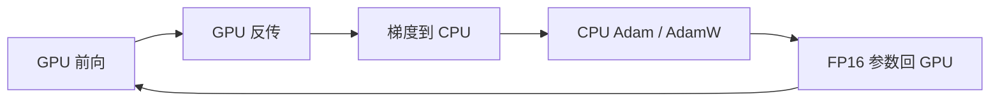

# ZeRO-Offload

把梯度、优化器状态和 Adam 步进放到 CPU，GPU 只留参数去做前向与反传——在 PCIe 体积与 CPU 算量都可承受的前提下，这是省显存的最优切法之一。

<footer>—— Ren 等，ZeRO-Offload: Democratizing Billion-Scale Model Training, 2021</footer>

ZeRO 三档解决的是多卡之间「谁存哪一片」。单卡或卡很少时，聚合 GPU 显存仍然不够，却还没到必须把参数也卸走的程度。Ren、Rajbhandari 等人 2021 年的 ZeRO-Offload 把异构训练的对象从「CNN 的激活」换成「大 Transformer 的模型状态」：CPU 既出内存也出计算。DeepSpeed 教程把它写成改配置、不改模型。本篇写 CPU 与 GPU 之间那条切分合同，以及它如何与 ZeRO 数据并行共生；不重写 [三档公式](/llm/zero-stages)，也不把后续的 NVMe 路径提前写成 Offload 的能力。

## 问题

混合精度 Adam 下，参数量 $M$ 大约对应 $16M$ 字节的模型状态（FP16 参数与梯度，FP32 主权重、$m$、$v$）。十亿到百亿参数已经超过当时单张 V100 的容量。流水线、张量并行、ZeRO 都能把状态摊到多卡，但前提是**有足够多的 GPU**。许多实验室只有一两张卡，微调 10B 级模型在当时是买不起 DGX-2 的问题，不是算法问题。

既有异构训练多针对 CNN：瓶颈是激活，模型本身不大，CPU 只当内存扩展，不算优化器。大语言模型的主占用是模型状态。若把前向也卸到 CPU，算力差两个数量级；若只把很少用的缓冲卸走，显存省不够。需要一张可证明的切分表：GPU 留什么、CPU 留什么，使得 GPU 显存省到能放大十倍模型，同时 PCIe 流量和 CPU 时间都不先爆。

### 一阶分析给出的切分

论文的效率目标有三条：CPU 算量远小于 GPU；CPU–GPU 通信量尽量小；在该通信量下 GPU 显存节省最大。结论是：**优化器状态、梯度、以及 Adam 更新在 CPU；FP16 参数与前向 / 反传在 GPU**。GPU 每步把梯度（或分片后的梯度）送到主机，CPU 更新主权重，再把新的 FP16 参数搬回 GPU。参数不卸，是因为每层前向都要读它们，来回 PCIe 会把 GEMM 打死。激活默认仍在 GPU，因为反传马上用；那是另一条优化，不是 Offload 的主刀。

Adam 对每个参数是 $O(1)$ 的向量更新，GPU 前向反传是 $O(B)$ 的 batch 维计算。$B$ 足够大时，CPU 上的 $O(M)$ 不会成为墙；$B$ 很小时，CPU Adam 与 PCIe 会露出。Offload 的「单卡 40 TFLOPS」绑定在论文的 10B / V100 / 足够 batch 设定上，小微批要另看。

## 方法

单卡路径可以看成：GPU 用常驻 FP16 参数做前向、反传，得到 FP16 梯度；梯度经 PCIe 到主机；CPU 上的 DeepSpeedCPUAdam 用 FP32 状态更新，再写回 FP16 参数。教程里典型配置是 ZeRO stage 2 加 `offload_optimizer.device: cpu`。stage 1 也可以卸优化器状态，但梯度仍占 GPU；stage 2 与「梯度也在 CPU」一致。参数仍复制在每张 GPU 上——这是 Offload 相对 Infinity 的规模上限：模型不能超过单卡参数容量。

多卡时不能把 Offload 接在普通 DDP 上。DDP 复制全部状态，于是每张卡都会在 CPU 上再复制一份 Adam，主机内存随并行度线性涨，PCIe 也复制。正确的共生是 **ZeRO 数据并行 + Offload**：优化器状态在 CPU 上只有一份分片视图，每张卡只更新自己负责的那一片。聚合的 CPU 算量和 CPU–GPU 体积不随数据并行度膨胀；节点变多，每卡要更新的片变小，CPU 反而更轻松。这是论文能报到 128 卡近线性加速的原因。

### CPU Adam 与错一步更新

即便切分最优，$O(M)$ 在小 batch 时仍可能露出。工程上有两刀。第一，向量化的 CPU Adam（论文写相对 PyTorch 实现约 6 倍；DeepSpeed 文档写 DeepSpeedCPUAdam 相对 `torch.optim.Adam(W)` 约 5–7 倍），用 SIMD 吃满主机核，并要求主权重在 CPU 上以 FP32 驻留。第二，**one-step delayed parameter update**：CPU 更新与 GPU 下一轮前向反传重叠，GPU 暂时用的是「慢一步」的参数。论文报告端到端可再抬一截，并声称精度可保持；这是用陈旧参数换墙钟，不是免费的数学恒等。关闭延迟更新应作为数值对照开关。

与模型并行叠用时，Offload 仍管优化器侧，张量并行管单层矩阵。论文在单台 DGX-2 上把规模报到 70B 以上，约为当时仅用模型并行的约 4.5 倍。那是「Offload + MP」的组合演示，不是 Offload 单独的单卡数字。单卡论文数字是：超过 13B 参数可训，10B 在 V100 上约 40 TFLOPS，对照 PyTorch 不卸载时大约 1.4B（文中亦写 1.2B）只能到约 30 TFLOPS。

## 机制

通信量为什么可控：每步经 PCIe 的主体是「本卡负责的梯度片 + 更新后的参数片」，体积与 $M/N$ 同阶（$N=1$ 时就是整份 $M$ 的梯度与参数各走一次量级）。前向激活不来回。若错误地把参数也每层从 CPU 拉一次，流量变成「层数 × 参数」，立刻掉进 PCIe 屋顶线。这就是 Offload 坚持参数常驻 GPU 的机制原因，也是 Infinity 必须靠预取和分片聚合带宽才能把参数再卸走的原因。

CPU 算量为什么通常不是墙：GEMM 在 GPU 上随 $B$ 与序列长度涨，Adam 只扫一遍参数。$B$ 大时，GPU 段远长于 CPU 段，错步重叠几乎能把 Adam 藏住。$B$ 小、或 CPU 核被数据加载打满、或没绑核，Adam 会从重叠里探出头。DeepSpeed 后来的 `--bind_cores_to_rank` 一类选项，就是在多卡 CPU Adam 时避免核争用。

Offload 的「10× 更大模型」是相对「同一张 GPU、不用模型并行、不用卸优化器」的 PyTorch 基线，不是相对 ZeRO-3 集群。已经有八张卡且 HBM 够用时，先开 ZeRO-2/3 往往比把 Adam 赶到 CPU 更划算。

### 和 Infinity 的分工

Offload 停在「参数仍在 GPU」。规模上限是单卡能放下 FP16 参数（加当下激活与临时缓冲）。Infinity 在第三档上继续卸参数到 CPU / NVMe，并加瓦片。两者都是存储层级，不是新并行维。选型可以记成：单卡 / 少卡、模型刚好被优化器状态挤爆 → Offload；参数本身已超过单卡，或要上 NVMe → Infinity。不要在 Offload 配置里写 `offload_param: nvme` 却以为仍在论文的 Offload 合同里。

## 边界与工程取舍

不要在 PCIe 代际很老、或 GPU 与主机不在同一 NUMA / 根复用器下，期待论文曲线。流量必须走得动。不要把 CPU Adam 与 GPU fused Adam 当成比特级可换：累积顺序、向量化宽度、是否 `fp32_optimizer_states` 都会改轨迹。需要可复现实验时，关掉卸载做小模型对照。

梯度累积时，若每个 microbatch 都把完整梯度放到 GPU 再累积，Offload 的显存收益会被吃掉；应在 CPU 或分片缓冲上累积。与梯度裁剪：全局范数要在分片上归约后再按同一系数缩放。混合精度的 unscale 发生在 Adam 之前，CPU 上的 FP32 状态看到的应是已经 unscale 的梯度。

FSDP 的 `cpu_offload=CPUOffload(offload_params=True)` 会把参数也卸走，语义更接近「第三档加卸载」，不是这篇论文的默认 Offload。跨框架不要只写「开了 CPU offload」，要写卸的是优化器还是参数。

小模型、大 batch、HBM 充足时，Offload 是净亏损：PCIe 与 CPU 核都是税。论文的民主化叙事针对「一张卡要训十亿到百亿」；今日一张 H100 80GB 能直接放下的模型，不必为叙事而开卸载。

## 小结

- ZeRO-Offload 的合同是：GPU 持参数并做前向反传，CPU 持梯度与 Adam 状态并做更新。
- 该切分在「少通信量、少 CPU 算量、尽量省 GPU 显存」的一阶目标下是论文给出的最优解之一。
- 多卡必须接 ZeRO 分片，而不是 DDP 复制，否则主机内存与 PCIe 随并行度爆炸。
- DeepSpeedCPUAdam 与延迟一步更新用来掩盖小 batch 下的 CPU 段；数值不保证与 GPU Adam 逐比特相同。
- 参数仍常驻 GPU，故规模小于 Infinity；与三档的关系是 stage 1/2 加优化器卸载，不是新档位。
- 出处：Ren 等，*ZeRO-Offload*，2021；DeepSpeed 教程 *ZeRO-Offload*。后续 NVMe 与瓦片见 [ZeRO-Infinity](/llm/zero-infinity)。
